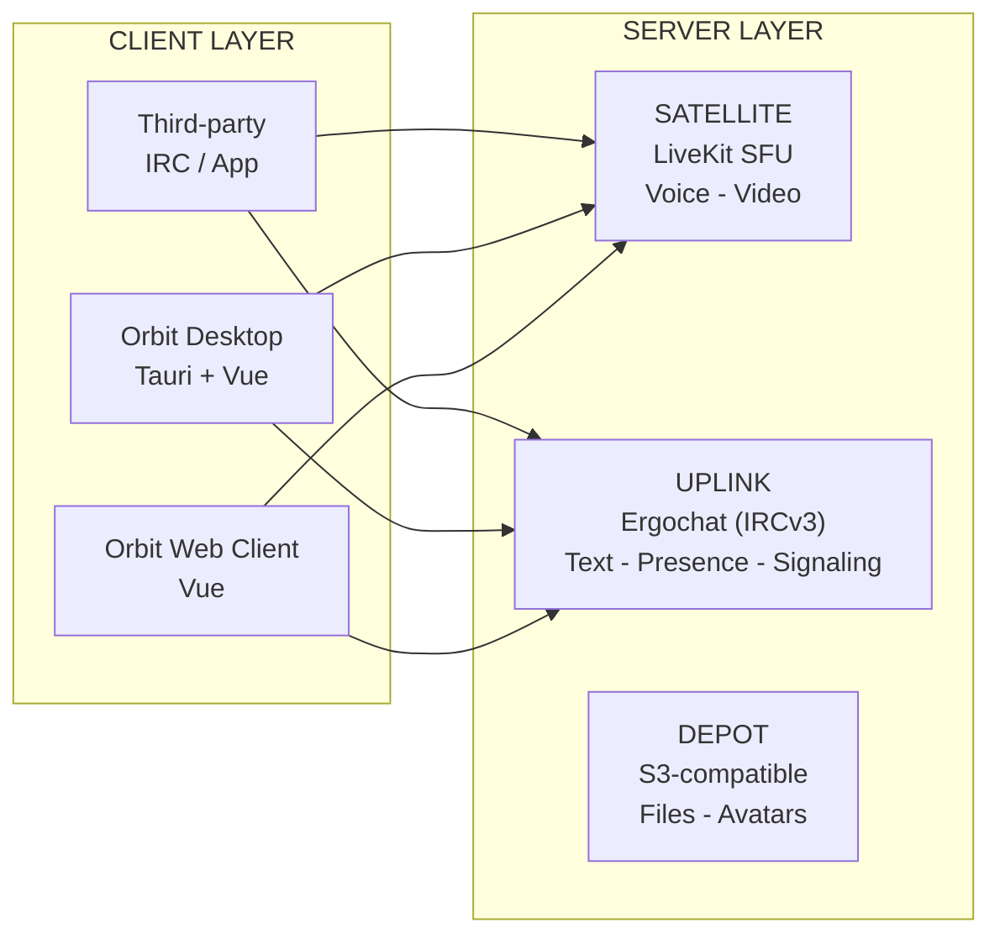
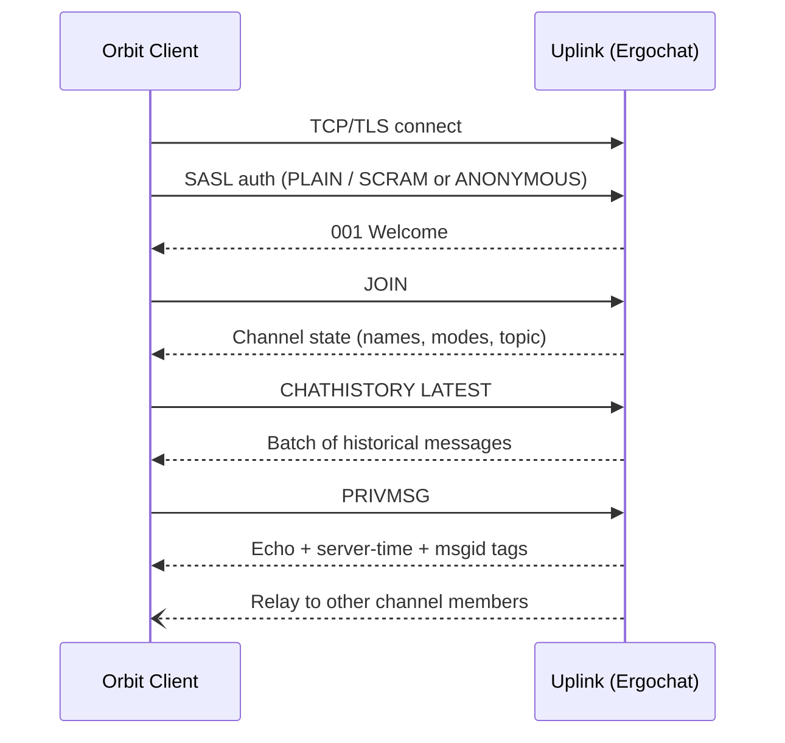
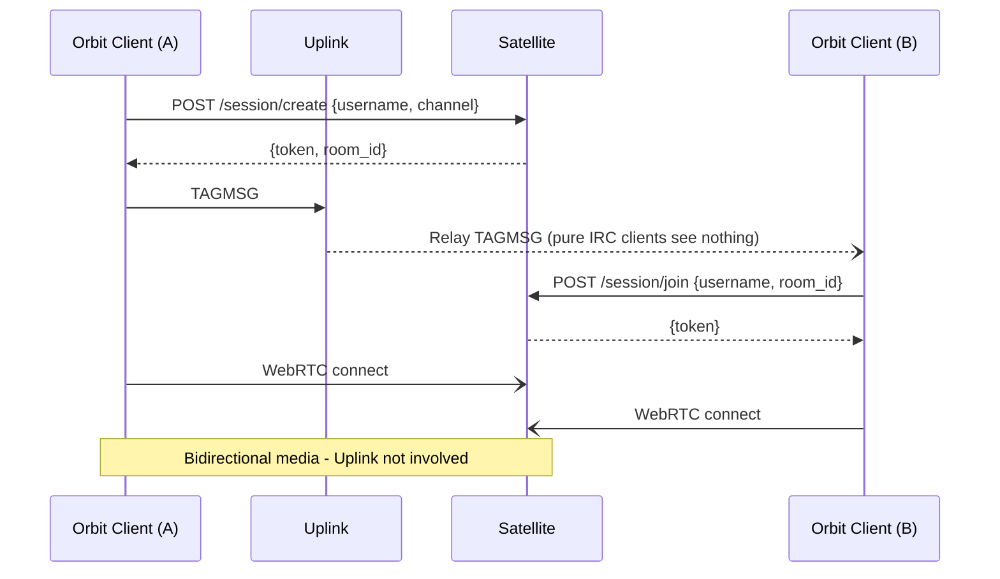
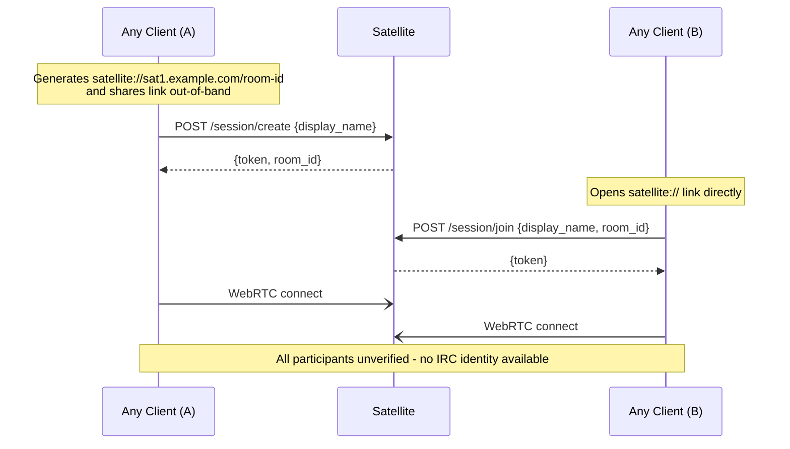

# Architecture Overview

## Overview

Orbit is a decentralized, open-source communication platform built by Hivecom. It targets communities, gaming groups, and privacy-conscious users who want an alternative to Discord without surrendering control of their data or infrastructure. Orbit is not a Discord clone - it is a fundamentally different model for community communication, built on open standards and designed so that communities overlap and interoperate rather than exist in isolation. Orbit is designed from the ground up to be self-hostable, lightweight, and built on open standards rather than proprietary protocols.

The system is split into multiple named layers. **Uplink** is the IRC layer - an Ergochat instance running IRCv3, handling text messaging, presence, channel state, and signaling. **Satellite** is the real-time media layer - an independent media service (SFU-backed) that handles voice, video, and streaming. **Depot** is the storage layer - S3-compatible object storage (MinIO, S3, or equivalent) for file uploads and avatars. **Orbit** itself is the client application (desktop and web widget) that ties these layers together into a cohesive experience. A fourth named role, **Transponder**, refers to any OIDC-compliant identity provider that the operator deploys - both Uplink and Satellite can consume it independently for identity verification. It is not part of the MVP but is designed as the first post-MVP addition.

The goal of the MVP is to ship a working product - not a prototype, not a demo. That means text chat with history, group voice via Satellite, an anonymous web widget for embedding on external sites, and a lightweight desktop client that doesn't eat 500 MB of RAM at idle. Every component must be functional enough for a small community to use daily.

This document is scoped strictly to the MVP. Advanced features - gaming overlays, Media over QUIC transport, Leptos/WASM rewrites, federation, mobile clients, and end-to-end encryption - are explicitly deferred to the research roadmap. If a feature isn't in this document, it's not in the MVP.

## System Diagram

Orbit is composed of four named services, each operating independently. The Orbit client (desktop or web) is the only thing that composes them - no service depends on another at runtime.

## Components

Each of the four named services operates independently. Below is a brief summary; see each component page for full detail.

| Component | Role | MVP Status |
|-----------|------|------------|
| [Uplink](../02-components/01-uplink/01-overview.md) | IRC text layer (Ergochat/IRCv3) - text chat, presence, channel state, and media signaling | MVP |
| [Satellite](../02-components/02-satellite.md) | Real-time media layer (LiveKit SFU) - voice, video, streaming, and ephemeral session chat | MVP |
| [Depot](../02-components/03-depot.md) | Storage layer (S3-compatible) - file uploads and avatars | MVP |
| [Transponder](../02-components/04-transponder.md) | Identity layer (OIDC) - any OIDC-compliant provider; components verify JWTs against its published keys | Post-MVP |

## IRC Communication

All text, presence, and signaling flows through [Uplink](../02-components/01-uplink/01-overview.md) over a standard IRC connection. Orbit clients connect the same way any IRCv3 client does - there is no proprietary gateway.

## Satellite Session Flow

[Satellite](../02-components/02-satellite.md) is a fully independent media service. Uplink carries only the invite signal - it never touches media. Clients negotiate directly with the Satellite. Satellite can also be used **entirely without Uplink** - a third-party app or website can connect directly via a `satellite://` link with no IRC involvement.

**There is no orchestrator bot.** Satellite is an independent service. Clients talk to them directly. Uplink handles text transport and signaling only.

### Via Uplink (IRC-signaled)

### Standalone (no Uplink)

In standalone mode, all participants are unverified. Ephemeral chat via LiveKit data channels is available; persistent chat is not (that requires Uplink). See [Satellite](../02-components/02-satellite.md) for the full standalone usage specification.

## Service Discovery

When a client connects to a domain, it resolves DNS SRV records to find each service: `_satellite._tcp`, `_depot._tcp`, `_transponder._tcp`. Users can also configure their own Satellite URL in settings (BYON - Bring Your Own Satellite). See [Domain Discovery](../05-infrastructure/01-domain-discovery.md) for the full resolution rules.