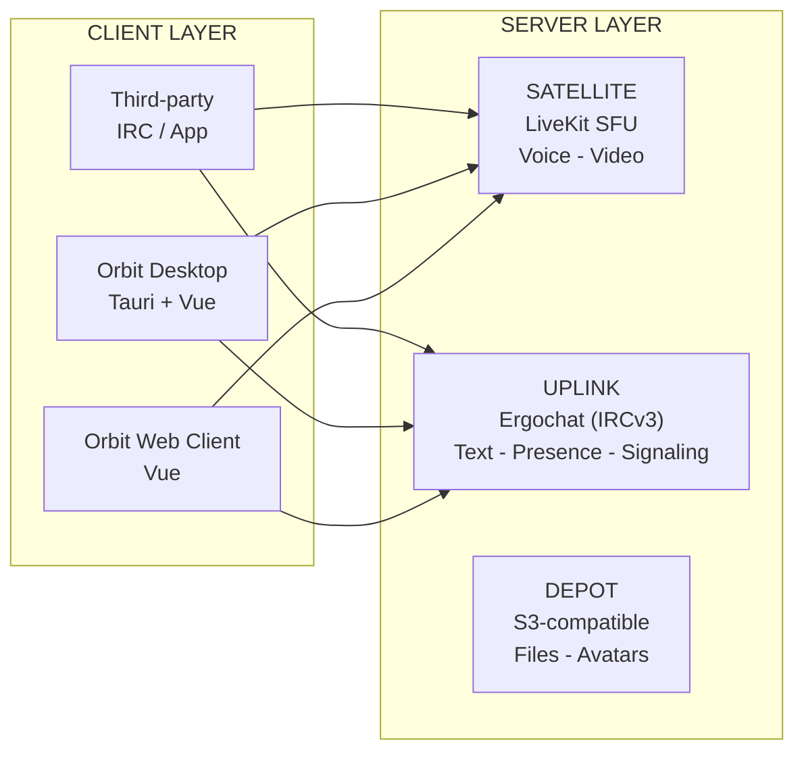
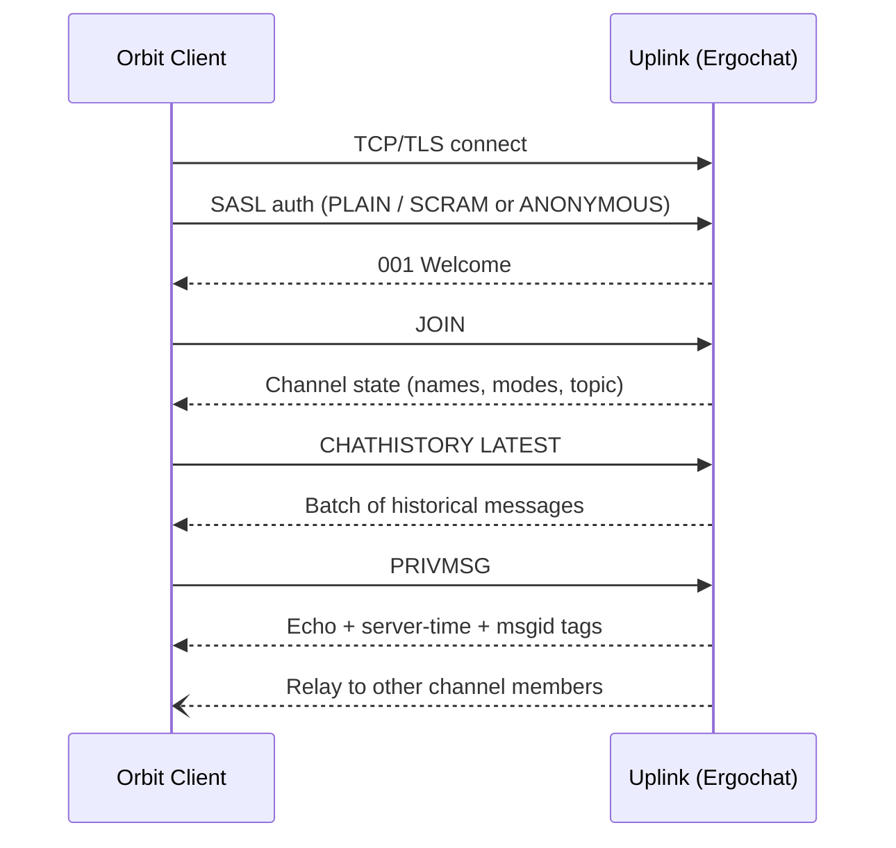
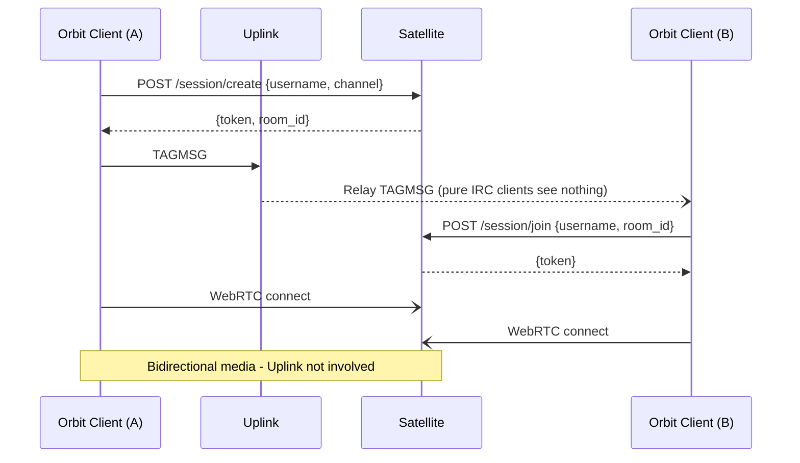
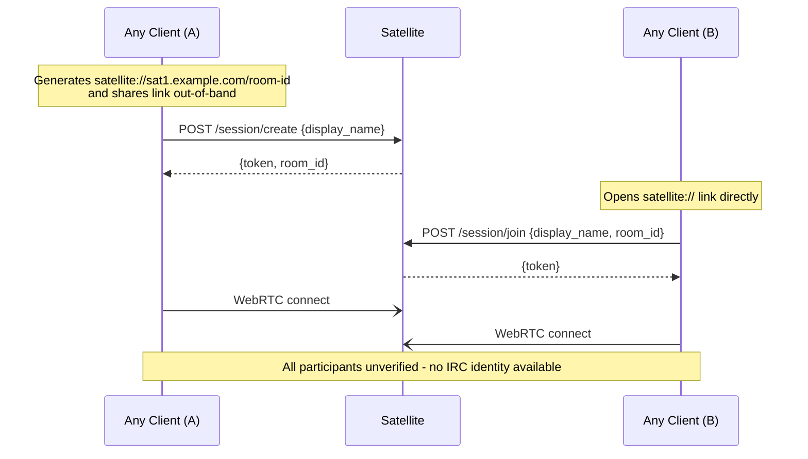

# Architecture Overview

## Overview

Orbit is a modern client layer built on IRC. It targets communities, gaming groups, and privacy-conscious users who want to own their infrastructure without giving up the accessibility that made centralized platforms the default. A single Uplink instance hosts many communities simultaneously. Channels are lightweight and porous - users belong to many at once. There are no walled-off servers, no per-community bureaucracy, and no proprietary protocol underneath.

The system is composed of four independent layers. **Uplink** is the IRC backbone - an Ergo instance running IRCv3, handling text messaging, presence, channel state, and signaling. Uplink is an adopted role: any stock IRCv3 server, with Ergo as the reference implementation. There is no Uplink fork; Orbit runs the server stock and builds its value in the client layer, Satellite, and Depot. **Satellite** is the real-time media layer - an independent WebRTC service (LiveKit SFU) handling voice, video, and streaming. **Depot** is the storage layer - a thin gateway over an S3-compatible backend or local disk for file uploads and avatars. A fourth named role, **Transponder**, refers to any OIDC-compliant identity provider the operator deploys; both Uplink and Satellite can consume it independently for identity verification. Deployments without a Transponder degrade gracefully to Ergo's built-in NickServ/SASL.

The goal of the MVP is to ship a working product. Text chat with history, group voice via Satellite, an anonymous web widget for embedding on external sites, and a lightweight desktop client. Every component must be functional enough for a small community to use daily.

This document covers the MVP architecture. Advanced features - gaming overlays, Media over QUIC transport, Leptos/WASM rewrites, federation, mobile clients, and end-to-end encryption - are deferred to the research roadmap. If a feature is not in this document, it is not in the MVP.

## System Diagram

## Components

| Component | Role | MVP Status |
|-----------|------|------------|
| [Uplink](../02-components/01-uplink/01-overview.md) | IRC text layer (Ergochat/IRCv3) - text chat, presence, channel state, and media signaling | MVP |
| [Satellite](../02-components/02-satellite.md) | Real-time media layer (LiveKit SFU) - voice, video, streaming, and ephemeral session chat | MVP |
| [Depot](../02-components/03-depot.md) | Storage layer (S3-compatible) - file uploads and avatars | MVP |
| [Transponder](../02-components/04-transponder.md) | Identity layer (OIDC) - any OIDC-compliant provider; components verify JWTs against its published keys | MVP (optional) |

## IRC Communication

All text, presence, and signaling flows through [Uplink](../02-components/01-uplink/01-overview.md) over a standard IRC connection. Orbit clients connect the same way any IRCv3 client does.

## Satellite Session Flow

[Satellite](../02-components/02-satellite.md) is a fully independent media service. Clients negotiate directly with the Satellite. Satellite can also be used **entirely without Uplink** - a third-party app or website can connect directly via a `satellite://` link with no IRC involvement.

### Via Uplink (IRC-signaled)

### Standalone (no Uplink)

In standalone mode, all participants are unverified. Ephemeral chat via LiveKit data channels is available; persistent chat is not (that requires Uplink). See [Satellite](../02-components/02-satellite.md) for the full standalone usage specification.

## Service Discovery

When a client connects to a domain, it resolves DNS SRV records to find each service: `_satellite._tcp`, `_depot._tcp`, `_transponder._tcp`. Users can also configure their own Satellite URL in settings (BYOS - Bring Your Own Satellite). See [Domain Discovery](../05-infrastructure/01-domain-discovery.md) for the full resolution rules.
