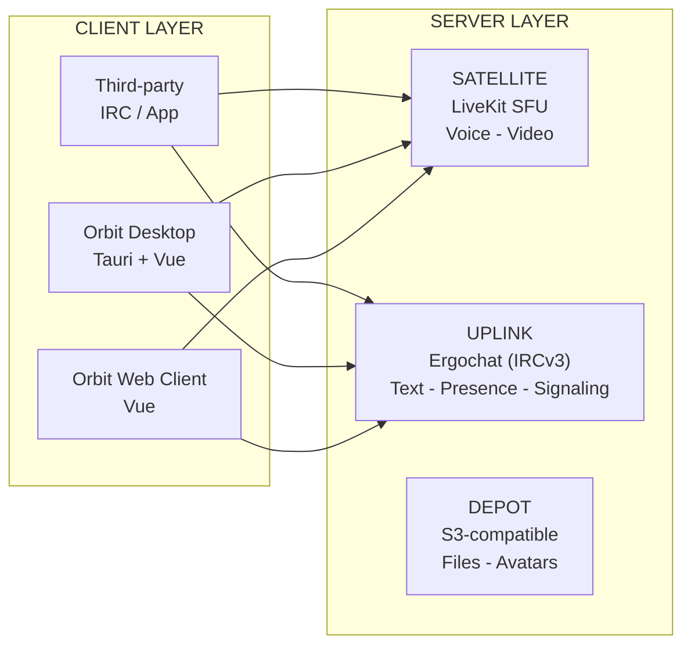

# Architecture Overview

Orbit is a client layer plus two bespoke services on top of stock
infrastructure. A single Uplink instance hosts many communities at once;
channels are lightweight and porous, and users belong to many at once. There
are no walled-off servers, no per-community bureaucracy, and no proprietary
protocol underneath.

The system is four independent layers:

- **Uplink** is the IRC backbone: any stock IRCv3 server, with Ergo as the
  reference implementation, handling text messaging, presence, channel state,
  and signaling. There is no Uplink fork; Orbit runs the server stock and
  builds its value in the client layer, Satellite, and Depot.
- **Satellite** is the real-time media layer: an independent WebRTC service
  (LiveKit SFU) handling voice, video, and streaming.
- **Depot** is the storage layer: a thin gateway over an S3-compatible
  backend or local disk for file uploads and avatars.
- **Transponder** refers to any OIDC-compliant identity provider the operator
  deploys; components verify its tokens independently. Deployments without a
  Transponder degrade gracefully to Ergo's built-in NickServ/SASL.

## System Diagram

## Components

| Component | Role |
|-----------|------|
| [Uplink](03-uplink.md) | IRC text layer (Ergochat/IRCv3) - text chat, presence, channel state, and media signaling |
| [Satellite](05-satellite.md) | Real-time media layer (LiveKit SFU) - voice, video, streaming, and ephemeral session chat |
| [Depot](06-depot.md) | Storage layer (S3-compatible or local disk) - file uploads and avatars |
| [Transponder](07-transponder.md) | Identity layer (OIDC) - any OIDC-compliant provider; components verify JWTs against its published keys |

## Component Classes

Orbit is made of two classes of parts: roles Orbit adopts and software Orbit
builds.

**Abstractions** are adopted roles fulfilled by third-party software. Orbit
specifies a contract and adopts an implementation; it doesn't build the
substance.

- **Uplink** is any stock IRCv3 server; Ergo is the reference implementation.
  Orbit adapts at the client layer where IRC has gaps
  ([Protocol Posture](02-protocol-posture.md)).
- **Transponder** is any OIDC-compliant identity provider (Keycloak,
  Authentik, Zitadel, Supabase). It's a role, not software Orbit builds.

**Components** are bespoke services Orbit builds and owns.

- **Satellite** is the real-time media product. It embeds LiveKit as the SFU
  but owns substantial bespoke logic: the session model, 1:1 P2P over IRC
  tags, moderation, discovery, and Bring Your Own Satellite. LiveKit is a
  substrate it embeds, not what Satellite is.
- **Depot** is a thin storage gateway that abstracts an S3-compatible backend
  or a local filesystem behind one contract: verify a credential, apply
  policy, and issue a pre-signed S3 URL or a proxied filesystem upload.
- **Clients** are the desktop, web, mobile, and embedded surfaces where
  product value lives.

The rule: an abstraction is Uplink or Transponder only. Satellite embeds
LiveKit and Depot abstracts S3 or disk, but both are built and owned by
Orbit.

## Components Are Independent

[Uplink](03-uplink.md), [Satellite](05-satellite.md),
[Transponder](07-transponder.md), and [Depot](06-depot.md) have no runtime
dependencies on each other. Uplink is a stock IRC server - it doesn't know
Satellite exists. Satellite is a media server - it doesn't know IRC exists.
Transponder is the adopted OIDC provider; components verify its tokens
independently against the provider's published keys (see
[Transponder](07-transponder.md) for the verification model). Depot stores
files and answers to no one.

The Orbit client is the only thing that composes these components into a
unified experience, and it doesn't require all of them. Connect to just
Uplink and you have IRC chat. Connect to just a Satellite with a join key and
you have voice. Any other client - a web page, a game, a bot - can compose a
different subset of the same components using the same interfaces.

This is why a custom protocol is the wrong answer. A custom protocol doesn't
reduce the number of services: Satellite, Depot, Transponder, coturn, and the
reverse proxy all still exist regardless of what the chat transport is. What
a custom protocol does is replace a battle-tested IRC server with something
you must maintain forever, eliminate the bot ecosystem, and re-couple every
service to every other service. Adopting a stock IRCv3 server keeps thirty
years of tooling and lets Orbit build what's missing on top.

## Extension Points

The core handles four things: text chat, real-time media, identity, and
client UX. Everything else extends Orbit at the edges - client-side Orbit
extensions built on the tag namespace, and IRC bots for server-side
automation - without touching the core. See
[Extensions](15-extensions.md).

## Service Discovery

Clients resolve a community domain's services through DNS SRV records and a
well-known discovery file; users can also configure their own Satellite (BYOS
- Bring Your Own Satellite). See [Infrastructure](12-infrastructure.md) for
the discovery model, and the implementation layer for the exact records,
resolution algorithms, and connection flows:
[deployment](../03-implementation/09-deployment.md),
[Uplink connection flow](../03-implementation/01-uplink.md), and
[Satellite session flows](../03-implementation/03-satellite.md).
