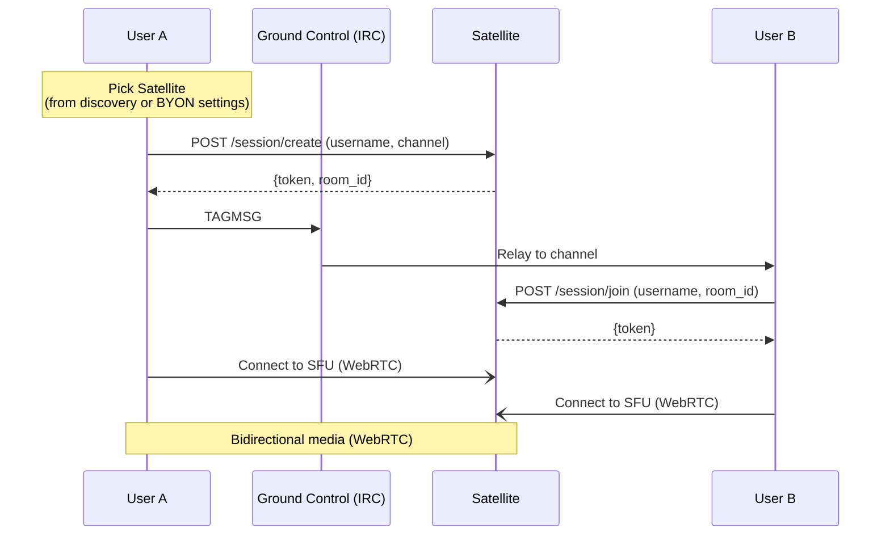
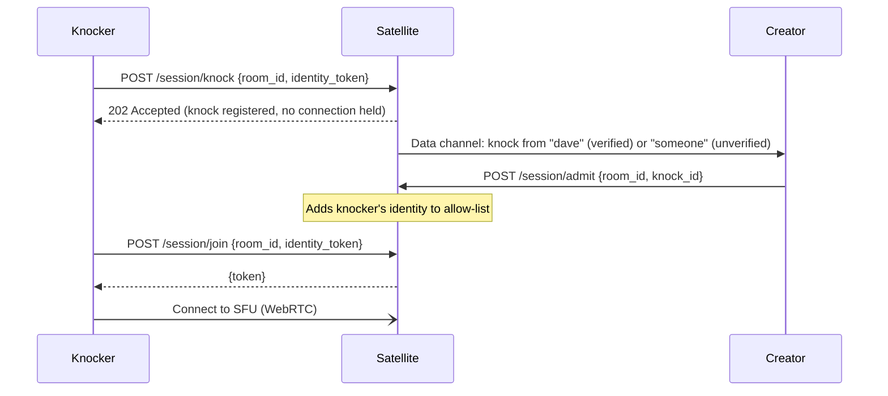

# Satellite

Satellite is the real-time media component of an Orbit deployment. It handles voice, video, screen sharing, and ephemeral in-session chat. Satellite is completely decoupled from Ground Control - it has no dependency on IRC, channels, or message history. A Satellite can be used standalone, without any Ground Control instance.

Satellite is an optional component. An Orbit deployment without Satellite is a fully functional IRC-based text chat server. When Satellite is present, it extends the experience with real-time media capabilities.

## Architecture

A Satellite deployment has two layers:

- **Satellite** - the logical service that clients interact with. Discovered via DNS SRV, queried via `/info`, addressed in `+orbit/sat-invite` tags. From the client's perspective, a Satellite is a single endpoint that hosts rooms.
- **Nodes** - individual LiveKit SFU instances within a Satellite. Each node hosts multiple concurrent rooms sharing the same resource pool. Nodes are an infrastructure detail - clients never address nodes directly.

For the MVP, a Satellite is a single node: one LiveKit process and one token service, deployed as a Docker container pair. This is analogous to a TeamSpeak or Mumble server - one process, many rooms.

For scaled deployments, a Satellite is multiple nodes behind a **gateway** - a thin routing layer that sits in front of the node pool. The gateway exposes the same API surface (`/info`, `/session/create`, `/session/join`) and routes requests to the appropriate node. Clients don't know or care how many nodes are behind the gateway.

A node consists of two co-located components:

- **SFU (LiveKit)**: Handles WebRTC media - audio/video forwarding, bandwidth adaptation, STUN/TURN integration - and data channels for ephemeral session chat.
- **Token service**: A small HTTP API that issues LiveKit-compatible JWTs for session authentication. In a single-node deployment, this is the entry point. In a multi-node deployment, this role is absorbed by the gateway.

Satellite sessions include built-in ephemeral text chat via LiveKit's data channels. This chat is **not persisted** - when the session ends, the messages are gone. It exists for in-session coordination: quick callouts during a voice call, links shared during a screen share, reactions during a stream. Persistent, searchable, historical chat lives in Ground Control (IRC). Ephemeral, throwaway chat lives in Satellite. The two are architecturally distinct and intentionally so.

## Discovery

DNS is the primary discovery mechanism for Satellites. This is an intentional architectural
choice: DNS works independently of any running service, requires no modification to the IRC server,
and allows domains without Ground Control to still advertise Satellites.

**DNS SRV discovery.** The client resolves `_satellite._tcp.example.com` SRV records. Each record
points to a Satellite's host and port. The client then queries the Satellite's metadata
endpoint (`GET /info`) to retrieve:

```json
{
  "name": "US East",
  "region": "us-east",
  "version": "0.1.0",
  "participants": 8,
  "rooms": [
    {
      "room_id": "gaming-strategy-a7f3e2",
      "participants": 5,
      "locked": false,
      "protected": false,
      "created_at": "2025-01-15T20:30:00Z",
      "initiator": "alice"
    },
    {
      "room_id": "dev-standup-b8c1d4",
      "participants": 3,
      "locked": true,
      "protected": true,
      "created_at": "2025-01-15T21:00:00Z",
      "initiator": "bob"
    }
  ]
}
```

SRV record priority and weight are respected for load balancing and failover. Multiple SRV records
can advertise multiple Satellites under the same domain.

Satellites discovered via DNS are shown with a verified badge - the domain's DNS
records are the operator's assertion that these Satellites are official.

**Fallback: no DNS records.** If no `_satellite._tcp` SRV records exist for the domain, no
server-operated Satellites are available. Voice features degrade gracefully - P2P calls still
work (they don't need a Satellite), and BYON Satellites can still be used, but group voice via
server Satellites is unavailable.

**Why not an IRC channel?** Earlier designs used a well-known IRC channel (`#orbit.satellites`) with
descriptors in the topic. DNS is preferred because: (1) it doesn't require creating or
configuring anything on the IRC server, (2) it works for domains that run Satellites without
IRC, and (3) DNS changes propagate without touching the IRC server, keeping all Orbit service
advertisement in one authoritative place.

For the canonical DNS SRV record definitions and the full client resolution algorithm, see
[DNS & Service Discovery](../05-infrastructure/01-domain-discovery.md).

## Bring Your Own Satellite (BYON)

Users can add their own Satellite URL in Orbit's settings. When starting a session, they choose their own Satellite instead of a server-advertised one. The `+orbit/sat-invite` posted to the channel includes the Satellite URL, so other participants connect to the user's Satellite.

- BYON Satellites appear in the UI as "Community" (no verified badge).
- The server operator cannot block BYON usage - Orbit clients can always choose their own Satellite. The IRC server just passes the tags.
- This enables voice in communities where the server operator hasn't set up any Satellite infrastructure. Two users on any IRCv3 server with message tags can use voice if one of them hosts a Satellite.

## Trust Model

| Type                | Discovery                      | UI Treatment                         | Trust Level      |
|---------------------|--------------------------------|--------------------------------------|------------------|
| Server Satellite    | DNS SRV (`_satellite._tcp`)    | Verified badge, shown by default     | Operator-trusted |
| Community Satellite | BYON, posted via invite        | "Community" label, no badge          | User-discretion  |

Orbit clients display a clear indicator when joining a community Satellite. The user must confirm before connecting to an unknown Satellite for the first time - similar to SSH host key confirmation. Once a user has accepted a BYON Satellite, the client remembers that decision.

## Voice Session Flow - Group



The `+orbit/sat-invite` payload is a base64-encoded JSON object:

```json
{
  "node": "https://sat1.example.com",
  "room": "gaming-strategy-a7f3e2",
  "initiator": "alice",
  "started": "2025-01-15T20:30:00Z",
  "protected": false
}
```

When `"protected": true`, the session is password-protected. The Orbit client displays a password
prompt before attempting to join. The password is sent to the Satellite's token service in the
`/session/join` request - if it matches, a token is issued; if not, the join is rejected. The
password is never sent over IRC.

Password-protected sessions are useful for private meetings, restricted briefings, or any case where
the session should be visible in the channel (so people know it exists) but not freely joinable. The
session creator sets the password when creating the session; it can be shared out-of-band (DM,
external chat, etc.).

### Error Handling and Edge Cases

- **Unreachable Satellite**: If the Satellite in a `+orbit/sat-invite` is unreachable, the client
  displays an error ("Satellite unavailable") and does not join. The invite remains visible in the
  channel with an "offline" indicator.
- **Token rejection**: If the token service rejects a join request (invalid key, session full,
  password wrong), the client shows the specific error reason returned by the token service.
- **Satellite crash during session**: If a Satellite goes down during an active session, all
  participants are disconnected. The client shows "Voice session ended unexpectedly." There is no
  automatic migration in the MVP - the session initiator (or any participant) must
  start a new session and post a new `+orbit/sat-invite`.
- **Competing invites**: If multiple users post `+orbit/sat-invite` for the same channel
  simultaneously (different Satellites or different rooms), the Orbit client displays all active sessions.
  Users choose which to join. There is no "one active session per channel" constraint - multiple
  concurrent voice sessions in the same channel are valid (e.g., different sub-groups).

## 1-on-1 Calls - P2P

Private connections between two users bypass Satellite entirely. The Orbit client establishes a direct WebRTC connection using IRC only for the initial handshake - a single message in each direction. All further negotiation happens over the WebRTC data channel, independent of Ground Control.

### Handshake

The initiator sends a `TAGMSG` to the recipient's nickname with a `+orbit/p2p-offer` tag containing a compact handshake payload:

```json
{
  "intent": "call",
  "ice_ufrag": "abcd",
  "ice_pwd": "longRandomString",
  "dtls_fingerprint": "sha-256 AA:BB:CC:...",
  "dtls_role": "actpass",
  "candidate": "candidate:1 1 udp 2122260223 203.0.113.5 54321 typ host"
}
```

The recipient's client displays the incoming request based on the `intent` field - "Alice wants to start a voice call" or "Bob wants to send you a file." If accepted, the recipient responds with a `+orbit/p2p-answer` tag containing the same fields (their own ICE credentials, DTLS fingerprint, and a candidate). That's it - two IRC messages total, ~300–400 bytes each. Ground Control's involvement ends here.

### Intent

The `intent` field declares the purpose of the connection and determines the client UX:

| Intent | Initial UI | Can escalate to | Session ends when |
|--------|-----------|-----------------|-------------------|
| `call` | Voice call | + video, + screen share, + chat, + file transfer | Either party hangs up |
| `video` | Video call | + screen share, + chat, + file transfer | Either party hangs up |
| `chat` | Ephemeral DM chat window | + call, + video, + file transfer | Either party closes the window |
| `file` | File transfer dialog | Nothing - single purpose | Transfer completes or is cancelled |

The intent sets the **starting state**, not a permanent constraint. A voice call can escalate to video, add screen sharing, or open a side chat - all negotiated over the WebRTC data channel. A file transfer is transactional: it completes and the connection tears down.

### Post-Handshake Negotiation

Once the WebRTC data channel is open, all further signaling happens over the direct connection:

- **Media negotiation**: Codec selection (Opus for audio, VP9 for video), adding/removing tracks, changing resolution - standard WebRTC renegotiation via SDP offer/answer exchanged over the data channel.
- **ICE trickling**: Additional ICE candidates are exchanged over the data channel, not IRC. If the initial candidate doesn't work (e.g., symmetric NAT), TURN relay candidates are sent through the data channel to establish a relayed path.
- **Escalation**: Adding video to a voice call, starting a screen share, or opening a file transfer - all negotiated over the data channel.

This design means that after the initial two-message handshake, the P2P connection is **fully self-sufficient**. Ground Control can go down, the entire Orbit infrastructure can be offline - the session continues. The only thing that requires IRC is starting a *new* connection.

### TURN Fallback

If direct connectivity fails (both peers behind symmetric NATs), the connection falls back to a TURN relay. Unlike the direct P2P case, a TURN-relayed session depends on the TURN server remaining available - if the TURN server goes down, the call drops. However, ICE restart candidates can be exchanged over the data channel to attempt a new path without re-involving IRC.

### Privacy Note

P2P handshake signaling is relayed through Ground Control (IRC). The IRC server operator can observe who is connecting to whom, the intent (call, video, chat, file), and the initial ICE candidate (which reveals one public IP per peer). This is consistent with the trust model for text chat - the server operator can already read message content. Post-handshake, the operator sees nothing - all media and further signaling flows directly between peers. Users who do not trust the server operator with connection metadata should use a Satellite for group calls instead, where signaling metadata is limited to the `+orbit/sat-invite` tag visible in the channel.

### No SDP over IRC

Earlier iterations of this design sent full SDP offers over IRC tags. SDPs are large (~2–3 KB for audio+video) due to exhaustive codec enumeration, which created pressure on the IRCv3 tag budget (4,094 bytes for client tags) and Ergochat's flood protection. The handshake-first model eliminates this entirely - the IRC payload contains only connection credentials (~300 bytes), and full SDP negotiation happens over the data channel where there are no size constraints.

## Satellite Authentication

Each Satellite runs a token service (or gateway, in multi-node deployments) - a small HTTP API that issues LiveKit-compatible JWTs scoped to a room and identity.

- **OIDC identity verification**: When the domain's OIDC identity provider is configured (the [Transponder](04-transponder.md) role), the token service verifies the client's JWT against the provider's JWKS endpoint. If valid, the issued LiveKit JWT includes `verified: true` and the authenticated account name. If no identity token is presented, the participant joins as unverified.
- **BYON Satellites**: The operator controls auth entirely. They issue tokens however they see fit.
- **Password-protected sessions**: When a session is created with a password, the token service stores the password hash for that room. Clients joining a protected session must include the password in their `/session/join` request. The token service verifies it before issuing a JWT. This is per-session, not per-Satellite - the same Satellite can host both open and protected sessions simultaneously.
- **No identity provider configured**: The token service issues tokens to anyone who can reach the Satellite. All participants are unverified. Sessions can still be password-protected.

## Session Permissions

Session permissions are minimal and creator-centric. The user who creates a session is the **session admin**. The creator can delegate moderation to other verified users, but there are no role hierarchies beyond creator and moderator, and no persistent moderation state - sessions are ephemeral.

**All session configuration is client-driven.** The creator's Orbit client sends the moderator list, allow-list, access mode, and lock state to the token service at session creation time (and can update them during the session). The Satellite holds this state only for the duration of the session - when the session ends, everything is gone. No server, no component persists session permissions. If the creator wants the same moderators and allow-list next time, their client provides them again. The Orbit client may store these preferences locally (e.g., "my usual moderators for #gaming"), but that is a client convenience - the server never stores it.

| Role | How you get it | Capabilities |
|------|---------------|--------------|
| **Creator** | Called `/session/create` | Mute participants, kick participants (including moderators), set/change session password, lock/unlock session, manage allow-list, end session |
| **Moderator** | Designated by the creator (see [Creator-Delegated Moderation](#creator-delegated-moderation)) | Mute participants, kick participants (but cannot kick the creator), lock/unlock session, admit knockers |
| **Participant** | Joined via `/session/join` | Publish and subscribe to media, send ephemeral chat |

The creator's LiveKit JWT is issued with the `roomAdmin` grant, which LiveKit enforces natively - mute and kick are built-in LiveKit operations, not custom Orbit logic.

**If you don't like how a room is run, make your own.** There is no appeals process, no override mechanism, no server-operator intervention in session moderation. The creator has full authority for the duration of the session. When the session ends, all permissions disappear.

### Creator-Delegated Moderation

A session creator can optionally designate other verified users as **co-moderators** at session creation time or during the session. This is done by specifying a list of account identities (from the OIDC provider) that should receive `roomAdmin` grants when they join:

```json
POST /session/create
{
  "username": "zealsprince",
  "channel": "#gaming",
  "moderators": ["alice", "bob"]
}
```

When `alice` or `bob` join with a verified identity token matching those accounts, the token service issues their LiveKit JWT with the `roomAdmin` grant. Unverified users cannot receive delegated moderation - identity must be provable.

This is optional. If no `moderators` list is provided, only the creator has admin privileges.

### Session Access Control

The session creator controls who can join. Three access modes, configurable at creation time and adjustable during the session:

| Mode | Behavior | Use case |
|------|----------|----------|
| **Open** | Anyone with the invite can join (default) | Casual channel voice, open hangouts |
| **Password-protected** | Must present the correct password to join | Private meetings, restricted briefings |
| **Allow-list** | Only specified verified identities can join | Trusted-group sessions, team calls |

The creator can also **lock** a session at any time. A locked session rejects all new join requests regardless of access mode - participants already in the room stay, but nobody new gets in. The creator can unlock at any time.

```json
POST /session/create
{
  "username": "zealsprince",
  "channel": "#gaming",
  "access": "allow-list",
  "allowed": ["alice", "bob", "charlie"]
}
```

When `access` is `"allow-list"`, only verified users whose account identity matches an entry in `allowed` can join. Unverified users are always rejected in allow-list mode - identity must be provable.

**Locking mid-session:**

```json
POST /session/lock
{
  "room_id": "gaming-strategy-a7f3e2",
  "locked": true
}
```

Only the session creator (or a co-moderator) can lock/unlock.

#### Knocking

When a session is locked or restricted (password-protected or allow-listed), a user who is rejected can **knock** - a request to be let in. The knock is delivered to the session creator (and co-moderators) as a LiveKit data channel message. The creator can admit or ignore the knock.



The knock is a plain HTTP request - the knocker does not hold a connection or consume any SFU resources while waiting. After knocking, the client polls or retries `/session/join` periodically. Once the creator admits the knocker (which adds their identity to the session's allow-list), the next join attempt succeeds and the knocker receives a token and connects to the SFU.

Knocking is best-effort. If no one responds, the knock expires silently after a reasonable timeout (e.g., 60 seconds). There is no queue, no persistent connection, no waiting room - it's a doorbell.

## STUN/TURN

- Self-hosted `coturn` is the default recommendation for NAT traversal.
- For Kubernetes deployments, **STUNner** is the recommended STUN/TURN layer - it integrates with
  the Kubernetes networking model and handles NAT traversal for WebRTC traffic exiting the cluster.
  STUNner is also the recommended layer when operating Satellite at scale (see
  [Scaling](#scaling) below).
- LiveKit is configured to use the TURN server for candidates.
- For P2P calls, the client is configured with the same STUN/TURN servers.
- Public STUN servers (e.g., Google's) may be used as a fallback, but self-hosted is preferred to
  avoid leaking metadata.

## Codec Defaults

| Media | Codec | Bitrate (default)                       | Notes                                                              |
|-------|-------|-----------------------------------------|--------------------------------------------------------------------|
| Audio | Opus  | 64 kbps (voice), 128 kbps (music mode) | Mandatory. No alternative in the MVP.                              |
| Video | VP9   | Adaptive (300–2500 kbps)               | SVC profile for bandwidth adaptation. AV1 is a post-MVP option.   |

## Scope Boundary

One media transport stack for the MVP: WebRTC via LiveKit (group) and native browser/Tauri WebRTC
(P2P), supporting voice and video. No MoQ, no Iroh, no custom transport experiments. Those are
tracked in [Research: MoQ / Iroh](../07-research/01-moq-iroh.md).

## Standalone Satellite Usage

Satellites are fully independent services. They can be used without Ground Control (IRC)
entirely. Two users can connect to a Satellite for voice, video, and ephemeral chat without any
IRC server involvement.

The bootstrapping mechanism is a direct link:

```
satellite://sat1.example.com/room-id?name=Hangout
```

The `satellite://` URI scheme is dedicated exclusively to Satellite standalone links and is
registered separately from `orbit://`. URI scheme registration details (platform-specific registry
entries, `.desktop` files, `Info.plist` entries) are covered in
[Desktop Client - Custom URI Scheme](../04-clients/01-desktop.md#custom-uri-scheme).

User A creates a session on a Satellite, generates a shareable link, and sends it out-of-band
(text message, email, another chat platform). User B opens the link, the Orbit client connects
directly to the Satellite's token service, obtains a JWT, and joins the session.

Use cases that do not require IRC infrastructure:

- **Quick voice calls** between friends who share a Satellite link
- **Embedded voice** on websites using only a Satellite (no IRC backend)
- **BYON-only communities** where users host their own Satellite and share room links
- **Bootstrapping new communities** before setting up a full Ground Control instance

In standalone mode, all participants are unverified - there is no OIDC identity provider ([Transponder](04-transponder.md))
or IRC identity to verify against. Ephemeral chat via LiveKit data channels is available; persistent
chat is not (that requires Ground Control). This is an intentional, honest trade-off - the
experience is reduced but functional.

### Standalone Authentication

When a user opens a `satellite://` link, the Satellite operates without Ground Control - but identity verification is still possible if the Satellite's domain has a discoverable identity provider.

The client-side flow:

1. User opens `satellite://sat.example.com/room-id`.
2. The client extracts the domain (`example.com`) and attempts service discovery - checking `/.well-known/orbit/services.json` or `_transponder._tcp.example.com` for an identity provider endpoint.
3. If a Transponder is discovered, the client offers the user the option to authenticate via the OIDC provider's Authorization Code flow.
4. If the user authenticates, the client presents the resulting JWT to the Satellite's token service alongside the `/session/join` request. The token service verifies the JWT against the provider's JWKS and issues a LiveKit token with `verified: true` and the authenticated account name.
5. If the user declines authentication or no Transponder is discovered, the client falls back to the unverified join flow (display name only, no identity badge).

This means standalone Satellite sessions can have a mix of verified and unverified participants - the same model as IRC-signaled sessions. The Satellite itself doesn't need to know about Ground Control; it only needs the OIDC provider's JWKS endpoint to verify tokens, which it fetches and caches independently.

The identity provider used for standalone authentication is always the one associated with the **Satellite's domain**, not the user's home domain. Cross-domain identity verification is a federation concern and is out of scope (see [Research: Federation](../07-research/05-federation.md)).

## Session Limits

Satellite does not impose a hardcoded participant cap. Session capacity is bounded by the underlying node hardware - primarily network bandwidth, then CPU.

LiveKit (the MVP SFU) has no built-in participant limit per room. A single node hosts multiple concurrent rooms, each drawing from the same resource pool. The practical ceiling for a single node depends on the session profile:

| Session profile | Approximate capacity (single node, 1 Gbps link) |
|---|---|
| Audio-only (Opus, ~50 kbps/participant) | ~200–500 participants |
| Mixed audio + video (360p, ~500 kbps/participant) | ~50 participants |
| Mixed audio + video (720p, ~1.5 Mbps/participant) | ~20–30 participants |

These are rough estimates based on aggregate bandwidth. Actual capacity depends on the node's NIC throughput, CPU (for SRTP encryption), and LiveKit's simulcast configuration. Audio-only sessions are dramatically cheaper than video sessions.

When a node cannot accept more participants (resource exhaustion or operator-configured limit), the token service rejects `/session/join` requests with an appropriate error. In a multi-node deployment, the gateway routes new sessions to nodes with available capacity rather than rejecting outright.

Communities that need to address audiences larger than a single Satellite can support should use a one-to-many streaming setup rather than a voice session - Satellite is a communication tool, not a broadcasting platform.

## Scaling

**MVP: single node.** A Satellite is one LiveKit instance and one token service, deployed as Docker containers. It hosts multiple concurrent rooms up to its hardware ceiling. The DNS SRV record points to it. This is sufficient for small to mid-sized communities.

**Scaling up: multi-node with gateway.** When a single node isn't enough, the operator deploys additional LiveKit instances behind a gateway. The gateway is a thin routing layer that:

1. Exposes the same API surface (`/info`, `/session/create`, `/session/join`) as a single-node deployment - clients see no difference.
2. Routes `/session/create` to the least-loaded node.
3. Routes `/session/join` to the node hosting the target room.
4. Aggregates room and participant data for the `/info` endpoint.

Room affinity is inherent - a room lives on one node for its entire lifetime. The gateway tracks which rooms are on which nodes.

**Scaling down: drain and retire.** When load decreases, the gateway stops routing new sessions to the least-busy nodes. Once all rooms on a node have naturally ended (all participants left), the node is retired. At least one node always remains active. This model works naturally with Kubernetes pod autoscaling - scale up by adding pods, scale down by draining and terminating idle pods.

**Kubernetes.** K8s is the recommended deployment model for multi-node Satellites. It provides pod autoscaling, health-based routing, and graceful drain on scale-down. STUNner (see [STUN/TURN](#stunturn)) is the recommended NAT traversal layer for K8s deployments. Single-node deployments do not require K8s - Docker Compose is sufficient.

## Cross-References

- [DNS & Service Discovery](../05-infrastructure/01-domain-discovery.md) - canonical SRV record definitions
  and client resolution algorithm
- [Desktop Client](../04-clients/01-desktop.md) - `orbit://` and `satellite://` URI scheme registration
- [Transponder](04-transponder.md) - post-MVP OIDC-based identity verification for Satellite sessions
- [Research: MoQ / Iroh](../07-research/01-moq-iroh.md) - post-MVP media transport research track
