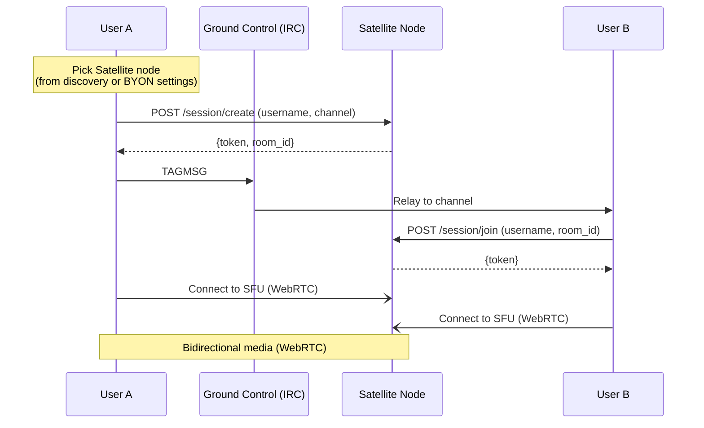
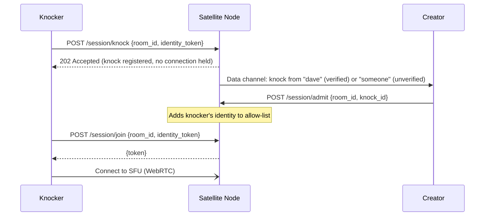

# Satellite

Satellite is the real-time media component of an Orbit deployment. It handles voice, video, screen
sharing, and ephemeral in-session chat. Satellite nodes are completely decoupled from Ground Control
- they have no dependency on IRC, channels, or message history. A Satellite node can be used
standalone, without any Ground Control instance.

Satellite is an optional component. An Orbit deployment without Satellite is a fully functional
IRC-based text chat server. When Satellite is present, it extends the experience with real-time
media capabilities.

## What Is a Satellite Node

A Satellite node is an independent real-time service that handles voice, video, streaming, and
ephemeral chat. Under the hood, it is an SFU (LiveKit for the MVP) with a lightweight token service
for authentication. Satellite nodes are completely decoupled from Ground Control - they don't need
to know about IRC, channels, or message history. They handle real-time sessions only.

Satellite sessions include built-in ephemeral text chat via LiveKit's data channels. This chat is
**not persisted** - when the session ends, the messages are gone. It exists for in-session
coordination: quick callouts during a voice call, links shared during a screen share, reactions
during a stream. Persistent, searchable, historical chat lives in Ground Control (IRC). Ephemeral,
throwaway chat lives in Satellite. The two are architecturally distinct and intentionally so.

A Satellite node consists of two components:

- **SFU (LiveKit)**: Handles WebRTC media - audio/video forwarding, bandwidth adaptation,
  STUN/TURN integration - and data channels for ephemeral session chat.
- **Token service**: A small HTTP API co-located with the SFU that issues LiveKit-compatible JWTs
  for session authentication.

## Node Discovery

DNS is the primary discovery mechanism for Satellite nodes. This is an intentional architectural
choice: DNS works independently of any running service, requires no modification to the IRC server,
and allows domains without Ground Control to still advertise Satellite nodes.

**DNS SRV discovery.** The client resolves `_satellite._tcp.example.com` SRV records. Each record
points to a Satellite node's host and port. The client then queries each discovered node's metadata
endpoint (`GET /info`) to retrieve:

```json
{
  "name": "US East",
  "region": "us-east",
  "capacity": { "current": 12, "max": 64 },
  "version": "0.1.0"
}
```

SRV record priority and weight are respected for load balancing and failover. Multiple SRV records
can advertise multiple nodes under the same domain.

Nodes discovered via DNS are shown as "Server Nodes" with a verified badge - the domain's DNS
records are the operator's assertion that these nodes are official.

**Fallback: no DNS records.** If no `_satellite._tcp` SRV records exist for the domain, no
server-operated Satellite nodes are available. Voice features degrade gracefully - P2P calls still
work (they don't need a Satellite node), and BYON nodes can still be used, but group voice via
server nodes is unavailable.

**Why not an IRC channel?** Earlier designs used a well-known IRC channel (`#orbit.satellites`) with
node descriptors in the topic. DNS is preferred because: (1) it doesn't require creating or
configuring anything on the IRC server, (2) it works for domains that run Satellite nodes without
IRC, and (3) DNS changes propagate without touching the IRC server, keeping all Orbit service
advertisement in one authoritative place.

For the canonical DNS SRV record definitions and the full client resolution algorithm, see
[DNS & Service Discovery](../05-infrastructure/01-domain-discovery.md).

## Bring Your Own Node (BYON)

Users can add their own Satellite node URL in Orbit's settings. When starting a session, they choose
their own node instead of a server-advertised one. The `+orbit/sat-invite` posted to the channel
includes the node URL, so other participants connect to the user's node.

- BYON nodes appear in the UI as "Community Node" or "User Node" (no verified badge).
- The server operator cannot block BYON usage - Orbit clients can always choose their own node.
  The IRC server just passes the tags.
- This enables voice in communities where the server operator hasn't set up any Satellite
  infrastructure. Two users on any IRCv3 server with message tags can use voice if one of them
  hosts a Satellite node.

## Node Trust Model

| Node Type           | Discovery                      | UI Treatment                         | Trust Level      |
|---------------------|--------------------------------|--------------------------------------|------------------|
| Server Node         | DNS SRV (`_satellite._tcp`)    | Verified badge, shown by default     | Operator-trusted |
| User/Community Node | BYON, posted via invite        | "Community" label, no badge          | User-discretion  |

Orbit clients display a clear indicator when joining a non-server node. The user must confirm before
connecting to an unknown node for the first time - similar to SSH host key confirmation. Once a user
has accepted a BYON node, the client remembers that decision.

## Voice Session Flow - Group



The `+orbit/sat-invite` payload is a base64-encoded JSON object:

```json
{
  "node": "https://sat1.example.com",
  "room": "gaming-strategy-a7f3e2",
  "initiator": "alice",
  "started": "2025-01-15T20:30:00Z",
  "protected": false
}
```

When `"protected": true`, the session is password-protected. The Orbit client displays a password
prompt before attempting to join. The password is sent to the Satellite node's token service in the
`/session/join` request - if it matches, a token is issued; if not, the join is rejected. The
password is never sent over IRC.

Password-protected sessions are useful for private meetings, restricted briefings, or any case where
the session should be visible in the channel (so people know it exists) but not freely joinable. The
session creator sets the password when creating the session; it can be shared out-of-band (DM,
external chat, etc.).

### Error Handling and Edge Cases

- **Unreachable node**: If the Satellite node in a `+orbit/sat-invite` is unreachable, the client
  displays an error ("Voice node unavailable") and does not join. The invite remains visible in the
  channel with a "node offline" indicator.
- **Token rejection**: If the token service rejects a join request (invalid key, session full,
  password wrong), the client shows the specific error reason returned by the token service.
- **Node crash during session**: If a Satellite node goes down during an active session, all
  participants are disconnected. The client shows "Voice session ended unexpectedly." There is no
  automatic migration to another node in the MVP - the session initiator (or any participant) must
  start a new session on a different node and post a new `+orbit/sat-invite`.
- **Competing invites**: If multiple users post `+orbit/sat-invite` for the same channel
  simultaneously (different nodes or different rooms), the Orbit client displays all active sessions.
  Users choose which to join. There is no "one active session per channel" constraint - multiple
  concurrent voice sessions in the same channel are valid (e.g., different sub-groups).

## 1-on-1 Calls - P2P

Private calls between two users bypass Satellite entirely:

1. Caller sends `+orbit/sdp-offer` via `TAGMSG` to the callee's nickname.
2. Callee responds with `+orbit/sdp-answer`.
3. ICE candidates are exchanged via `+orbit/ice-candidate` tags.
4. A direct P2P WebRTC connection is established.
5. If P2P fails (symmetric NAT), fall back to a TURN relay.

No server processes media for 1-on-1 calls. The only server involvement is signaling relay through
Ground Control.

**Privacy note:** P2P call signaling is relayed through Ground Control (IRC). The IRC server
operator can observe who is calling whom, ICE candidates (which may reveal IP addresses including
local/private IPs), and SDP content (codec preferences, media capabilities). This is consistent with
the trust model for text chat - the server operator can already read message content. Users who do
not trust the server operator with call metadata should use a Satellite node for group calls instead,
where signaling metadata is limited to the `+orbit/sat-invite` tag visible in the channel.

## Satellite Authentication

Each Satellite node runs a token service (a small HTTP API) that issues LiveKit-compatible JWTs scoped to a room and identity.

- **OIDC identity verification**: When the domain's OIDC identity provider is configured (the [Transponder](../02-components/04-transponder.md) role), the token service verifies the client's JWT against the provider's JWKS endpoint. If valid, the issued LiveKit JWT includes `verified: true` and the authenticated account name. If no identity token is presented, the participant joins as unverified.
- **BYON nodes**: The node operator controls auth entirely. They issue tokens however they see fit.
- **Password-protected sessions**: When a session is created with a password, the token service stores the password hash for that room. Clients joining a protected session must include the password in their `/session/join` request. The token service verifies it before issuing a JWT. This is per-session, not per-node — the same node can host both open and protected sessions simultaneously.
- **No identity provider configured**: The token service issues tokens to anyone who can reach the node. All participants are unverified. Sessions can still be password-protected.

## Session Permissions

Session permissions are minimal and creator-centric. The user who creates a session is the **session admin**. The creator can delegate moderation to other verified users, but there are no role hierarchies beyond creator and moderator, and no persistent moderation state — sessions are ephemeral.

**All session configuration is client-driven.** The creator's Orbit client sends the moderator list, allow-list, access mode, and lock state to the token service at session creation time (and can update them during the session). The Satellite node holds this state only for the duration of the session — when the session ends, everything is gone. No server, no node, no component persists session permissions. If the creator wants the same moderators and allow-list next time, their client provides them again. The Orbit client may store these preferences locally (e.g., "my usual moderators for #gaming"), but that is a client convenience — the server never stores it.

| Role | How you get it | Capabilities |
|------|---------------|--------------|
| **Creator** | Called `/session/create` | Mute participants, kick participants (including moderators), set/change session password, lock/unlock session, manage allow-list, end session |
| **Moderator** | Designated by the creator (see [Creator-Delegated Moderation](#creator-delegated-moderation)) | Mute participants, kick participants (but cannot kick the creator), lock/unlock session, admit knockers |
| **Participant** | Joined via `/session/join` | Publish and subscribe to media, send ephemeral chat |

The creator's LiveKit JWT is issued with the `roomAdmin` grant, which LiveKit enforces natively — mute and kick are built-in LiveKit operations, not custom Orbit logic.

**If you don't like how a room is run, make your own.** There is no appeals process, no override mechanism, no server-operator intervention in session moderation. The creator has full authority for the duration of the session. When the session ends, all permissions disappear.

### Creator-Delegated Moderation

A session creator can optionally designate other verified users as **co-moderators** at session creation time or during the session. This is done by specifying a list of account identities (from the OIDC provider) that should receive `roomAdmin` grants when they join:

```json
POST /session/create
{
  "username": "zealsprince",
  "channel": "#gaming",
  "moderators": ["alice", "bob"]
}
```

When `alice` or `bob` join with a verified identity token matching those accounts, the token service issues their LiveKit JWT with the `roomAdmin` grant. Unverified users cannot receive delegated moderation — identity must be provable.

This is optional. If no `moderators` list is provided, only the creator has admin privileges.

### Session Access Control

The session creator controls who can join. Three access modes, configurable at creation time and adjustable during the session:

| Mode | Behavior | Use case |
|------|----------|----------|
| **Open** | Anyone with the invite can join (default) | Casual channel voice, open hangouts |
| **Password-protected** | Must present the correct password to join | Private meetings, restricted briefings |
| **Allow-list** | Only specified verified identities can join | Trusted-group sessions, team calls |

The creator can also **lock** a session at any time. A locked session rejects all new join requests regardless of access mode — participants already in the room stay, but nobody new gets in. The creator can unlock at any time.

```json
POST /session/create
{
  "username": "zealsprince",
  "channel": "#gaming",
  "access": "allow-list",
  "allowed": ["alice", "bob", "charlie"]
}
```

When `access` is `"allow-list"`, only verified users whose account identity matches an entry in `allowed` can join. Unverified users are always rejected in allow-list mode — identity must be provable.

**Locking mid-session:**

```json
POST /session/lock
{
  "room_id": "gaming-strategy-a7f3e2",
  "locked": true
}
```

Only the session creator (or a co-moderator) can lock/unlock.

#### Knocking

When a session is locked or restricted (password-protected or allow-listed), a user who is rejected can **knock** — a request to be let in. The knock is delivered to the session creator (and co-moderators) as a LiveKit data channel message. The creator can admit or ignore the knock.



The knock is a plain HTTP request — the knocker does not hold a connection or consume any SFU resources while waiting. After knocking, the client polls or retries `/session/join` periodically. Once the creator admits the knocker (which adds their identity to the session's allow-list), the next join attempt succeeds and the knocker receives a token and connects to the SFU.

Knocking is best-effort. If no one responds, the knock expires silently after a reasonable timeout (e.g., 60 seconds). There is no queue, no persistent connection, no waiting room — it's a doorbell.

## STUN/TURN

- Self-hosted `coturn` is the default recommendation for NAT traversal.
- For Kubernetes deployments, **STUNner** is the recommended STUN/TURN layer - it integrates with
  the Kubernetes networking model and handles NAT traversal for WebRTC traffic exiting the cluster.
  STUNner is also the recommended layer when operating Satellite at scale (see
  [Scaling](#scaling) below).
- LiveKit is configured to use the TURN server for candidates.
- For P2P calls, the client is configured with the same STUN/TURN servers.
- Public STUN servers (e.g., Google's) may be used as a fallback, but self-hosted is preferred to
  avoid leaking metadata.

## Codec Defaults

| Media | Codec | Bitrate (default)                       | Notes                                                              |
|-------|-------|-----------------------------------------|--------------------------------------------------------------------|
| Audio | Opus  | 64 kbps (voice), 128 kbps (music mode) | Mandatory. No alternative in the MVP.                              |
| Video | VP9   | Adaptive (300–2500 kbps)               | SVC profile for bandwidth adaptation. AV1 is a post-MVP option.   |

## Scope Boundary

One media transport stack for the MVP: WebRTC via LiveKit (group) and native browser/Tauri WebRTC
(P2P), supporting voice and video. No MoQ, no Iroh, no custom transport experiments. Those are
tracked in [Research: MoQ / Iroh](../07-research/01-moq-iroh.md).

## Standalone Satellite Usage

Satellite nodes are fully independent services. They can be used without Ground Control (IRC)
entirely. Two users can connect to a Satellite node for voice, video, and ephemeral chat without any
IRC server involvement.

The bootstrapping mechanism is a direct link:

```
satellite://sat1.example.com/room-id?name=Hangout
```

The `satellite://` URI scheme is dedicated exclusively to Satellite standalone links and is
registered separately from `orbit://`. URI scheme registration details (platform-specific registry
entries, `.desktop` files, `Info.plist` entries) are covered in
[Desktop Client - Custom URI Scheme](../04-clients/01-desktop.md#custom-uri-scheme).

User A creates a session on a Satellite node, generates a shareable link, and sends it out-of-band
(text message, email, another chat platform). User B opens the link, the Orbit client connects
directly to the Satellite's token service, obtains a JWT, and joins the session.

Use cases that do not require IRC infrastructure:

- **Quick voice calls** between friends who share a Satellite link
- **Embedded voice** on websites using only a Satellite node (no IRC backend)
- **BYON-only communities** where users host their own Satellite and share room links
- **Bootstrapping new communities** before setting up a full Ground Control instance

In standalone mode, all participants are unverified - there is no OIDC identity provider ([Transponder](../02-components/04-transponder.md))
or IRC identity to verify against. Ephemeral chat via LiveKit data channels is available; persistent
chat is not (that requires Ground Control). This is an intentional, honest trade-off - the
experience is reduced but functional.

## Session Limits

Each Satellite session supports a maximum of **64 concurrent participants**. This limit applies per room, not per node - a single node can host multiple concurrent rooms each up to the 64-participant ceiling.

This is a deliberate design constraint, not a hardware limit. Orbit is a communication tool for communities, not a broadcasting platform. The 64-participant ceiling keeps sessions intimate and avoids the complexity of large-scale media routing. Communities that need to address larger audiences should use a streaming setup (e.g., one-to-many broadcast via a separate streaming service) rather than a voice session.

The token service MUST reject `/session/join` requests for rooms that have reached the participant limit and return an appropriate error. The Orbit client displays a “Session full” message in this case.

The session limit is reflected in the node `/info` metadata endpoint as `capacity.max` (see [Node Discovery](#node-discovery)). Clients SHOULD check this field before displaying a join option.

## Scaling

A single Satellite node (LiveKit + token service) scales vertically to a meaningful ceiling -
LiveKit is designed to handle hundreds of concurrent participants per instance on modest hardware.
For the MVP, a single node per region is sufficient.

**For the MVP:** A single node per deployment. Session capacity is bounded at 64 participants per room (see [Session Limits](#session-limits)); a node can host multiple concurrent rooms up to its hardware ceiling. The DNS SRV record points to it. Operators who need
more capacity run a second node under a second SRV record - clients see two nodes and users pick one
when starting a session. Room affinity is enforced naturally because the `+orbit/sat-invite` tag
embeds the specific node URL.

**Post-MVP horizontal scaling** requires solving session routing - when a client hits the token
service to create or join a room, it needs to land on the node actually hosting that room. The
approaches in order of complexity are: DNS round-robin (simple, no room affinity), sticky sessions
via DNS weight (predictable primary, still no room affinity), token service as router (room affinity
guaranteed, coordination point), and a full LiveKit self-hosted cluster (best long-term, higher
operational complexity). Detailed evaluation of these approaches is tracked as post-MVP research.

For Kubernetes deployments specifically, STUNner (see [STUN/TURN](#stunturn) above) is the
recommended NAT traversal layer when operating at scale.

## Cross-References

- [DNS & Service Discovery](../05-infrastructure/01-domain-discovery.md) - canonical SRV record definitions
  and client resolution algorithm
- [Desktop Client](../04-clients/01-desktop.md) - `orbit://` and `satellite://` URI scheme registration
- [Transponder](../02-components/04-transponder.md) - post-MVP OIDC-based identity verification for Satellite sessions
- [Research: MoQ / Iroh](../07-research/01-moq-iroh.md) - post-MVP media transport research track
