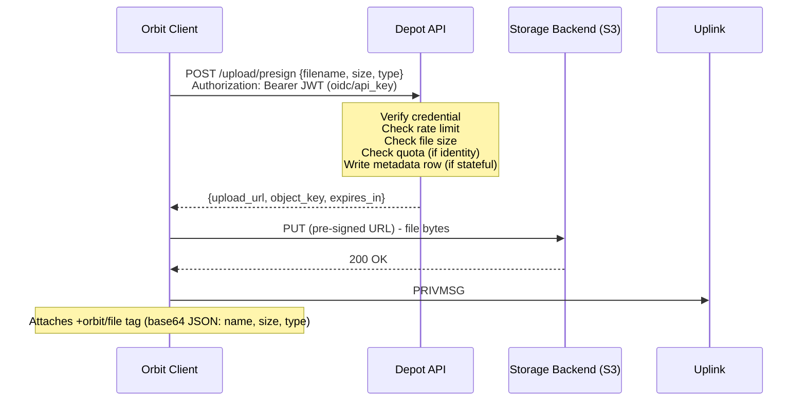

# Depot

> **Component class: bespoke component (Orbit-built).** Depot is software Orbit builds, but it is deliberately a *thin* gateway, not a UI app. It abstracts its own storage backend (S3 or local disk), but Depot itself is not one of Orbit's adopted abstractions; it is built by Orbit. See [Component Classes](../01-architecture/02-philosophy.md#component-classes).

Depot is a thin S3/disk policy-and-signing gateway, not an app. It holds the storage credentials, decides who may upload what, signs (or proxies) the transfer, and gets out of the way. It is the file storage component of an Orbit deployment, used for file uploads, user avatars, and other binary assets shared within Orbit communities.

Existing self-hosted products like [Zipline](https://github.com/diced/zipline) and [Plik](https://github.com/root-gg/plik) already do everything Depot does and far more: full web UIs, galleries, URL shorteners, account dashboards. Orbit deliberately does not want that. The Orbit client *is* the UI; Depot only needs to be the authority that sits in front of the bytes.

Raw S3 alone is insufficient, which is why a thin authority is always needed in front of it. S3 cannot verify an OIDC token and attribute an upload to one of *your* users, it cannot enforce *your-app* per-user quotas, it cannot mint *your-app* API keys, and it cannot scope a download to specific recipients. Those are application-level concerns. Depot is exactly that thin authority, and nothing more.

Depot is an optional component - text chat and real-time media function without it. File sharing within Uplink channels requires a Depot instance.

For backend configuration (MinIO setup, S3 bucket policy, TLS), see [Infrastructure & Deployment](../05-infrastructure/02-deployment.md). For DNS-based discovery of a domain's Depot instance, see [DNS & Service Discovery](../05-infrastructure/01-domain-discovery.md).

## What S3 Does vs What Depot Does

Depot stays thin by leaning on everything S3-compatible storage already does natively, and only implementing the handful of things storage cannot.

**What S3-compatible storage gives natively (Depot leans on all of this):**

- Direct client transfer via pre-signed URLs (bytes never touch Depot).
- Per-upload constraints baked into the signature: content-type, content-length range, key prefix, expiry.
- Object metadata.
- Lifecycle and expiry rules.
- Bucket and IAM policies.
- CORS.
- Range requests and multipart uploads.

**What only Depot can do (application-level, S3 cannot):**

- Verify a [Transponder](04-transponder.md) OIDC JWT and attribute the upload to a real account.
- Enforce per-user storage quotas.
- Mint and manage your-app API keys (ShareX, Puush, cURL).
- Scope downloads to specific recipients (DMs).

Everything in the first list is configuration Depot hands to the storage backend. Everything in the second list is the reason Depot exists at all.

## Storage Drivers

Where the bytes live is the first of two orthogonal axes an operator composes. The storage driver is a small interface with two operations:

```
StorageDriver {
  presign_upload(key, constraints) -> upload_url
  resolve_download(key)            -> download_url
}
```

`constraints` carries the content-type, content-length range, key prefix, and expiry that S3 can enforce in the signature. The client API contract is **identical** for both drivers: the client always calls the presign endpoint and PUTs to whatever URL it gets back. It never knows which backend is behind Depot.

### `s3` driver

- **Upload** is a direct pre-signed PUT. `presign_upload` returns an S3 pre-signed URL and the client PUTs bytes straight to the storage backend. Bytes never touch Depot.
- **Download** is a public object URL, or a short-lived pre-signed GET when the object is private.
- Any S3-compatible backend works: MinIO (self-hosted), Amazon S3, Cloudflare R2, Backblaze B2, Garage. Depot does not care which.

### `fs` driver (local filesystem)

- There is no pre-signed-URL equivalent for a local disk, so Depot **proxies** the transfer. `presign_upload` returns a Depot-hosted upload URL; the client PUTs through Depot, which writes to local disk.
- Depot also **serves** downloads itself from disk.
- No object storage is required to run.

### Tradeoff

State this honestly:

- **`s3`** keeps Depot stateless and bandwidth-free; the storage backend carries all transfer load. This is the path to scale.
- **`fs`** puts Depot directly in the data path, consuming its bandwidth and CPU, which makes Depot a bottleneck. In exchange it needs no object storage at all.

Rule of thumb: **`fs` for single-box/homelab, `s3` for scale.**

## Accepted Credentials

The second orthogonal axis is *which credentials Depot accepts*. This is a set of capability flags the operator toggles, in any combination, not a choice between exclusive modes. There is no longer an "open mode vs OIDC mode" switch.

| Flag | Meaning |
|------|---------|
| `anonymous` | Accept unauthenticated presign requests. |
| `oidc` | Accept a [Transponder](04-transponder.md) OIDC JWT and attribute the upload to the account. |
| `api_key` | Accept a long-lived Depot-issued API key (ShareX/Puush/cURL). |

The two formerly-named modes are just points in this space:

- "Open mode" is simply `anonymous` being the only accepted credential.
- "OIDC mode" is simply `oidc` enabled.

An operator can enable several at once: for example `oidc` + `api_key` for a normal Orbit server, or `anonymous` + `oidc` for a community that wants quick anonymous drops alongside attributed uploads.

When OIDC is enabled, Depot verifies the JWT signature against the provider's published JWKS, the same verification pattern used by [Satellite](02-satellite.md) and the [auth-script bridge](04-transponder.md). No component contacts any other component to check identity.

```
POST /upload/presign
Authorization: Bearer <JWT>        # when oidc or api_key credential is used

{
  "filename": "screenshot.png",
  "size": 2048576,
  "content_type": "image/png",
  "place": "uploads"                 # optional; falls back to default_place
}
```

### Statefulness is opt-in per capability

Pure anonymous signing needs no state at all; Depot is fully stateless. State is only required by the capabilities that genuinely need it:

- Quotas, deletion, audit, API keys, and recipient-scoping all require a small [metadata store](#metadata-store).
- SQLite is plenty; Postgres is optional for operators who already run one.

An operator who enables only `anonymous` runs a stateless Depot. The moment any stateful capability is enabled, the metadata store comes into play.

### Guest users

Regardless of configuration, anonymous web widget guests (SASL ANONYMOUS users with `guest-*` nicknames) cannot upload files. In OIDC-only configurations they have no JWT; when `anonymous` is enabled the Orbit client still does not present the upload UI to guests. This is client-side enforcement - guests are not the intended audience for file uploads.

## Upload Flow

1. User selects a file in the Orbit client.
2. The client sends a presign request to Depot (`POST /upload/presign`). Depot authenticates the request against the accepted credentials, enforces rate limits and maximum file size, checks per-user quota (when an identity is present), and - if all checks pass - returns an upload URL.
3. The client PUTs the file to the returned upload URL. With the `s3` driver this goes directly to the storage backend and never passes through Depot; with the `fs` driver the URL points back at Depot, which proxies the bytes to disk.
4. On successful upload, the client posts a `PRIVMSG` to the channel containing the public file URL as the message body.
5. The client attaches file metadata as a single `+orbit/file` tag (base64-encoded JSON containing name, size, and type) on the same `PRIVMSG`.
6. The Orbit client renders an inline preview (images, audio, video) or a download card. Pure IRC clients see a plain URL.



The diagram shows the `s3` driver (direct pre-signed PUT) as the primary illustration. With the `fs` driver the only change is that `upload_url` points back at Depot, so the PUT in step `U->>S3` is instead `U->>D` and Depot writes to local disk; everything else, including the client contract, is identical.

## The Depot API

Depot is a thin HTTP service deployed co-located with (or in front of) the storage backend.

| Endpoint | Purpose |
|----------|---------|
| `POST /upload/presign` | Authenticate, validate, rate-limit, return a time-limited upload URL |
| `POST /upload` | One-shot multipart upload (ShareX/cURL); returns the final URL |
| `POST /keys` | Mint a long-lived API key (requires OIDC) |
| `GET /keys` | List the caller's API keys (requires OIDC) |
| `DELETE /keys/{id}` | Revoke an API key (requires OIDC) |
| `DELETE /file/{key}` | Delete a file (requires identity; uploader or operator only) |
| `GET /quota` | Return current usage for the authenticated user |
| `GET /health` | Health check for deployment tooling |

**Responsibilities:**

- **Authentication**: Verify the caller against the accepted credential flags.
- **Upload URL issuance**: Generate a time-limited upload URL via the active [storage driver](#storage-drivers). With the `s3` driver the SDK handles signing natively; no custom signing logic is needed.
- **Rate limiting**: Enforce per-IP upload rate limits always, and per-user limits when an identity is present.
- **Size enforcement**: Reject requests that exceed the configurable maximum file size per upload.
- **Quota enforcement**: Reject requests that would exceed the user's storage quota.
- **Metadata tracking**: Record upload metadata for quota accounting, deletion, and audit (when a stateful capability is enabled).

Depot does **not** proxy file downloads under the `s3` driver; those are served by the storage backend. It does serve and proxy under the `fs` driver, and it serves the private/proxied download path in either driver when recipient-scoping requires it.

## API Keys & External Uploads (ShareX / Puush / cURL)

API keys are a separate auth path from the short-lived OIDC browser token, designed for external tools that cannot run an interactive OIDC flow.

A user, already authenticated via OIDC in the Orbit client, mints a long-lived key:

```
POST /keys
Authorization: Bearer <JWT>

{ "label": "ShareX desktop", "scopes": ["upload"], "expires_at": "2027-01-01" }
```

Depot stores **only a hash** of the key plus the owner identity (`sub`/`iss`), the label, optional scopes, and an optional expiry. The raw key is shown **once**, at creation. Lifecycle operations:

- **List** (`GET /keys`): the caller's keys with labels and `last_used` timestamps.
- **Revoke** (`DELETE /keys/{id}`): instant, unlike a JWT which remains valid until it expires.
- **Last-used** tracking for spotting stale or leaked keys.

A key is presented exactly like a JWT:

```
Authorization: Bearer <key>
```

Depot resolves the key to its owner and then reuses **all** the OIDC-mode machinery: identity, quota, deletion rights, and audit. A key-attributed upload is indistinguishable from an OIDC-attributed upload once the owner is resolved.

### One-shot upload endpoint

The two-step presign dance is awkward for ShareX and cURL, so Depot provides a one-shot endpoint:

```
POST /upload          (multipart/form-data)
Authorization: Bearer <key>
```

It accepts the file bytes directly and returns the final URL. Note that the one-shot endpoint **proxies bytes even under the `s3` driver**, since the client cannot perform the pre-signed PUT itself. Because of this it should be **rate-limited more tightly** than the presign flow. The Orbit client keeps using the efficient presign flow and does not touch `/upload`.

## Per-User Quotas

When an identity is present (OIDC or API key), Depot enforces per-user storage quotas. At presign time, before issuing the upload URL, it queries the metadata store:

```
SUM(file_size) WHERE uploader_account = ? AND uploader_issuer = ?
```

If the current total plus the requested file size exceeds the configured quota, the request is rejected with a clear error before any upload URL is issued.

**Configuration:**

- `default_quota`: the default per-user storage limit (e.g., `500MB`), applied to all users unless overridden.
- `quota_overrides`: a map of account names to custom limits (e.g., a higher quota for trusted users or bots).

Quotas require an identity. Anonymous uploads cannot be quota'd per-user; for those the operator relies on bucket-level storage limits and manual monitoring.

## File Deletion

### By uploaders (identity present)

When the caller has an identity, they can delete their own files:

```
DELETE /file/{object_key}
Authorization: Bearer <JWT or API key>
```

Depot verifies the credential, checks the metadata store to confirm the authenticated account matches the `uploader_account` for the given object key, deletes the object, and removes the metadata row. If the account does not match, the request is rejected.

### By server operators

Operators can always delete files at the backend level (MinIO console, AWS S3 management, `mc rm`, or simply removing files from disk under the `fs` driver) regardless of credential configuration. Depot does not gate operator-level access. When an operator deletes a file out of band, the metadata row (if any) becomes orphaned and [reconciliation](#metadata-reconciliation) prunes it automatically.

### Anonymous uploads

There is no client-facing delete API for anonymous uploads. Without an identity, ownership cannot be proven.

## Recipient-Scoped Uploads (NEXT)

> This is a **NEXT**, Orbit-specific capability, not part of the MVP.

DMs need a file shared with a specific person, not the whole world. This is something only Depot can provide, because S3 has no concept of *your* accounts. Two layers are planned.

### Layer 1 - access-controlled downloads

- Files are stored **private**. Their metadata gains an `allowed_recipients` field: a list of account `sub`s (the sender plus the DM target).
- Downloads go **through Depot**, which checks that `requester.sub` is in `allowed_recipients`. The requester proves their identity with their own valid JWT.
- This forces the private/proxied download path even under the `s3` driver: Depot either issues a short-lived pre-signed GET or streams the bytes itself.
- **The sender does not sign with the recipient's JWT.** At presign time the sender *asserts* the recipient account identities; at download time the recipient *proves* their own identity. These are distinct steps.
- Only works when `oidc` is enabled. Reject `allowed_recipients` for anonymous callers.

### Layer 2 - end-to-end encryption (future)

Layer 2 supersedes the trust assumption of Layer 1. The client encrypts the file before upload, and the URL points to ciphertext, useless without the decryption key, which never leaves the participants' clients. Depot stays a dumb object store and the security guarantee comes from the encryption layer rather than access control on the URL. See [Research: E2E Encryption](../06-next/05-e2e-encryption.md).

Until these land, operators of private communities should be aware that ordinary Depot URLs are accessible to anyone who obtains them, and communicate this to their users.

## Content Moderation

Because every upload either passes through Depot (filesystem driver) or is authorized by Depot (S3 pre-signed URL driver), the gateway is the natural chokepoint for optional automated content scanning. Hash-matching against known-bad databases (e.g. PhotoDNA / NCMEC-style hash lists), ML-based classification, or custom operator-defined rules can all hook in at this layer. This is an operator concern, not a core Depot feature - Depot provides the hook point, not the scanner itself.

### Scaling the capability

A small friend-group instance does not need content scanning. A large public-facing instance probably does. The capability scales with deployment size, and Depot's job is to make both paths easy: no scanning overhead when it is not configured, clean integration points when it is.

### Storage-driver asymmetry

The two storage drivers create a real asymmetry for scanning, and this section documents it honestly rather than glossing over it.

**Filesystem / proxy mode.** Depot receives the bytes directly. Scanning can happen inline (synchronously, before the file is made available to other users). This is the simplest and safest path for deployments that need hard content gating.

**S3-direct mode (pre-signed PUT).** The bytes go straight to the storage backend and never touch Depot. Scanning cannot happen synchronously at the gateway. Instead, scanning happens asynchronously - typically via an S3 event notification (or equivalent) that triggers a scan on the newly uploaded object. Until the scan completes, the object exists in storage.

This means deployments that need real content gating under the S3 driver should use a **private-by-default bucket policy** with gateway-mediated downloads: Depot issues a short-lived pre-signed GET only after the object's scan status is marked clean. This sacrifices the bandwidth-free public-URL property of the S3 driver but gains content safety.

Operators choose their position on this spectrum:

| Posture | Bucket policy | Download path | Scanning | Typical deployment |
|---------|--------------|---------------|----------|--------------------|
| No scanning | Public | Direct URL | None | Friend-group, homelab |
| Async scan-and-quarantine | Public | Direct URL | Async, best-effort | Mid-size community |
| Private-by-default, gateway-served | Private | Pre-signed GET via Depot | Inline or pre-serve | Large/public-facing instance |

### Safe anonymous defaults

Anonymous (unauthenticated) users can join calls and chat via Uplink/Satellite without restriction - that is the frictionless entry model. But anonymous users should not be able to upload files to public channels by default. This is consistent with the existing [guest restriction](#guest-users): guests cannot upload regardless of configuration.

For operators who explicitly enable anonymous uploads, Depot applies tighter rate limits and smaller size caps than authenticated uploads receive. The safe default is authenticated uploads only; anonymous upload capability is an explicit operator opt-in.

### The posture

Orbit is infrastructure. For shared content, every upload is attributed to an identity, content is removable, and operators can scan at the gateway. For 1:1 private content (P2P calls, E2E-encrypted DMs), Orbit cannot see or store the content - the shield is cryptographic and architectural. This is the same trust model as Signal for private content and a moderated platform for shared content.

## Metadata Store

When any stateful capability is enabled (quotas, deletion, audit, API keys, recipient-scoping), Depot maintains a small metadata database tracking uploads.

| Field | Description |
|-------|-------------|
| `object_key` | Object key (primary key) |
| `uploader_account` | Account from the JWT `sub` claim (or the API key owner) |
| `uploader_issuer` | Issuer from the JWT `iss` claim (supports multi-server identity) |
| `file_size` | File size in bytes |
| `content_type` | MIME type |
| `original_filename` | Original filename as provided by the client |
| `uploaded_at` | Timestamp of presign URL issuance |
| `completed` | Whether the upload finished; drives [reconciliation](#metadata-reconciliation) |
| `allowed_recipients` | (NEXT) account subs permitted to download a private file |

SQLite is sufficient for most single-server deployments. Postgres is supported for operators who already have one.

The metadata row is written at **presign time**, not at upload completion. The presigned URL constrains the upload (size, content type, expiry), so the row is a reliable record of intent. If the client never completes the upload, the row is orphaned; [reconciliation](#metadata-reconciliation) prunes it.

When only `anonymous` is enabled, no metadata is stored and Depot is stateless.

## Metadata Reconciliation

Because the metadata row is written at presign time, the set of rows and the set of actually-stored objects can drift apart. Depot reconciles them with a background job. Two kinds of drift occur:

- **Orphaned row** - a row with no stored object. The usual cause is an upload that was presigned but never completed (the client cancelled, failed, or let the URL expire). It also happens when an operator deletes an object out of band at the backend. Until reconciled, an orphaned row counts against the uploader's quota for bytes that do not exist.
- **Orphaned object** - a stored object with no row. This happens if a delete removes the row but the subsequent object delete fails, or from out-of-band writes. The object is untracked: attributed to no account and counted in no quota.

### Record completion instead of scanning

The naive approach - list every row and probe the backend for each object - is correct but scales poorly. The design instead records upload completion, so finding orphans is a cheap indexed query rather than a full set-difference:

- **`fs` driver** - Depot proxies the bytes, so it observes the PUT finishing and marks the row `completed` inline.
- **`s3` driver** - Depot is out of the data path and never sees the transfer, so completion is driven by an S3 event notification (or equivalent) fired when the object lands; Depot marks the row `completed` on that event.

Finding orphaned rows then reduces to `completed = false AND uploaded_at < now - grace`, a query over a small tail of recent rows. A full scan remains available as an occasional integrity check, not the hot path.

### The grace period

Reconciliation MUST act only on rows older than the presigned URL's lifetime plus a margin. A freshly presigned row legitimately has no object yet - the client may still be uploading - so pruning it would delete the metadata of an in-flight upload. Because `uploaded_at` is the presign timestamp, the rule is: a row is a deletion candidate only when `now - uploaded_at > presign_ttl + margin`. The same caution applies when deleting orphaned objects, where a concurrent upload may create the object between the existence check and the delete.

### Coordination at scale

In a horizontally scaled deployment, reconciliation must not run redundantly on every instance:

- The work list is the metadata store itself; it is never copied elsewhere. Instances page through it with a keyset cursor.
- Mutual exclusion is the baseline: a single leader runs the sweep, held by a Postgres advisory lock (already present in the scale shape) or a Redis lock, so instances do not race to delete the same rows.
- Within an instance, the per-object backend checks fan out across a worker pool.
- Only if one instance cannot keep up is the key space partitioned across instances (for example by `object_key` hash range) via the coordination layer. This is a last resort, not the default.

Consistent with the rest of Depot, the metadata store is the source of truth and the coordination layer (Redis) only coordinates the work, never holds it.

## Upload Destinations (Places)

A *place* is a named upload destination with its own policy. The client names a place in the presign request; it never names the object key. Depot derives the key from the verified identity, so a caller can only ever write within their own namespace.

Every place is configured - there is no built-in default place. This keeps Depot versatile: a deployment can offer a permissive catch-all, or expose only tightly-scoped destinations (avatars, banners) and refuse everything else. A place carries:

| Field | Purpose |
|-------|---------|
| `prefix` | Object-key prefix bytes land under (e.g. `orbit/user-content/avatars`). Defaults to the place name. |
| `key` | Key strategy: `dump` (random per upload; place-link-forget) or `account` (deterministic per account; re-upload overwrites). Defaults to `dump`. |
| `max_size` | Per-place size cap; falls back to `limits.max_file_size`. |
| `allowed_mime` | MIME whitelist; empty means any. |
| `require_identity` | Reject anonymous uploads. Implied by `key = "account"`. |

A permissive place (dump strategy, no MIME restriction) is the catch-all. An operator may name one as `default_place`, used when a presign request omits a place; leaving `default_place` unset forces every request to name one explicitly. Restricted places are pure configuration and need no code changes - a bot extension or a new content class is just another entry.

## Object Key Structure

The client never supplies the object key. Depot derives it from the resolved place and the verified identity, so placement always encodes who the uploader is and which destination they targeted.

For the `dump` strategy:

```
{place.prefix}/{owner}/{timestamp}-{random}/{filename}
```

For the `account` strategy (deterministic, so a re-upload replaces the previous object):

```
{place.prefix}/{owner}/{filename}
```

| Segment | Purpose |
|---------|---------|
| `{place.prefix}` | The target place's prefix; separates content classes (uploads, avatars, ...) |
| `{owner}` | Identifies the uploader (see below); groups a user's files for admin tooling without exposing the raw account name in the URL |
| `{timestamp}-{random}` | Collision-free directory per upload; the timestamp sorts lexically, so a listing is chronological (dump strategy only) |
| `{filename}` | Original filename, sanitized; preserves human-readable context in the URL |

The `{owner}` segment is a short hash of the uploader's **stable account subject** (the OIDC `sub` claim) together with the issuer - never the username. A user can rename without moving any of their files, and the same username on two different identity providers stays distinct. For anonymous uploads (no identity), `{owner}` is the reserved segment `_anonymous`, which cannot collide with a real account hash.

Ownership is not load-bearing in the path for authorization - it is recorded in the [metadata store](#metadata-store), the source of truth for quota, deletion, and audit. The path encodes owner and time for admin grouping and per-user chronological listing; cross-cutting queries (newest across all users) are answered by the store.

## The +orbit/file Tag

When a file is shared in a channel, the client attaches a single `+orbit/file` tag to the `PRIVMSG`. The tag value is a base64-encoded JSON payload:

```json
{
  "name": "screenshot.png",
  "size": 245760,
  "type": "image/png"
}
```

| Field  | Content                                      |
|--------|----------------------------------------------|
| `name` | Original filename (e.g., `screenshot.png`)   |
| `size` | File size in bytes                           |
| `type` | MIME type (e.g., `image/png`)                |

This tag is defined in the [Orbit Tag Namespace](01-uplink/02-tags/01-namespace.md).

This metadata is client-asserted and informational. Orbit clients SHOULD verify file metadata independently by checking HTTP response headers (`Content-Type`, `Content-Length`) on download. See [Tag Trust Model](01-uplink/02-tags/02-trust-model.md) for enforcement rules.

## Service Discovery

Orbit clients discover a domain's Depot instance via a `_depot._tcp` DNS SRV record or the well-known services file. For record format and the full client resolution algorithm, see [DNS & Service Discovery](../05-infrastructure/01-domain-discovery.md).

## Configuration Example

```toml
[depot]
# Axis 1: storage driver - where bytes live
driver        = "s3"                # "s3" | "fs"
default_place = "uploads"           # place used when a request omits one; unset = always require a named place

[depot.s3]                           # used when driver = "s3"
endpoint = "https://s3.example.com"
bucket   = "orbit-uploads"
region   = "auto"

[depot.fs]                           # used when driver = "fs"
root = "/var/lib/depot/uploads"

# Axis 2: accepted credentials - any combination
[depot.credentials]
anonymous = false
oidc      = true                     # verify Transponder JWTs
api_key   = true                     # ShareX / Puush / cURL

[depot.limits]
max_file_size = "100MB"
default_quota = "500MB"
rate_limit_per_ip   = "30/min"
rate_limit_per_user = "120/min"
oneshot_rate_limit  = "10/min"       # /upload proxies bytes; throttle harder

[depot.quota_overrides]
"botaccount" = "5GB"

# Upload destinations. Every place is declared; there is no built-in default.
# A permissive place (no allowed_mime, dump key) is the catch-all; restricted
# places add their own rules for specific content classes.
[depot.places.uploads]
# key defaults to "dump"; prefix defaults to the place name ("uploads")

[depot.places.avatars]
prefix           = "orbit/user-content/avatars"
key              = "account"         # deterministic per account; re-upload overwrites
max_size         = "2MB"
allowed_mime     = ["image/png", "image/jpeg", "image/webp"]
require_identity = true              # implied by key = "account"

[depot.store]
backend = "sqlite"                   # "sqlite" | "postgres"; only needed for stateful capabilities
path    = "/var/lib/depot/depot.db"
```

## Cross-References

- [Transponder](04-transponder.md) - the OIDC identity provider role whose JWTs Depot verifies
- [Authentication](../03-identity/01-authentication.md) - how the JWT flows through all components
- [Tag Namespace](01-uplink/02-tags/01-namespace.md) - file metadata tag definitions
- [Tag Trust Model](01-uplink/02-tags/02-trust-model.md) - client-side verification rules
- [Research: E2E Encryption](../06-next/05-e2e-encryption.md) - Layer 2 of recipient-scoped uploads
- [Infrastructure & Deployment](../05-infrastructure/02-deployment.md) - storage backend setup
- [DNS & Service Discovery](../05-infrastructure/01-domain-discovery.md) - Depot endpoint discovery
