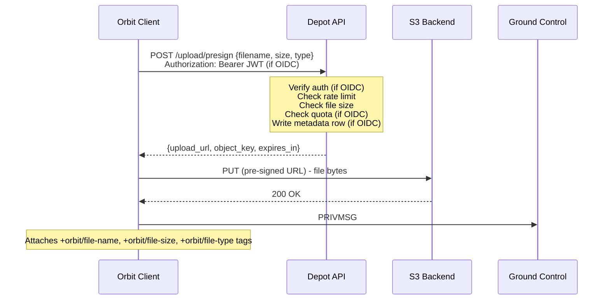

# Depot

Depot is the file storage component of an Orbit deployment. It provides S3-compatible object
storage for file uploads, user avatars, and other binary assets shared within Orbit communities.

Depot is an optional component - text chat and real-time media function without it. File sharing
within Ground Control channels requires a Depot instance.

A Depot deployment consists of two parts:

- **S3-compatible backend**: Any S3-compatible service that stores the actual objects and serves
  them via public URLs. MinIO (self-hosted), Amazon S3, Cloudflare R2, Backblaze B2, Garage, or
  any other S3-compatible provider. The Depot API does not care which backend is behind it.
- **Depot API**: A thin HTTP service that sits in front of the S3 backend. This is the only piece
  that Orbit clients interact with directly - the S3 backend is never accessed by clients except
  via pre-signed upload URLs issued by the Depot API.

The Depot API is a small service (~200-300 lines of core logic). It authenticates requests, enforces
limits, generates pre-signed URLs, and optionally tracks upload metadata. It does not proxy file
content in either direction.

For backend configuration (MinIO setup, S3 bucket policy, TLS), see
[Infrastructure & Deployment](../05-infrastructure/02-deployment.md).

For DNS-based discovery of a domain's Depot instance, see
[DNS & Service Discovery](../05-infrastructure/01-domain-discovery.md).

## Upload Flow

1. User selects a file in the Orbit client.
2. The client sends a pre-signed URL request to the Depot API (`POST /upload/presign`). The Depot
   API authenticates the request (if OIDC is configured), enforces rate limits and maximum file
   size, checks per-user quota (if OIDC is configured), and - if all checks pass - generates a
   pre-signed S3 upload URL.
3. The client uploads the file directly to the S3 backend via the pre-signed URL. The upload
   does not pass through the Depot API.
4. On successful upload, the client posts a `PRIVMSG` to the channel containing the public file
   URL as the message body.
5. The client attaches file metadata as message tags on the same `PRIVMSG`: `+orbit/file-name`,
   `+orbit/file-size`, `+orbit/file-type`.
6. The Orbit client renders an inline preview (images, audio, video) or a download card. Pure IRC
   clients see a plain URL.



## The Depot API

The Depot API is a thin HTTP service deployed co-located with (or in front of) the S3 backend.

**Endpoints:**

| Endpoint | Purpose |
|----------|---------|
| `POST /upload/presign` | Authenticate, validate, rate-limit, return a time-limited S3 upload URL |
| `DELETE /file/{key}` | Delete a file (requires OIDC; uploader or server admin only) |
| `GET /quota` | Return current usage for the authenticated user (requires OIDC) |
| `GET /health` | Health check for deployment tooling |

**Responsibilities:**

- **Authentication**: Verify the caller's identity via JWT when OIDC is configured; accept all
  requests when running in open mode (see [Authentication](#authentication)).
- **Pre-signed URL issuance**: Generate time-limited S3 pre-signed upload URLs. The S3 SDK handles
  this natively - no custom signing logic is needed.
- **Rate limiting**: Enforce per-IP upload rate limits (both modes). Enforce per-user upload rate
  limits (OIDC mode).
- **Size enforcement**: Reject requests that exceed the configurable maximum file size per upload.
- **Quota enforcement**: Reject requests that would exceed the user's storage quota (OIDC mode).
- **Metadata tracking**: Record upload metadata for quota accounting, deletion, and audit
  (OIDC mode).

The Depot API does **not** proxy file downloads. Downloads are served directly from the S3 backend
via public object URLs.

## Download Model

Downloads are public. Anyone with the file URL can fetch the file directly from the S3 backend. The
URL is the access control - if you don't want someone to access a file, don't share the URL. This
is the same model as Imgur, public S3 buckets, or paste services.

## Authentication

Depot operates in one of two modes, chosen by the server operator at deployment time.

### OIDC Mode (Recommended)

When the server has a [Transponder](04-transponder.md) (OIDC identity provider) configured, Depot
verifies uploads against it. The client sends a Bearer JWT with its pre-sign request. Depot
verifies the JWT signature against the provider's published JWKS - the same verification pattern
used by [Satellite](02-satellite.md) and the
[auth-script bridge](04-transponder.md#ground-control-ergochat). No component contacts any other
component to check identity.

```
POST /upload/presign
Authorization: Bearer <JWT>

{
  "filename": "screenshot.png",
  "size": 2048576,
  "content_type": "image/png"
}
```

OIDC mode enables the full feature set:

- Uploads are tied to a verified account identity.
- Per-user quotas are enforced.
- Uploaders can delete their own files.
- Operators can audit and moderate uploads by account.

**This is the recommended configuration for any deployment.** Transponder is a standard OIDC
provider (Keycloak, Authentik, etc.) plus a ~100-line auth-script bridge for Ergochat. It is not
a heavy dependency.

### Open Mode

When no identity provider is configured, Depot runs in **open mode**. No authentication is
performed. Anyone who can reach the Depot API can request a pre-signed upload URL.

```
POST /upload/presign

{
  "filename": "screenshot.png",
  "size": 2048576,
  "content_type": "image/png"
}
```

**The trade-offs of open mode must be understood clearly:**

- **No upload attribution.** There is no identity to bind uploads to. Every upload is anonymous
  from Depot's perspective. The IRC `PRIVMSG` that shares the URL will carry the sender's
  nickname and `account-tag` (if they are logged in via NickServ), but Depot itself has no
  knowledge of this.
- **No per-user quotas.** Without identity, there is no "user" to quota against. A single actor
  can fill the storage backend up to whatever global limits the operator configures.
- **No file deletion by uploaders.** Without identity, there is no way to prove ownership.
  Only server operators can delete files via S3 admin tools.
- **No audit trail.** The operator cannot answer "who uploaded this file?" from Depot alone.
  The only record is the IRC message history in Ground Control, which may have been purged.
- **Abuse surface is larger.** Rate limiting (per-IP) and file size caps are the only protection.
  This may be acceptable for small, private, trusted communities. It is not appropriate for
  public-facing deployments.

Open mode exists because Depot should function without hard dependencies on other components -
consistent with Orbit's design philosophy of independent services. But it is the operator's
responsibility to understand what they are giving up. **If you are running a public server, configure
an identity provider.**

### Guest Users

Regardless of mode, anonymous web widget guests (SASL ANONYMOUS users with `guest-*` nicknames)
cannot upload files. In OIDC mode, they have no JWT. In open mode, the Orbit client does not
present the upload UI to guest users. This is a client-side enforcement - guests are not the
intended audience for file uploads.

## Metadata Store

When running in OIDC mode, the Depot API maintains a small metadata database that tracks uploads.
This is the foundation for quotas, deletion, and audit.

**Schema:**

| Field | Description |
|-------|-------------|
| `object_key` | S3 object key (primary key) |
| `uploader_account` | Account name from the JWT `sub` claim |
| `uploader_issuer` | Issuer from the JWT `iss` claim (supports multi-server identity) |
| `file_size` | File size in bytes |
| `content_type` | MIME type |
| `original_filename` | Original filename as provided by the client |
| `uploaded_at` | Timestamp of pre-signed URL issuance |

SQLite is sufficient for most single-server deployments. Postgres is supported for operators who
already have one running.

The metadata row is written at **pre-sign time**, not at upload completion. The pre-signed URL
constrains the upload (size, content type, expiry), so the metadata is a reliable record of intent.
If the client never completes the upload, the row is orphaned - a periodic cleanup job can reconcile
metadata against actual S3 objects and prune stale rows.

In open mode, no metadata is stored. The Depot API is stateless.

## Object Key Structure

The S3 object key encodes the uploader identity for easy grouping, admin tooling, and S3-level
lifecycle policies:

```
uploads/{account_hash}/{timestamp}-{random}/{filename}
```

| Segment | Purpose |
|---------|---------|
| `uploads/` | Top-level prefix; separates user uploads from other bucket contents (avatars, etc.) |
| `{account_hash}` | A short hash of the uploader's account name; groups all files by user at the S3 level without exposing the raw account name in the URL |
| `{timestamp}-{random}` | Collision-free directory per upload; timestamp enables chronological listing |
| `{filename}` | Original filename, sanitized; preserves human-readable context in the URL |

In open mode (no identity), `{account_hash}` is replaced with `_anonymous`.

## Per-User Quotas

When OIDC is configured, the Depot API enforces per-user storage quotas. At pre-sign time, before
generating the upload URL, the API queries the metadata store:

```
SUM(file_size) WHERE uploader_account = ? AND uploader_issuer = ?
```

If the current total plus the requested file size exceeds the configured quota, the request is
rejected with a clear error before any upload URL is issued.

**Configuration:**

- `default_quota`: The default per-user storage limit (e.g., `500MB`). Applied to all users unless
  overridden.
- `quota_overrides`: A map of account names to custom limits (e.g., give trusted users or bots a
  higher quota).

Quota enforcement is only possible in OIDC mode. In open mode, there is no identity to quota
against - the operator relies on S3 bucket-level storage limits and manual monitoring.

## File Deletion

### By Uploaders (OIDC Mode)

When OIDC is configured, uploaders can delete their own files:

```
DELETE /file/{object_key}
Authorization: Bearer <JWT>
```

The Depot API verifies the JWT, checks the metadata store to confirm the authenticated account
matches the `uploader_account` for the given object key, deletes the S3 object, and removes the
metadata row. If the account does not match, the request is rejected.

### By Server Operators

Server operators can always delete files via S3 admin tools (MinIO console, AWS S3 management,
`mc rm`, etc.) regardless of auth mode. The Depot API does not gate operator-level access - that
is handled at the S3 backend level.

When an operator deletes a file via S3 admin tools, the metadata row (if any) becomes orphaned.
The periodic cleanup job reconciles this automatically.

### In Open Mode

There is no client-facing delete API in open mode. Without identity, ownership cannot be proven.

## File Metadata Tags

When a file is shared in a channel, the client attaches the following tags to the `PRIVMSG`:

| Tag                 | Content                                      |
|---------------------|----------------------------------------------|
| `+orbit/file-name`  | Original filename (e.g., `screenshot.png`)   |
| `+orbit/file-size`  | File size in bytes                           |
| `+orbit/file-type`  | MIME type (e.g., `image/png`)                |

These tags are defined in the [Orbit Tag Namespace](01-ground-control/02-tags/01-namespace.md).

**These are client-asserted metadata.** The tags are set by the sending client and can contain any
value - they are not validated by the IRC server. Orbit clients SHOULD verify file metadata
independently by checking HTTP response headers on download, rather than trusting the tags blindly.
For the full verification rules governing client-asserted tags, see
[Tag Integrity and Trust Model](01-ground-control/02-tags/02-trust-model.md).

## Service Discovery

Orbit clients discover a domain's Depot instance via a `_depot._tcp` DNS SRV record or the
well-known services file. For record format and the full client resolution algorithm, see
[DNS & Service Discovery](../05-infrastructure/01-domain-discovery.md).

## Cross-References

- [Transponder](04-transponder.md) - the OIDC identity provider that enables authenticated uploads
- [Authentication](../03-identity/01-authentication.md) - how the JWT flows through all components
- [Tag Namespace](01-ground-control/02-tags/01-namespace.md) - file metadata tag definitions
- [Tag Trust Model](01-ground-control/02-tags/02-trust-model.md) - client-side verification rules
- [Infrastructure & Deployment](../05-infrastructure/02-deployment.md) - S3 backend setup
- [DNS & Service Discovery](../05-infrastructure/01-domain-discovery.md) - Depot endpoint discovery
