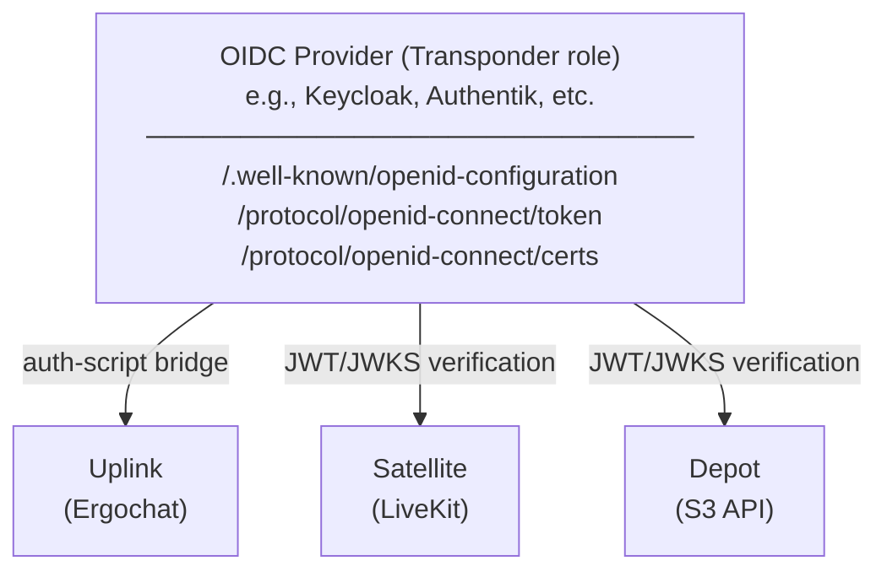
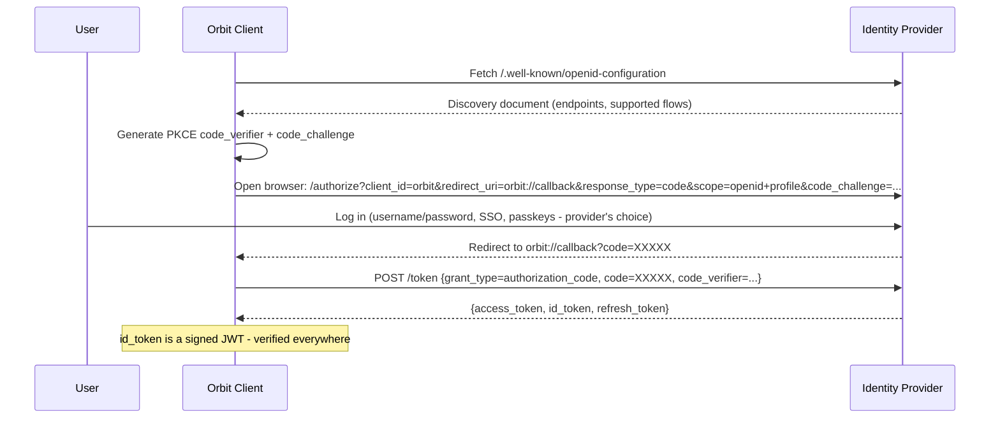
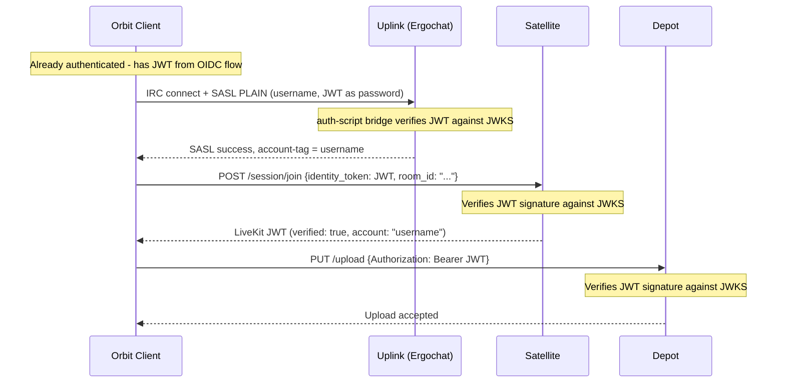
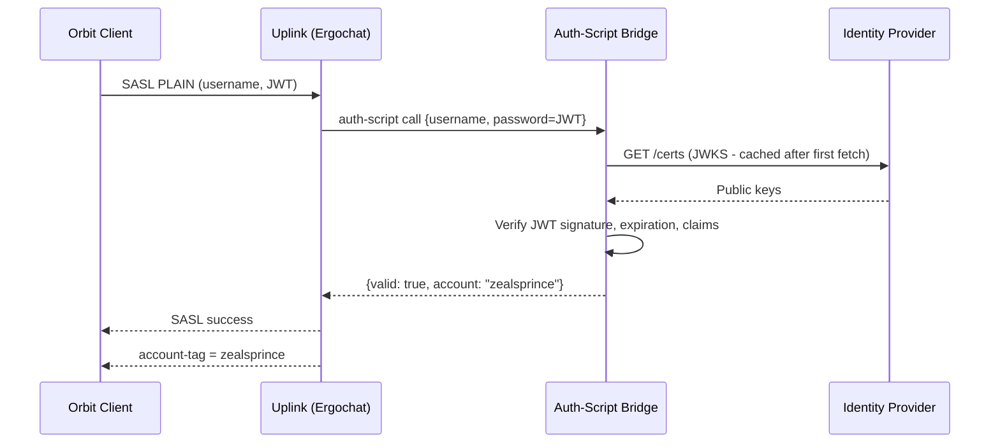

# Transponder

Transponder is not a service - it is a **role**. In the Orbit ecosystem, "Transponder" refers to whatever OIDC-compliant identity provider the server operator deploys. This can be [Keycloak](https://www.keycloak.org/), [Authentik](https://goauthentik.io/), [Authelia](https://www.authelia.com/), [Zitadel](https://zitadel.com/), or any other provider that implements [OpenID Connect Discovery](https://openid.net/specs/openid-connect-discovery-1_0.html). Orbit does not ship its own identity service - it consumes standard OIDC.

The operator deploys an identity provider, points Orbit components at its issuer URL, and everything else - credential verification, token issuance, key publication - is handled by the provider. Uplink, Satellite, Depot, and any future service all consume the same identity layer without custom adapters or glue code.

Transponder is **optional**. Deployments without an identity provider use Ergochat's built-in NickServ/SASL for IRC authentication and degrade gracefully - voice and video still function, but all Satellite participants appear unverified.

## Why a Shared Identity Layer

The MVP authenticates users within Uplink's own boundary: SASL to Ergochat, NickServ for account management, `account-tag` for identity assertion on the IRC wire. This works for text chat, but those assertions are server-scoped - they do not travel outside the IRC connection.

When a user connects to a Satellite (a completely separate service), the Satellite has no way to verify that this person is the same authenticated user from Uplink. The [Satellite authentication model](../02-components/02-satellite.md#satellite-authentication) in the MVP uses a public join key - anyone who presents the key gets access. That model cannot support verified identity display in voice sessions, cross-server trust, or federation.

The deeper problem is architectural: in the MVP, identity is embedded inside Uplink. There is no shared identity layer that multiple components can consume. An external OIDC provider solves this by extracting identity into a standalone authority that all components plug into equally.

## How It Works

The entire system hinges on one configuration value: the **OIDC issuer URL**. Every Orbit component that needs to verify identity points at this URL.



### OIDC Discovery

Every OIDC-compliant provider serves a discovery document at `/.well-known/openid-configuration`. This document tells any consumer where to find the provider's endpoints:

```json
{
  "issuer": "https://id.example.com/realms/orbit",
  "authorization_endpoint": "https://id.example.com/realms/orbit/protocol/openid-connect/auth",
  "token_endpoint": "https://id.example.com/realms/orbit/protocol/openid-connect/token",
  "jwks_uri": "https://id.example.com/realms/orbit/protocol/openid-connect/certs",
  "userinfo_endpoint": "https://id.example.com/realms/orbit/protocol/openid-connect/userinfo",
  "scopes_supported": ["openid", "profile", "email"],
  "response_types_supported": ["code"],
  "code_challenge_methods_supported": ["S256"]
}
```

No component needs to know what provider is behind this URL. They fetch the discovery document, find the endpoints they need, and proceed with standard OIDC flows.

### Client Authentication Flow

The Orbit client authenticates against the identity provider using the standard OIDC Authorization Code flow with PKCE (Proof Key for Code Exchange). This is the recommended flow for native/desktop applications and works with any OIDC provider.



The identity provider controls the login experience entirely. If the operator wants username/password, that's their choice. If they want Google SSO, passkeys, or MFA - that's configured in the provider, not in Orbit. The client just opens a browser to the authorization endpoint and collects the token at the end.

The resulting JWT is then used across all Orbit components for the duration of the session:



One authentication, one JWT, verified everywhere. Each component independently verifies the token against the provider's published public keys - no component contacts any other component to check identity.

## Component Integration

### Uplink (Ergochat)

IRC predates OIDC by decades. Ergochat authenticates users via SASL - it has no native OIDC support. The integration requires a thin **auth-script bridge**: a small HTTP service or script that translates Ergochat's `auth-script` credential check into a JWT verification against the OIDC provider's JWKS endpoint.

Ergochat supports `auth-script` as a standard configuration option - it delegates SASL credential verification to an external command or HTTP endpoint. This is not an Orbit-specific patch.

The flow:

1. The Orbit client obtains a JWT from the OIDC provider (via the browser-based Authorization Code flow).
2. The client connects to IRC and sends `SASL PLAIN` with the JWT as the password.
3. Ergochat's `auth-script` calls the bridge.
4. The bridge verifies the JWT signature against the provider's JWKS, checks expiration and claims.
5. If valid, the bridge returns the account name. Ergochat sets the `account-tag` as usual.



The auth-script bridge is the **only Orbit-specific glue code** in the entire identity system. It is a small, stateless service (~50–100 lines) that performs local JWT verification. It does not manage users, issue tokens, or store state. The JWKS is cached after the first fetch - subsequent verifications are local cryptographic operations with no network round-trips.


**Account name mapping:** The auth-script bridge extracts the IRC account name from the JWT's `preferred_username` claim (standard OIDC `profile` scope). This claim MUST be present and MUST be a valid IRC nickname. The OIDC provider is responsible for ensuring that `preferred_username` values are unique and conform to IRC nickname rules (no spaces, no leading digits, within length limits). If the `preferred_username` claim is absent, the bridge MUST reject the authentication attempt. The `sub` claim (which is often an opaque UUID in providers like Keycloak) is NOT used for the IRC account name.

**Without an identity provider:** Ergochat uses its built-in NickServ and internal account database for SASL authentication. This is the MVP default and requires no external service.

### NickServ and the Identity Provider

When an OIDC provider is configured, NickServ should be **disabled**. The two cannot coexist as dual sources of truth - if NickServ manages some accounts and the OIDC provider manages others, nickname ownership conflicts are inevitable.

The clean separation:

| Configuration | Account management | Credential verification | Nickname enforcement |
|---------------|-------------------|------------------------|---------------------|
| **No identity provider (MVP)** | NickServ handles registration, password changes, email verification | Ergochat's built-in SASL against NickServ's database | NickServ enforces registered nicknames |
| **Identity provider configured** | OIDC provider owns all accounts - registration, password resets, MFA, etc. happen there | `auth-script` bridge verifies JWTs (and optionally plain passwords) against the provider | Ergochat still enforces registered nicknames - enforcement is tied to account login, not to NickServ specifically |

**Migration from NickServ to an OIDC provider:**

1. Import existing NickServ accounts into the OIDC provider (or connect the provider to the same backing store - e.g., if accounts already live in a database the provider can consume).
2. Disable NickServ registration (`REGISTER` command).
3. Configure `auth-script` to point at the auth-script bridge.
4. Existing nickname reservations continue to work - Ergochat's enforcement mechanism is unchanged, only the credential verification path is swapped.

**Legacy IRC clients:** When an identity provider is active, traditional IRC clients that don't understand OIDC can still authenticate via SASL PLAIN - the auth-script bridge accepts both JWTs and plain passwords. For plain passwords, the bridge forwards them to the OIDC provider's token endpoint (Resource Owner Password Credentials grant). This grant type is supported by most providers (Keycloak, Supabase, etc.) but is deprecated in OAuth 2.1 - operator discretion applies. If the provider does not support it, legacy clients must obtain a JWT out-of-band (e.g., via a web login page) and paste it as their SASL password.

### Satellite

Satellite integration requires no Orbit-specific code. The Satellite token service:

1. Fetches the OIDC provider's JWKS from the `jwks_uri` in the discovery document (cached after first fetch).
2. When a client presents an identity token with a session join request, verifies the JWT signature and expiration.
3. If valid, issues a LiveKit JWT with `verified: true` and the authenticated account name.
4. If invalid or absent, falls back to the unverified flow (join key, password, or open access).

Token verification is a local cryptographic operation. The Satellite does not contact the identity provider at session-join time - it only needs the public keys, fetched once and cached. This keeps the identity provider out of the media hot path.

### Depot

Depot (and any future Orbit service) follows the same pattern: fetch the JWKS, verify incoming JWTs locally. No adapter, no custom integration - standard Bearer token authentication.

## Multi-Server Identity

An Orbit user may be connected to multiple servers simultaneously, each with its own identity provider:

```
Server: Hivecom
  IRC:          irc.hivecom.net
  Transponder:  https://camqocmuyolpjjbnbcha.supabase.co/auth/v1/.well-known/openid-configuration  ->  Supabase
  JWT:          (issued by id.hivecom.net)

Server: Friends Gaming
  IRC:          irc.friends.gg
  Transponder:  https://auth.friends.gg ->  Keycloak
  JWT:          (issued by auth.friends.gg)

Server: Libera Chat
  IRC:          irc.libera.chat
  Transponder:  (none)
  JWT:          (none - NickServ only)
```

Each domain is its own identity domain. Hivecom's JWT means nothing to Friends Gaming, and that's correct - they are separate communities with separate user databases. Orbit maintains a JWT per domain, the same way a browser keeps separate cookies per domain.

From the user's perspective: they join Hivecom, a login page opens (Hivecom's Keycloak), they sign in, done - verified everywhere on Hivecom. They join Friends Gaming, a different login page opens (Friends Gaming's Authentik), they sign in, done - verified everywhere on Friends Gaming. Two separate logins because they are two separate identities.

When the Orbit client knows that multiple components (IRC, Satellite, Depot) share the same identity provider for a given domain, the user authenticates once and the JWT is reused across all components. The experience is seamless - one login, verified everywhere on that domain.

## Discovery

The Orbit client discovers a server's identity provider through the following mechanisms, in priority order:

1. **Well-known URL** - fetch `/.well-known/orbit/oidc` on the server's domain. This returns the OIDC issuer URL. The client then fetches the standard `/.well-known/openid-configuration` from that issuer to discover endpoints. (All clients.)
2. **DNS SRV** - resolve `_transponder._tcp.example.com`. Use the returned host and port as the OIDC issuer base URL. (Desktop only.)

**If no identity provider is discovered:** all Satellite participants are treated as unverified. Voice sessions continue normally; identity verification is absent. The client hides verification UI rather than presenting a broken state.

## Verified and Unverified Users

The Satellite token service can issue tokens in two modes:

| Mode | How they authenticate | LiveKit JWT contains | Orbit UI treatment |
|------|----------------------|---------------------|--------------------|
| **Verified** | Signed JWT from the OIDC provider | `account: "zealsprince"`, `server: "hivecom.net"`, `verified: true` | Display name + verified indicator (e.g., checkmark, badge) |
| **Unverified** | Join key, room password, or node-level auth | `display_name: "some-name"`, `verified: false` | Display name shown, no badge, clear "unverified" indicator |

Unverified users:

- Can join voice/video sessions if the node's auth policy allows it (join key, password, or open access).
- Have self-asserted display names. These are **not trustworthy** - the UI must never present them as equivalent to verified identities.
- Cannot impersonate a verified user. If a verified user is in the session, an unverified participant claiming the same name must be visually distinguishable (e.g., suffixed with a tag, different color, or lacking the badge).
- Are subject to the same moderation controls as anyone else in the session (mute, kick, etc.).

## Graceful Degradation

An identity provider is optional. If a server operator doesn't deploy one, nothing breaks:

| Feature | With Identity Provider | Without Identity Provider |
|---------|----------------------|--------------------------|
| Text chat | Works - Ergochat delegates credential verification via auth-script bridge | Works - Ergochat uses built-in NickServ/SASL |
| Group voice / video | Works, participants verified | Works, all participants unverified |
| BYOS | Works, users verified | Works, everyone unverified |
| Web widget | Works (guests use SASL ANONYMOUS regardless) | Works (guests use SASL ANONYMOUS regardless) |
| P2P calls | Works, caller identity verified | Works, caller identity unverified |

## Federation Trust Chain

The OIDC model scales naturally to federation - more cleanly than a custom identity service, because OIDC providers are already independent HTTP services with published keys and standardized discovery:

- **Same-server**: All components point at one OIDC issuer URL. Auto-configured at deployment.
- **Linked network**: Multiple Uplink instances in a linked Ergo network share an OIDC provider, or run separate providers. Satellites trust the key set from one or both.
- **True federation**: Satellites maintain a trust store of JWKS endpoints from federated identity providers. Trust establishment follows one of several models: manual (operator explicitly adds trusted issuers, like SSH `known_hosts`), TOFU (Trust On First Use - accept on first contact, warn on key change), directory-based (a shared discovery service vouches for issuer-to-server bindings), or DNS-based (issuer URL in a DNSSEC-verified TXT record).

Because the identity layer is standard OIDC - not a custom protocol - federated trust is just "trust additional issuers." The same pattern used by OIDC federation in enterprise environments (multi-tenant Keycloak, Azure AD B2B, etc.).

For the full federation research track, including IRC network linking, hard federation questions, and evaluation criteria, see [Research: Federation](../06-next/01-federation.md).

## Example: Keycloak Deployment

A concrete example using Keycloak as the identity provider.

**1. Deploy Keycloak alongside Orbit:**

```yaml
# docker-compose.yml (relevant services only)
services:
  keycloak:
    image: quay.io/keycloak/keycloak:latest
    environment:
      KC_DB: postgres
      KC_DB_URL: jdbc:postgresql://db:5432/keycloak
      KEYCLOAK_ADMIN: admin
      KEYCLOAK_ADMIN_PASSWORD: "..."
    command: start
    ports:
      - "8080:8080"

  auth-bridge:
    image: orbit/auth-bridge:latest
    environment:
      OIDC_ISSUER: "https://id.example.com/realms/orbit"
    ports:
      - "9090:9090"
```

**2. Configure Keycloak:**

- Create a realm (e.g., `orbit`).
- Create a client (e.g., `orbit-client`) with Authorization Code + PKCE flow, redirect URI `orbit://callback`.
- Add users or connect external identity sources (LDAP, Google, GitHub - Keycloak handles all of this).

**3. Point Orbit components at the issuer URL:**

- **Ergochat** - configure `auth-script` to call the auth-bridge service, which verifies JWTs against `https://id.example.com/realms/orbit`.
- **Satellite** - set `OIDC_ISSUER=https://id.example.com/realms/orbit`. The token service fetches the JWKS and verifies identity tokens.
- **Depot** - set `OIDC_ISSUER=https://id.example.com/realms/orbit`. Same JWKS verification.

**4. Publish discovery:**

Serve `/.well-known/orbit/oidc` on the community domain:

```json
{
  "issuer": "https://id.example.com/realms/orbit"
}
```

The Orbit client fetches this, discovers the Keycloak instance, and handles the rest automatically.

## Implementation Notes

### Auth-Script Bridge

The auth-script bridge is the only Orbit-specific component in the identity system and sits in the authentication critical path for every IRC connection when an OIDC provider is configured. Despite its small scope (~50–100 lines of JWT verification logic), it is a **production dependency** and should be treated as such.

The bridge should be published as a standalone container image and binary that operators deploy alongside Ergochat. Configuration is a single environment variable: the OIDC issuer URL (`OIDC_ISSUER`).

**Requirements:**

- **Health checks**: The bridge MUST expose a health endpoint (e.g., `/healthz`) that verifies it can reach the OIDC provider's JWKS endpoint. Container orchestrators and monitoring should use this to detect failures.
- **Structured logging**: All authentication attempts (successes and failures) MUST be logged with structured fields (timestamp, account name, failure reason). This is the operator's primary audit trail for identity-related issues.
- **Startup validation**: On startup, the bridge MUST fetch the OIDC discovery document and JWKS at least once. If the provider is unreachable at startup, the bridge should fail loudly rather than start in a degraded state.

### JWKS Caching and Key Rotation

All components that verify JWTs (auth-script bridge, Satellite token service, Depot) MUST cache the JWKS with a reasonable TTL (default: 1 hour). When an incoming JWT contains a `kid` (key ID) that doesn't match any cached key, the component MUST re-fetch the JWKS immediately. This handles key rotation gracefully - keys can be rotated at the provider without restarting any Orbit component.

If the JWKS re-fetch fails (provider temporarily unreachable), the component should continue using the cached keyset and log a warning. JWTs signed with an unknown `kid` are rejected, but JWTs matching a cached key continue to verify successfully. This provides resilience against transient provider outages.

### OIDC Provider Downtime

If the OIDC provider is unreachable and the cached JWKS has expired:

- **Auth-script bridge**: Returns a clear authentication failure to Ergochat. Ergochat rejects the SASL attempt with a standard error. The client displays "Authentication failed" - not a silent hang. Already-connected IRC sessions are unaffected (SASL is only checked at connection time).
- **Satellite token service**: Falls back to the unverified join flow. Users can still join sessions but appear as unverified participants.
- **Depot**: Rejects authenticated upload requests. Users see a clear error. Downloads (which are public/unauthenticated) are unaffected.

### Token Lifetime and Clock Skew

The OIDC provider controls token lifetime. For IRC connections, the JWT only needs to be valid at SASL authentication time - once the IRC session is established, it persists independently of the token's expiry. Short-lived tokens (5–15 minutes) are ideal for security; refresh tokens handle longer client sessions transparently.

All JWT verification MUST apply a clock skew tolerance of ±30 seconds to account for time drift between the provider and verifying components. This is standard practice in JWT libraries.

### Scope

Orbit requires the `openid` and `profile` scopes at minimum. The `email` scope is optional and can be used for account recovery or display if the provider supports it.

## MVP Status

The Transponder role (external OIDC identity provider) ships with the MVP. Deploying a standard OIDC provider (Keycloak, Authentik, etc.) alongside Orbit is high-feasibility and included in the first release. It improves Satellite authentication with verified identity and centralizes identity in a standard, pluggable layer. It is fully optional - deployments without an identity provider use Ergochat's built-in NickServ/SASL for IRC authentication and degrade to fully-unverified Satellite sessions.

## Cross-References

- [Satellite](../02-components/02-satellite.md) - Satellite authentication context and the public join key model that verified identity supersedes
- [Uplink](../02-components/01-uplink/01-overview.md) - Ergochat configuration, `auth-script` delegation
- [DNS & Service Discovery](../05-infrastructure/01-domain-discovery.md) - identity provider discovery and DNS SRV records
- [Research: Federation](../06-next/01-federation.md) - the full federation research track, including IRC network linking, trust models, and evaluation criteria
