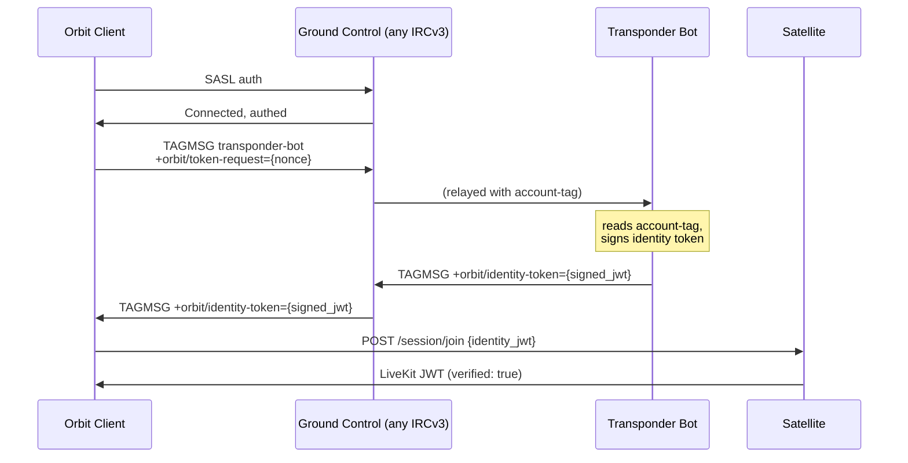

# Transponder

Transponder is a standalone, optional identity-bridging service in the Orbit ecosystem. It is not
an IRC component and not a media component - it is a signing service that bridges the identity
boundary between Ground Control (IRC) and Satellite nodes.

Transponder is the first planned post-MVP addition to the Orbit component set. Phase 0
(single-server identity bridging) is high-feasibility and should follow the MVP closely.

## Why Transponder Is Needed

IRC handles user authentication within its own protocol boundary. SASL authenticates a user to the
IRC server; the `account-tag` extension lets other clients on the same server see which account sent
a message. But those assertions are server-scoped - they do not travel outside the IRC connection.

When a user connects to a Satellite node (a completely separate service), the Satellite has no
native way to verify that this person is the same authenticated user from Ground Control. The
[Satellite authentication model](../02-components/02-satellite.md#satellite-authentication) in the MVP
uses a public join key - anyone who presents the key gets access. That model cannot support
federation, cross-server trust, or basic verified identity display in voice sessions.

The solution must not require modifications to any IRC server. Orbit's design philosophy is
explicit: Orbit is a layer on top of existing IRC. Any IRCv3 server that supports `account-tag` and
`message-tags` can become Orbit-enabled. Transponder must be a standalone component that works
alongside any compliant IRC server, not a patch to one specific implementation. It must also be
**optional** - if Transponder isn't deployed, everything else still works and the experience degrades
gracefully, not catastrophically.

## Architecture

Transponder is a small, standalone service deployed alongside Ground Control (e.g., in the same
`docker-compose.yml`). It has no code-level dependency on any specific IRC server implementation.

Two components:

- **IRC bot**: A lightweight IRC client connected to Ground Control. It listens for `TAGMSG`
  messages carrying a `+orbit/token-request` tag.
- **HTTP signing endpoint**: Publishes the Transponder's signing public key and handles key
  distribution (see [Key Publication](#key-publication)).

Transponder needs exactly one thing from the IRC server: **server-asserted `account-tag` on
messages** - a standard IRCv3 feature that cannot be forged by clients. It does not access the IRC
server's auth backend, does not handle passwords, and does not need to know whether Ground Control
uses internal accounts, LDAP, SQL-backed auth, or an external OIDC provider. It trusts the
`account-tag` that the IRC server asserts after authenticating the user through whatever backend it
uses. This makes Transponder IRC-server-agnostic - it works with any IRCv3 server that supports
`account-tag`.

## How It Works

1. Transponder generates an **Ed25519 signing keypair** at deployment and stores it in its own
   configuration. The IRC server knows nothing about this key.
2. Transponder publishes its public key (see [Key Publication](#key-publication)).
3. When a user wants to join a Satellite session, the Orbit client requests an identity token from
   Transponder via IRC - no separate HTTP authentication step. The client sends a `TAGMSG` to the
   Transponder bot's nickname with a `+orbit/token-request` tag containing a nonce. The Transponder
   bot receives this message, reads the server-asserted `account-tag` (which cannot be forged -
   the IRC server attaches it based on the user's SASL session), signs an identity token, and
   responds via `TAGMSG` back to the client.
4. The client presents this token to the Satellite token service in the `/session/join` request.
5. The Satellite verifies the token's signature against Transponder's known public key (configured
   at node setup or fetched from `.well-known`). If valid, it issues a LiveKit JWT with the
   verified account name baked into the participant identity.

This keeps both the IRC server and the Satellite completely unchanged. The IRC server does what IRC
servers do - authenticate users, relay messages, manage channels. The Satellite does what media
servers do - route audio and video. Transponder is the only Orbit-specific server-side component in
this flow, and it is a thin, stateless bridge.

## Identity Token Format

The signed identity token is a short-lived JWT. Required claims:

| Claim | Value                                              | Description                                   |
|-------|----------------------------------------------------|-----------------------------------------------|
| `sub` | IRC account name (e.g., `zealsprince`)             | Subject - the authenticated user              |
| `iss` | Server identifier (e.g., `irc.hivecom.net`)        | Issuer - the Ground Control instance          |
| `aud` | Target Satellite session or node (optional)        | Audience - can be broad for MVP               |
| `iat` | Issued-at timestamp                                | Token creation time                           |
| `exp` | Short expiration (5 minutes is sufficient)         | Token is only used to obtain a LiveKit JWT    |

The token is signed with Transponder's Ed25519 private key and verified by the Satellite using the
corresponding public key.

## Key Publication

Transponder publishes its signing public key via one or more of:

- **`/.well-known/orbit/keys.json`** (primary): Served by Transponder itself or a reverse proxy.
  This is the simplest mechanism for operators - a standard well-known endpoint that clients and
  Satellite nodes can fetch automatically without any DNS configuration.
- **DNS TXT record**: Analogous to DKIM - a `orbit._keys.example.com` TXT record containing the
  public key. Decentralized; leverages existing DNS infrastructure.
- **DNS SRV record**: `_transponder._tcp.example.com` pointing to the Transponder service,
  consistent with how Satellite nodes and Ground Control are discovered. See
  [DNS & Service Discovery](../05-infrastructure/01-domain-discovery.md).

The primary mechanism is `.well-known` - it is the simplest for operators and requires no DNS
changes beyond what is already needed for the deployment. DNS records are alternatives for
deployments that prefer DNS-centric service advertisement or need out-of-band key distribution.

## Verified and Unverified Users

The Satellite token service can issue tokens in two modes:

| Mode           | How they authenticate                          | LiveKit JWT contains                                                           | Orbit UI treatment                                              |
|----------------|------------------------------------------------|--------------------------------------------------------------------------------|-----------------------------------------------------------------|
| **Verified**   | Signed identity token from Transponder         | `account: "zealsprince"`, `server: "irc.hivecom.net"`, `verified: true`       | Display name + verified indicator (e.g., checkmark, badge)     |
| **Unverified** | Join key, room password, or node-level auth    | `display_name: "some-name"`, `verified: false`                                 | Display name shown, no badge, clear "unverified" indicator      |

Unverified users:

- Can join voice/video sessions if the node's auth policy allows it (join key, password, or open
  access).
- Have self-asserted display names. These are **not trustworthy** - the UI must never present them
  as equivalent to verified identities.
- Cannot impersonate a verified user. If a verified `zealsprince` is in the session, an unverified
  participant claiming the same name must be visually distinguishable (e.g., suffixed with a tag,
  different color, or lacking the badge).
- Are subject to the same moderation controls as anyone else in the session (mute, kick, etc.).

## Graceful Degradation

Transponder is optional. If a server operator doesn't deploy it, nothing breaks:

| Feature             | With Transponder                                       | Without Transponder                                    |
|---------------------|--------------------------------------------------------|--------------------------------------------------------|
| Text chat           | Works (pure IRC)                                       | Works (pure IRC)                                       |
| Group voice / video | Works, participants verified                           | Works, all participants unverified                     |
| BYON                | Works, IRC users verified                              | Works, everyone unverified                             |
| Web widget          | Works (has its own JWT flow via widget gateway)        | Works (has its own JWT flow via widget gateway)        |
| P2P calls           | Works, caller identity verified                        | Works, caller identity unverified                      |

The Orbit client detects whether a Transponder is available for the current domain (via
`_transponder._tcp` DNS SRV, `/.well-known/orbit/keys.json`, or the `orbit._keys` DNS TXT record).
If none is found, the client skips the identity token step and joins Satellite sessions as an
unverified participant. The UI reflects this - no verification badges for anyone, but everything
functions.

This is the correct default for the "Orbit works on any IRCv3 server" promise. Two people running
Orbit on Libera.Chat with no Transponder and no server-operated Satellite can still use BYON voice.
They both show up unverified because nobody's running the service. The experience is honest, not
broken.

## Federation Trust Chain

The signed identity model scales naturally to federation:

- **Same-server (MVP)**: The Satellite trusts one Transponder's public key. Auto-configured at
  deployment - Transponder ships alongside Ground Control and the key is shared via local config.
- **Linked network**: Multiple Ground Control instances in a linked Ergo network share a
  Transponder, or run separate instances with cross-signed keys. All Satellites in the network
  trust the same key set.
- **True federation**: Satellites maintain a trust store of public keys from federated Transponder
  instances. Trust establishment follows one of several models: manual (operator explicitly adds
  keys, like SSH `known_hosts`), TOFU (Trust On First Use - accept on first contact, warn on key
  change), directory-based (a shared discovery service vouches for key-to-server bindings), or
  DNS-based (public key in a DNSSEC-verified TXT record, analogous to DKIM for email).

This is a forward-looking design. The federation trust chain is not an MVP concern - Phase 0 targets
single-server identity bridging only. For the full federation research track, including Layer 1 IRC
network linking, hard federation questions, and evaluation criteria, see
[Research: Federation](../07-research/05-federation.md).

## Implementation Phases

- **Phase 0 - single-server identity bridging**: Implement Transponder - Ed25519 keypair
  generation, IRC bot with `account-tag` verification, TAGMSG-based token issuance, and
  `/.well-known/orbit/keys.json` key publication. Implement token verification in the Satellite
  token service. This replaces the public join key model for verified users while retaining join
  key / password access for unverified users. Phase 0 requires no IRC server changes and no
  federation infrastructure.

- **Phase 1 - IRC linking**: Set up a two-server Ergo linked network. Both servers share the same
  Transponder, or run separate instances with cross-signed keys. Satellites trust both. Test text
  federation, history synchronization under netsplits, and failure modes before proceeding.

- **Phase 2 - cross-org federation**: Independent servers with independent Transponder instances
  and independent keys. Implement trust store management in the Satellite token service. Evaluate
  TOFU vs. directory vs. DNS-based trust models via prototype. Do not attempt Phase 2 until Phase 1
  is deployed and its limitations are understood in practice.

## MVP Status

Transponder is the first planned post-MVP addition. Phase 0 (single-server identity bridging) is
high-feasibility and should follow the MVP closely. It improves single-server Satellite
authentication with no IRC server changes required. It is fully optional - deployments without
Transponder degrade gracefully to fully-unverified Satellite sessions.

## Cross-References

- [Satellite](../02-components/02-satellite.md) - Satellite authentication context and the public join
  key model that Transponder supersedes
- [DNS & Service Discovery](../05-infrastructure/01-domain-discovery.md) - Transponder SRV discovery and
  key publication via DNS
- [Research: Federation](../07-research/05-federation.md) - the full federation research track, including
  Layer 1 IRC network linking, hard federation questions, risks, and evaluation criteria
