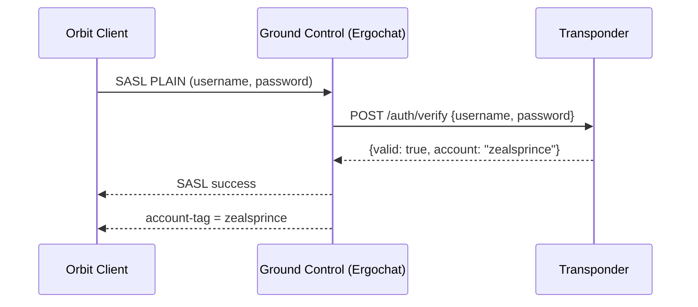
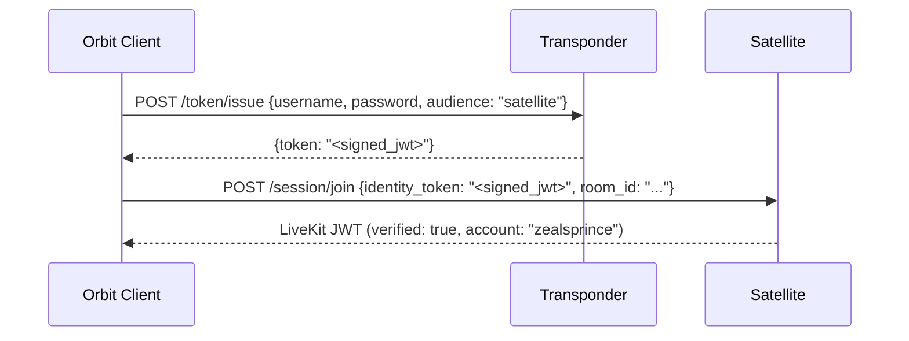

# Transponder

Transponder is a standalone, optional identity service in the Orbit ecosystem. It is the single source of truth for user identity across all Orbit components. Ground Control, Satellite, and any future service that needs to verify a user's identity can plug into Transponder via its HTTP API.

Transponder is not an IRC component and not a media component. It is a lightweight auth and token-signing service that any Orbit component can consume independently. Like every other Orbit component, it has no runtime dependency on any other service - it operates as a self-contained HTTP service with a pluggable authentication backend.

Transponder is the first planned post-MVP addition to the Orbit component set. Phase 0 (single-server identity service) is high-feasibility and should follow the MVP closely.

## Why Transponder Is Needed

The MVP authenticates users within Ground Control's own boundary: SASL to Ergochat, NickServ for account management, `account-tag` for identity assertion on the IRC wire. This works for text chat, but those assertions are server-scoped - they do not travel outside the IRC connection.

When a user connects to a Satellite node (a completely separate service), the Satellite has no way to verify that this person is the same authenticated user from Ground Control. The [Satellite authentication model](../02-components/02-satellite.md#satellite-authentication) in the MVP uses a public join key - anyone who presents the key gets access. That model cannot support verified identity display in voice sessions, cross-server trust, or federation.

The deeper problem is architectural: in the MVP, identity is embedded inside Ground Control. There is no shared identity layer that multiple components can consume. Transponder solves this by extracting identity into its own service - a standalone authority that all components plug into equally.

Transponder must be **optional**. If it is not deployed, Ground Control falls back to its built-in NickServ/SASL authentication (which works perfectly for text-only deployments), and Satellite sessions operate with unverified participants. The experience degrades gracefully, not catastrophically.

## Architecture

Transponder is a small, standalone HTTP service deployed alongside other Orbit components (e.g., in the same `docker-compose.yml`). It has no code-level dependency on any other Orbit component.

```
                   Transponder (Identity Service)
                  ┌──────────────────────────────┐
                  │  HTTP API                     │
                  │  POST /auth/verify            │
                  │  POST /token/issue            │
                  │  GET  /keys                   │
                  │                               │
                  │  Backend: pluggable            │
                  │  (internal DB, OIDC, LDAP…)   │
                  └──────┴───────────────┴────────┘
                         │               │
               auth-script delegation    token verification
                         │               │
                  ┌──────┴──────┐  ┌─────┴──────┐
                  │Ground Control│  │  Satellite  │
                  │  (Ergochat)  │  │  (LiveKit)  │
                  └─────────────┘  └────────────┘
```

Three components consume Transponder:

- **Ground Control (Ergochat)** delegates user authentication to Transponder via Ergochat's `auth-script` mechanism. Ergochat's SASL flow remains unchanged from the client's perspective - the client still sends `SASL PLAIN` or `SCRAM-SHA-256` - but Ergochat verifies credentials by calling Transponder's `/auth/verify` endpoint instead of its internal account database. The `account-tag` continues to work exactly as before: the IRC server sets it after successful authentication, regardless of which backend verified the credentials.
- **Satellite** verifies identity tokens issued by Transponder. When a user wants to join a voice session with verified identity, the Orbit client requests a signed token from Transponder's `/token/issue` endpoint and presents it to the Satellite token service. Satellite verifies the signature against Transponder's published public key.
- **The Orbit client** authenticates to Transponder directly via HTTP to obtain identity tokens for Satellite sessions. The client's IRC credentials are verified through the normal SASL flow (which Ergochat delegates to Transponder); for Satellite tokens, the client makes a separate HTTP request to Transponder.

## API Contract

Transponder defines a minimal HTTP API. The contract is intentionally small - it covers authentication verification, token issuance, and key publication. The auth backend behind this contract is pluggable.

### `POST /auth/verify`

Verifies user credentials. Called by Ergochat's `auth-script` during SASL authentication.

**Request:**
```json
{
  "username": "zealsprince",
  "password": "..."
}
```

**Response (success):**
```json
{
  "valid": true,
  "account": "zealsprince"
}
```

**Response (failure):**
```json
{
  "valid": false
}
```

This endpoint is called by the IRC server, not by clients directly. The `account` field in the response is the canonical account name that Ergochat will use for the `account-tag` - this allows Transponder to normalize usernames (e.g., case folding) before they enter the IRC layer.

### `POST /token/issue`

Issues a signed identity token for use with Satellite or other services. Called by authenticated Orbit clients.

**Request:**
```json
{
  "username": "zealsprince",
  "password": "...",
  "audience": "satellite"
}
```

**Response:**
```json
{
  "token": "<signed_jwt>"
}
```

The client authenticates directly to Transponder with the same credentials used for IRC. Transponder verifies them against its auth backend (the same backend Ergochat delegates to) and issues a signed JWT. This is a direct HTTP call - no IRC involvement, no TAGMSG, no bot.

The `audience` field is optional and can scope the token to a specific service or session. For the initial implementation, a broad audience (e.g., `"satellite"`) is sufficient.

### `GET /keys`

Publishes Transponder's signing public key(s) for token verification. Called by Satellite nodes and optionally by clients.

**Response:**
```json
{
  "keys": [
    {
      "kid": "transponder-1",
      "kty": "OKP",
      "crv": "Ed25519",
      "x": "<base64url-encoded public key>"
    }
  ]
}
```

This follows the JWKS (JSON Web Key Set) convention. Satellite nodes fetch this endpoint at startup (or periodically) to obtain the public key(s) needed to verify identity tokens. The endpoint can also be served at `/.well-known/orbit/keys.json` via a reverse proxy for discovery convenience.

## Auth Backend Adapters

Transponder's auth backend is pluggable. The API contract above is the interface; the implementation behind it varies:

| Backend | Use Case | How It Works |
|---------|----------|--------------|
| **Internal** | Small communities, simple setups | Transponder manages its own user database (accounts, password hashes). Equivalent to NickServ but external to Ergochat. |
| **OIDC / OAuth2** | Organizations with existing identity infrastructure | Transponder delegates to an external IdP (Keycloak, Authentik, Authelia, Zitadel, etc.). The `/auth/verify` endpoint validates credentials against the IdP's token endpoint. |
| **LDAP** | Enterprise environments | Transponder performs an LDAP bind to verify credentials. |
| **Custom** | Anything else | Transponder's backend interface is a simple trait/interface - verify(username, password) → bool. Any backend that implements it works. |

For the MVP-adjacent Phase 0 implementation, the internal backend is sufficient. OIDC and LDAP adapters are natural follow-ups that extend Transponder's reach without changing its API contract or any other component's integration.

The key property: **neither Ground Control nor Satellite knows or cares which backend Transponder uses.** Ground Control sends credentials to `/auth/verify` and gets back a yes/no. Satellite sends a JWT to its token service and verifies the signature. The auth backend is Transponder's private concern.

## Ground Control Integration

Ergochat supports `auth-script` - a configuration option that delegates SASL credential verification to an external command or HTTP endpoint. This is a standard Ergochat feature, not an Orbit-specific patch.

When Transponder is deployed, the operator configures Ergochat's `auth-script` to call Transponder's `/auth/verify` endpoint. The SASL flow from the client's perspective is unchanged:



The client doesn't know Transponder exists at the IRC level. Ergochat doesn't know what backend Transponder uses. `account-tag` continues to be server-asserted and unforgeable - the trust model for the [Tag System](01-ground-control/02-tags/02-trust-model.md) is unchanged.

**Without Transponder:** Ergochat uses its built-in NickServ and internal account database for SASL authentication. This is the MVP default and requires no external service. Deploying Transponder is an upgrade, not a requirement.

## Satellite Integration

The Satellite integration is straightforward:



The Satellite token service:

1. Receives the identity token from the client.
2. Fetches Transponder's public key from the `/keys` endpoint (cached after first fetch).
3. Verifies the JWT signature and expiration.
4. If valid, issues a LiveKit JWT with `verified: true` and the authenticated account name.
5. If invalid or absent, falls back to the unverified flow (join key, password, or open access).

The Satellite node does not contact Transponder at session-join time - it only needs the public key, which it fetches once and caches. Token verification is a local cryptographic operation. This keeps Transponder out of the media hot path.

## Identity Token Format

The signed identity token is a short-lived JWT. Required claims:

| Claim | Value | Description |
|-------|-------|-------------|
| `sub` | Account name (e.g., `zealsprince`) | Subject - the authenticated user |
| `iss` | Transponder instance identifier (e.g., `transponder.hivecom.net`) | Issuer - the Transponder that signed the token |
| `aud` | Target service (e.g., `satellite`) | Audience - which service this token is for |
| `iat` | Issued-at timestamp | Token creation time |
| `exp` | Short expiration (5 minutes is sufficient) | Token is only used to obtain a LiveKit JWT |

The token is signed with Transponder's Ed25519 private key and verified by consumers using the corresponding public key from the `/keys` endpoint.

## Key Publication

Transponder publishes its signing public key via the `/keys` endpoint. For broader discovery, the key can also be published through:

- **`/.well-known/orbit/keys.json`** (primary): The `/keys` endpoint response served at a well-known URL via the reverse proxy. This is the simplest mechanism for operators - a standard well-known endpoint that Satellite nodes and clients can fetch automatically without any DNS configuration.
- **DNS TXT record**: Analogous to DKIM - an `orbit._keys.example.com` TXT record containing the public key. Decentralized; leverages existing DNS infrastructure.
- **DNS SRV record**: `_transponder._tcp.example.com` pointing to the Transponder service, consistent with how Satellite nodes and Ground Control are discovered. See [DNS & Service Discovery](../05-infrastructure/01-domain-discovery.md).

The primary mechanism is the `/keys` endpoint (optionally mirrored to `.well-known`). DNS records are alternatives for deployments that prefer DNS-centric service advertisement or need out-of-band key distribution.

## Verified and Unverified Users

The Satellite token service can issue tokens in two modes:

| Mode | How they authenticate | LiveKit JWT contains | Orbit UI treatment |
|------|----------------------|---------------------|--------------------|
| **Verified** | Signed identity token from Transponder | `account: "zealsprince"`, `server: "hivecom.net"`, `verified: true` | Display name + verified indicator (e.g., checkmark, badge) |
| **Unverified** | Join key, room password, or node-level auth | `display_name: "some-name"`, `verified: false` | Display name shown, no badge, clear "unverified" indicator |

Unverified users:

- Can join voice/video sessions if the node's auth policy allows it (join key, password, or open access).
- Have self-asserted display names. These are **not trustworthy** - the UI must never present them as equivalent to verified identities.
- Cannot impersonate a verified user. If a verified `zealsprince` is in the session, an unverified participant claiming the same name must be visually distinguishable (e.g., suffixed with a tag, different color, or lacking the badge).
- Are subject to the same moderation controls as anyone else in the session (mute, kick, etc.).

## Graceful Degradation

Transponder is optional. If a server operator doesn't deploy it, nothing breaks:

| Feature | With Transponder | Without Transponder |
|---------|-----------------|-------------------|
| Text chat | Works - Ergochat delegates auth to Transponder | Works - Ergochat uses built-in NickServ/SASL |
| Group voice / video | Works, participants verified | Works, all participants unverified |
| BYON | Works, users verified | Works, everyone unverified |
| Web widget | Works (guests use SASL ANONYMOUS regardless) | Works (guests use SASL ANONYMOUS regardless) |
| P2P calls | Works, caller identity verified | Works, caller identity unverified |

The Orbit client detects whether a Transponder is available for the current domain (via `_transponder._tcp` DNS SRV, `/.well-known/orbit/keys.json`, or the `orbit._keys` DNS TXT record). If none is found, the client skips the identity token step and joins Satellite sessions as an unverified participant. The UI reflects this - no verification badges for anyone, but everything functions.

This is the correct default for the "Orbit works on any IRCv3 server" promise. Two people running Orbit on Libera.Chat with no Transponder and no server-operated Satellite can still use BYON voice. They both show up unverified because nobody's running the service. The experience is honest, not broken.

## Federation Trust Chain

The standalone identity service model scales naturally to federation - more cleanly than the previous IRC-bot design, because Transponder instances are already independent HTTP services with published keys:

- **Same-server**: The Satellite trusts one Transponder's public key. Auto-configured at deployment - Transponder ships alongside Ground Control and the key is shared via local config or `.well-known` discovery.
- **Linked network**: Multiple Ground Control instances in a linked Ergo network share a Transponder, or run separate instances with cross-signed keys. All Satellites in the network trust the same key set.
- **True federation**: Satellites maintain a trust store of public keys from federated Transponder instances. Trust establishment follows one of several models: manual (operator explicitly adds keys, like SSH `known_hosts`), TOFU (Trust On First Use - accept on first contact, warn on key change), directory-based (a shared discovery service vouches for key-to-server bindings), or DNS-based (public key in a DNSSEC-verified TXT record, analogous to DKIM for email).

Because Transponder is a standalone HTTP service - not an IRC bot - federated trust is key exchange between HTTP endpoints. No IRC topology is involved. This is the same trust model used by OIDC discovery (`/.well-known/openid-configuration` + JWKS endpoints) and by DKIM (DNS TXT records for email signing keys).

For the full federation research track, including IRC network linking, hard federation questions, and evaluation criteria, see [Research: Federation](../07-research/05-federation.md).

## Implementation Phases

- **Phase 0 - single-server identity service**: Implement Transponder with the internal auth backend, Ed25519 keypair generation, the three HTTP endpoints (`/auth/verify`, `/token/issue`, `/keys`), and `/.well-known/orbit/keys.json` publication. Configure Ergochat's `auth-script` to delegate to Transponder. Implement token verification in the Satellite token service. This replaces the public join key model for verified users while retaining join key / password access for unverified users. Phase 0 requires no IRC server patches - only standard Ergochat configuration.

- **Phase 1 - auth backend adapters**: Add OIDC and LDAP backend adapters. This extends Transponder to organizations with existing identity infrastructure without changing the API contract or any other component's integration.

- **Phase 2 - IRC linking**: Set up a two-server Ergo linked network. Both servers delegate auth to the same Transponder instance, or run separate instances with cross-signed keys. Satellites trust both. Test text federation, history synchronization under netsplits, and failure modes before proceeding.

- **Phase 3 - cross-org federation**: Independent servers with independent Transponder instances and independent keys. Implement trust store management in the Satellite token service. Evaluate TOFU vs. directory vs. DNS-based trust models via prototype. Do not attempt Phase 3 until Phase 2 is deployed and its limitations are understood in practice.

## MVP Status

Transponder is the first planned post-MVP addition. Phase 0 (single-server identity service) is high-feasibility and should follow the MVP closely. It improves Satellite authentication with verified identity and centralizes auth in a pluggable service. It is fully optional - deployments without Transponder use Ergochat's built-in NickServ/SASL for IRC auth and degrade to fully-unverified Satellite sessions.

## Cross-References

- [Satellite](../02-components/02-satellite.md) - Satellite authentication context and the public join key model that Transponder supersedes
- [Ground Control](../02-components/01-ground-control/01-overview.md) - Ergochat configuration, `auth-script` delegation
- [DNS & Service Discovery](../05-infrastructure/01-domain-discovery.md) - Transponder SRV discovery and key publication via DNS
- [Research: Federation](../07-research/05-federation.md) - the full federation research track, including IRC network linking, hard federation questions, risks, and evaluation criteria
