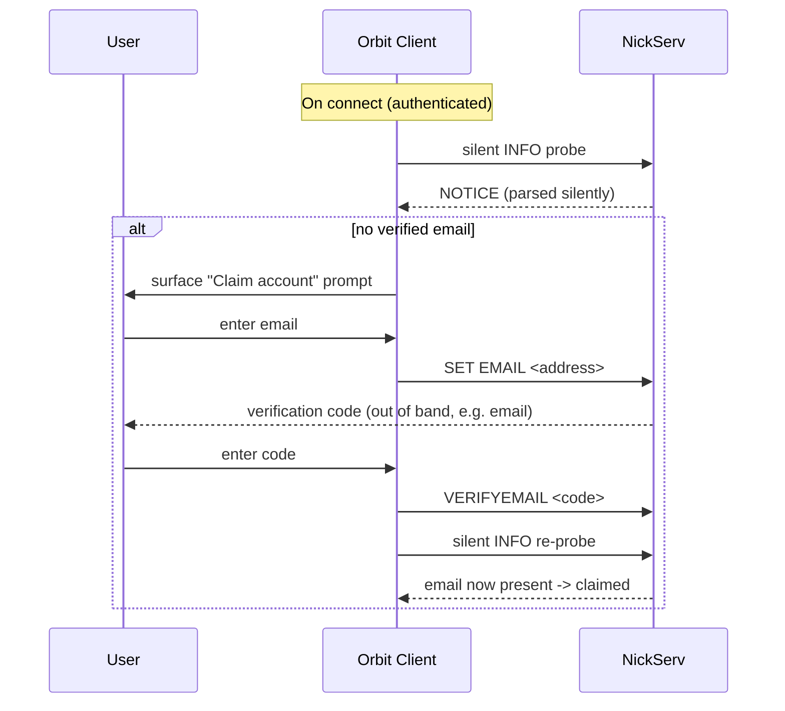

# IRC Services Abstraction

Ergochat ships built-in services - NickServ (account management), ChanServ (channel
management), and HistServ (history access). These are the standard IRC services interface:
a user sends commands to a service bot via `PRIVMSG NickServ :IDENTIFY ...` and reads its
replies as `NOTICE`s. Decades of IRC clients drive these services by typing raw commands.

Orbit treats services as **implementation details of the Uplink deployment**, not as a user
interface. The guiding principle:

> Orbit clients express user **intent** (claim my account, stay reachable offline, ban a user,
> register a channel). The client translates intent into the appropriate service commands behind
> the scenes. Users never type `/NS` or `/CS` commands and never see raw service `NOTICE` traffic
> unless they explicitly opt into a power-user/raw mode.

This page defines which service interactions Orbit abstracts, how it abstracts them, and what
stays as a raw IRC fallback. It complements [Transponder](04-transponder.md) (the OIDC identity role)
and [Permissions](../03-identity/02-permissions.md) (channel modes).

## Design Principles

1. **Intent over commands.** UI surfaces actions ("Claim account", "Stay online", "Promote to
   operator"). The client maps each action to the underlying service command(s). The command
   syntax is never the contract the user sees.
2. **Silence the service chatter.** Service `NOTICE` replies that result from client-initiated
   background operations (probes, `SET` operations) MUST NOT open a query buffer or pollute the
   server log. They are parsed silently and reflected in UI state. Unsolicited service notices
   (e.g., a verification reminder the server sends on connect) MAY be surfaced, but SHOULD be
   rendered as structured UI, not raw text.
3. **Services are not the source of truth for identity.** When an identity provider is configured,
   OIDC is authoritative (see [Transponder](04-transponder.md)). NickServ is a coexisting
   compatibility and recovery layer, not the identity authority.
4. **Degrade honestly.** On a deployment with no identity provider, the same UI actions map
   directly onto NickServ/ChanServ. The abstraction is identical; only the backing authority
   changes.
5. **Never gatekeep raw IRC.** A power user or a third-party IRC client can always drive the
   services directly. Orbit's abstraction is additive, never a lock-in.

## NickServ

NickServ owns the IRC account: registration, credentials, email, and per-account settings such
as `always-on`. In an OIDC deployment the account itself is autocreated on first JWT login -
verified by the auth-script bridge (`SASL PLAIN`) or Ergo's native `accounts.jwt-auth` (`IRCV3BEARER`) (see
[Transponder - NickServ and the Identity Provider](04-transponder.md#nickserv-and-the-identity-provider)) -
but NickServ remains the surface for the things OIDC does not own: offline delivery configuration
and email-based account recovery for legacy clients.

### Account Claim (Email Recovery Readiness)

An OIDC-autocreated account starts with **no email** on its NickServ record. The presence of a
verified email is the signal that the account is "claimed" - i.e., recoverable via NickServ's
`SENDPASS`/`RESETPASS` flow by a legacy IRC client, independent of the identity provider.

- The client probes account state **silently** on connect to determine claim status (does the
  NickServ record carry a verified email?).
- If unclaimed, the client surfaces a non-blocking prompt to claim the account.
- The claim flow maps to NickServ commands: `SET EMAIL <address>` then `VERIFYEMAIL <code>`.
- The verified email is the claim signal; once present, the account can recover via
  `SENDPASS`/`RESETPASS`.

The email a user claims with is their own choice. The client SHOULD prefill it from the OIDC
`email` claim. It MUST NOT treat the NickServ email as an identity assertion - it is a recovery
channel, not a verified identity (see [Metadata Is Not an Identity Signal](#metadata-is-not-an-identity-signal)).

**Email match is the account-integrity signal.** Comparing the NickServ email against the OIDC
`email` claim is how the client detects that an account was not cleanly claimed - most importantly
the co-ownership case where someone NickServ-registered the nick before the OIDC user first logged
in (see [Transponder - Namespace conflicts](04-transponder.md#nickserv-and-the-identity-provider)).
The client SHOULD surface three states:

- **Claimed (in sync):** NickServ email present and equal to the OIDC email. No action.
- **Mismatch:** NickServ email present but different from the OIDC email - warn prominently and
  offer re-claim. This is the squatting/co-ownership tell.
- **Unclaimed:** no NickServ email - offer the claim flow.

> **Implementation note - why the claim sequence is `SET EMAIL` then `RESETPASS`, never
> `SET PASSWORD`.** An OIDC-autocreated account has empty credentials (`PassphraseHash` unset).
> Ergo blocks `NS SET PASSWORD` on such accounts with `errCredsExternallyManaged` - it treats the
> account as externally managed (by the OIDC provider, whether verified natively or via the
> auth-script bridge). The email-reset path is the way in: `RESETPASS` calls the
> internal `setPassword` with elevated privileges, which bypasses that lock and can set the first
> password. So `SET EMAIL` -> `VERIFYEMAIL` establishes recovery, and `SENDPASS`/`RESETPASS` is the
> only self-service route to an actual password on an OIDC-origin account. Re-running `RESETPASS`
> also overwrites a squatter's stored password, which is how a re-claim can fully evict prior
> co-ownership.

### Always-On (Offline Delivery)

[DMs](01-uplink/03-dms.md#always-on-mode) require always-on mode so messages are not lost while a
registered user is disconnected. Deployments MUST set always-on as `opt-out` so registered users
are reachable by default. The client therefore should never need to *enable* always-on for a
correctly configured deployment - but it SHOULD:

- Surface current always-on state as a clear, plain-language status ("You stay reachable while
  offline"), not as a raw `GET always-on` value.
- Warn when always-on is *off* for a registered user, since that contradicts the deployment
  requirement and means missed DMs.
- Map a toggle to `SET always-on true|false` with the reply notices suppressed.

> **Conformance note.** Offering a *disable* toggle lets a user opt out of the deployment's
> reachability guarantee. That is acceptable as a user choice, but the default and recommended
> state is on. Clients SHOULD treat "off" as a warning state, not a neutral one.

### What Stays Raw

OIDC users have no reason to ever type a `/NS` command - registration, password, MFA, and renames
live in the identity provider. Legacy IRC clients continue to use NickServ `IDENTIFY`,
`SENDPASS`, `RESETPASS`, and `RENAME` directly; that path is unchanged and is the reason the email
claim matters. See [Transponder](04-transponder.md#nickserv-and-the-identity-provider).

## ChanServ

ChanServ owns **persistent** channel state. This is the gap that raw channel modes do not cover:
[Permissions](../03-identity/02-permissions.md) deliberately scopes Orbit to IRC's built-in
channel modes (`+o`, `+v`, `+b`), which are *ephemeral* - they live only as long as the channel
is in memory. ChanServ is what makes a channel survive a server restart, remembers who the
founder is, and re-applies standing grants and bans when the channel is recreated.

| Concern | Mechanism | Layer |
|---|---|---|
| Live moderation (op, voice, kick, ban) | Channel modes `+o`/`+v`/`+b`, `KICK` | Raw IRC (see [Permissions](../03-identity/02-permissions.md)) |
| Channel survives restart / no-members | `CS REGISTER`, persistent channel | ChanServ |
| Founder / standing operator grants | `CS AMODE`, access list | ChanServ |
| Standing bans (re-applied on rejoin) | `CS AKICK` | ChanServ |
| Topic, entry message, channel settings | `CS SET` | ChanServ |

The Orbit abstraction:

- **Live moderation is intent-mapped to channel modes**, not ChanServ. Promoting a user to
  operator in the UI sends `MODE #chan +o nick`; banning sends `MODE #chan +b` plus `KICK`. This
  matches the Permissions spec and works on any IRCv3 server.
- **Persistent channel administration is intent-mapped to ChanServ.** "Make this channel
  permanent", "set so-and-so as a permanent operator", "permanently ban", and "edit channel
  settings" map to `CS REGISTER`, `CS AMODE`, `CS AKICK`, and `CS SET` respectively - reserved
  for channel founders/operators and surfaced in a channel-settings panel, not a command line.
- **Reply notices are suppressed** the same way as NickServ: the client confirms success/failure
  through UI state, not raw `ChanServ` notice text.

## HistServ

HistServ exposes stored history through a service command interface. Orbit does not use it as a
user-facing surface: history retrieval is handled by the `chathistory` capability (see
[Uplink](01-uplink/01-overview.md)), which the client drives natively for scrollback and backlog.
HistServ messages are therefore treated as service chatter - filtered out of unread/mention/badge
state and never rendered as ordinary chat.

## Metadata Is Not an Identity Signal

Ergo's `draft/metadata-2` (avatars, display names, status; see
[Presence](01-uplink/04-presence.md) and the [Glossary](../01-architecture/03-glossary.md#user-metadata))
is a per-account key/value store that users set themselves. It is the right surface for cosmetic,
cross-client profile signals - and it is explicitly **not** a claim or identity-verification
signal. Anyone can set their own metadata. The authoritative identity signal is the
server-asserted `account-tag` (see [Permissions](../03-identity/02-permissions.md#identity-display)
and [Tag Trust Model](01-uplink/02-tags/02-trust-model.md)); the recovery signal is the verified
NickServ email. Clients MUST NOT conflate metadata with either.

## Service Notice Routing

Because the abstraction depends on never leaking service chatter, clients MUST handle service
`NOTICE`/`PRIVMSG` traffic deterministically:

| Source | Trigger | Routing |
|---|---|---|
| NickServ/ChanServ | Reply to a client-initiated background op (probe, `SET`) | Parsed silently; never opens a buffer |
| NickServ/ChanServ | Unsolicited (server-initiated reminder, e.g. unverified-email notice) | Reflected as structured UI state; not raw text |
| HistServ | Any | Suppressed from unread/mention/badge state |
| Any service | Power-user/raw mode explicitly enabled | Shown verbatim in a service query buffer |

Suppression is implemented with short-lived "suppressing" flags around each client-initiated
operation plus a dedicated silent-probe path: while a probe or `SET` is in flight, matching service
notices are parsed for state and withheld from buffers.

## Conformance Summary

| Service interaction | Orbit requirement |
|---|---|
| NickServ email claim / recovery readiness | Abstracted - silent probe + claim flow; never raw commands |
| NickServ always-on management | Abstracted - surface status, warn when off |
| NickServ raw commands for OIDC users | Never required |
| Live channel moderation (modes) | Intent-mapped to channel modes (see Permissions) |
| Persistent channel admin (ChanServ) | Abstracted into a channel-settings panel |
| HistServ | Not user-facing; use `chathistory` |
| Metadata as profile signal | Cosmetic only, never an identity signal |

## Cross-References

- [Transponder](04-transponder.md) - the OIDC identity role, native Ergo verification, NickServ coexistence
- [Authentication](../03-identity/01-authentication.md) - SASL, OIDC flow, NickServ compatibility
- [Permissions](../03-identity/02-permissions.md) - channel modes, identity display
- [DMs](01-uplink/03-dms.md) - always-on delivery requirement
- [Presence](01-uplink/04-presence.md) - metadata, avatars, status
