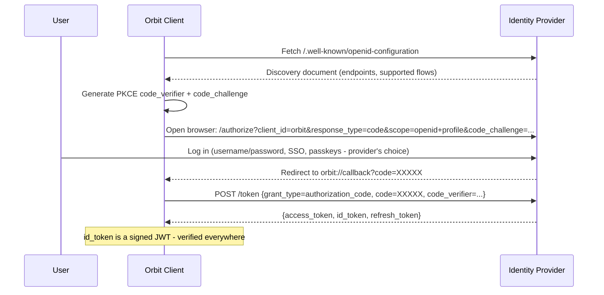
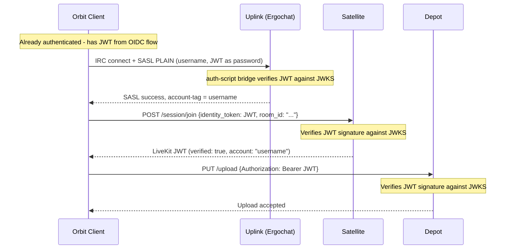
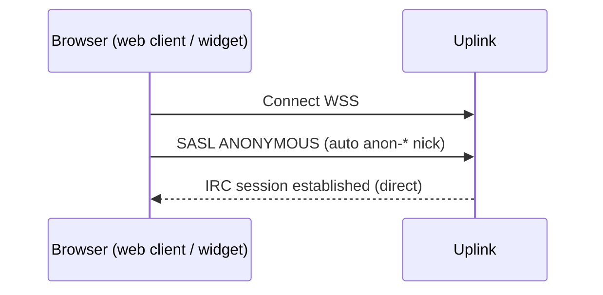

# Authentication

Authentication in Orbit is built on standard OIDC (OpenID Connect). The Orbit client authenticates against the server's identity provider using the Authorization Code flow with PKCE, obtains a signed JWT, and uses that JWT across all Orbit components - Uplink (IRC), Satellite (voice/video), and Depot (file storage). One login, verified everywhere.

For deployments without an identity provider, Ergochat's built-in NickServ/SASL provides a fallback authentication path for IRC - but identity verification on Satellite and Depot is unavailable. See [Graceful Degradation](#graceful-degradation) below.

For channel-level permissions that derive from authentication state, see [Permissions](02-permissions.md).

## OIDC Authentication Flow

The Orbit client authenticates against the server's OIDC identity provider (the [Transponder](../02-components/04-transponder.md) role) using the standard Authorization Code flow with PKCE. This works with any OIDC-compliant provider - Keycloak, Authentik, Authelia, Zitadel, Supabase, or any other.

The identity provider controls the login experience. If the operator wants username/password, that's their choice. If they want Google SSO, passkeys, or MFA - that's configured in the provider, not in Orbit. The client opens a browser to the authorization endpoint and collects the token at the end.

## How the JWT Flows Through Components

Once the client has a JWT, it is reused across all Orbit components for the current domain - the domain whose `/.well-known/orbit/oidc` or DNS SRV records pointed to the identity provider:

- **Uplink (Ergochat)** - the client sends the JWT as the SASL PLAIN password. Ergochat's `auth-script` calls the auth-script bridge, which verifies the JWT against the provider's JWKS. On success, the bridge returns the `preferred_username` claim as the account name, and Ergochat sets the `account-tag` accordingly.
- **Satellite** - the client presents the JWT with its session join request. The Satellite token service verifies the JWT against the provider's JWKS and issues a LiveKit JWT with `verified: true`.
- **Depot** - the client sends the JWT as a Bearer token. Depot verifies it against the same JWKS.

Each component verifies independently against the provider's published keys. No component contacts any other component to check identity.

## Token Refresh

The OIDC authorization flow returns three tokens: `access_token`, `id_token`, and `refresh_token`. The `access_token` and `id_token` are short-lived (typically 5–15 minutes, controlled by the identity provider). The `refresh_token` is long-lived and used to silently obtain new tokens without requiring the user to log in again.

The Orbit client manages token refresh transparently:

1. On startup, the client checks the stored `id_token` expiry. If it is within 60 seconds of expiry (or already expired), the client immediately performs a silent refresh before attempting to connect to any component.
2. During a session, the client tracks the token expiry and schedules a background refresh before expiry. The refresh uses the `refresh_token` against the provider's token endpoint (`grant_type=refresh_token`). No user interaction is required.
3. On refresh success, the client stores the new tokens and uses the new `id_token` for any subsequent component requests (new Depot uploads, new Satellite session joins). Already-established connections are unaffected:
   - **Uplink (IRC)**: SASL authentication only happens at connect time. An already-connected IRC session persists independently of token expiry. The refreshed token is used on the next reconnect.
   - **Satellite**: The LiveKit session JWT issued at join time has its own lifetime, independent of the OIDC token. An active voice session is unaffected by OIDC token refresh.
   - **Depot**: Each upload request presents the current token. If the token was refreshed since the last upload, the new token is used automatically.
4. If the refresh token is expired or revoked (e.g., the user's account was suspended), the refresh fails. The client displays a re-authentication prompt. The user must log in again to continue using authenticated features.

The refresh token lifetime is set by the identity provider. Operators should configure a refresh token lifetime appropriate to their community (e.g., 7–30 days for persistent logins, shorter for higher-security deployments).

## NickServ and the Identity Provider

When an identity provider is configured, OIDC is the authoritative source of truth for accounts. If a user has a valid JWT, it wins - their Hivecom account maps directly to their IRC account via `preferred_username`, enforced by the auth-script bridge.

NickServ registration can remain open as a compatibility layer. This is a deployment choice, not a requirement. The case for keeping it:

- **Traditional IRC clients cannot authenticate via SASL PLAIN with OIDC.** JWTs are long, short-lived (5-15 minutes), and require a browser-based PKCE flow to obtain. There is no practical way to enter one from irssi, weechat, or similar clients. NickServ `IDENTIFY` bypasses the auth-script path entirely and remains the only viable authentication route for these clients.
- **Self-serve account migration.** When a user changes their Hivecom username, they can rename their NickServ account themselves via `/NS RENAME` rather than requiring admin intervention.

The two authentication paths coexist cleanly:

| Client | Auth path | Account |
|--------|-----------|---------|
| Web / Orbit client | SASL PLAIN (JWT) via auth-script bridge | OIDC account |
| Traditional IRC client | NickServ IDENTIFY | NickServ account |

Namespace conflicts are possible but self-inflicted - if a NickServ account claims a nick that an OIDC user later claims from Hivecom, the NickServ account becomes unreachable via SASL. Nick enforcement still works; the OIDC claim simply wins.

Operators who want strict single-source-of-truth can disable registration (`accounts.registration.enabled = false`). Operators who want maximum client compatibility leave it open.

In the coexistence model, OIDC accounts are autocreated on first login and start with no NickServ email. Orbit clients surface a non-blocking "claim your account" flow that sets and verifies an email so the account is recoverable via NickServ (`SENDPASS`/`RESETPASS`) from legacy clients. This claim email is a recovery channel, not an identity assertion - identity remains the `account-tag`. The client abstracts all NickServ interaction (claim, always-on, service-notice suppression); users never type `/NS` commands. See [IRC Services Abstraction](../02-components/05-services.md).

## Legacy IRC Clients

Traditional IRC clients that cannot perform an OIDC browser flow authenticate via NickServ `IDENTIFY` - this path bypasses the auth-script bridge entirely and works regardless of whether an identity provider is configured. 

## Anonymous Web Widget Users

The Orbit web client (whether embedded as a widget or deployed as a full web app) connects directly to Ergochat's WebSocket endpoint - the same path as the desktop client. There is no middleware proxy.

- Anonymous/guest users connect via SASL ANONYMOUS. Ergochat assigns a `anon-*` nickname automatically.
- No account creation, no backend, no JWT, no session tokens required.
- Guest nicknames are prefixed with `anon-` and cannot be registered.
- Any IRC client - including third-party web UIs - can connect the same way. This is intentional: Orbit does not gatekeep access to a standard IRC server.

## Graceful Degradation

An identity provider is not strictly required. Deployments without one fall back to Ergochat's built-in NickServ/SASL for IRC authentication. However, without an identity provider:

- Satellite participants are **all unverified** - there is no shared identity layer to verify against.
- Depot cannot verify uploads against a user identity.
- There is no single sign-on across components.

This is an acceptable configuration for simple, text-only IRC deployments or communities that don't need verified identity in voice sessions. Everything functions - the experience is honest, not broken.

See [Transponder](../02-components/04-transponder.md) for the full identity provider specification.
