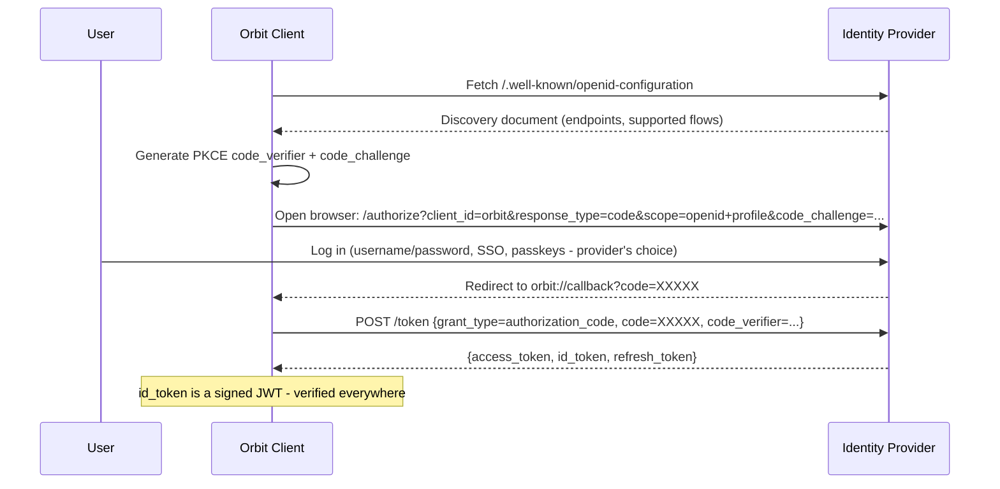
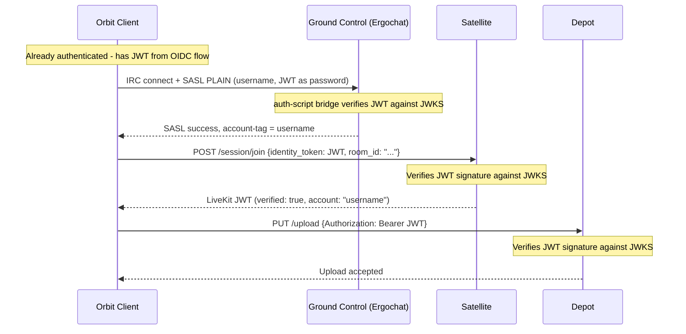

# Authentication

Authentication in Orbit is built on standard OIDC (OpenID Connect). The Orbit client authenticates against the server's identity provider using the Authorization Code flow with PKCE, obtains a signed JWT, and uses that JWT across all Orbit components - Ground Control (IRC), Satellite (voice/video), and Depot (file storage). One login, verified everywhere.

For deployments without an identity provider, Ergochat's built-in NickServ/SASL provides a fallback authentication path for IRC - but identity verification on Satellite and Depot is unavailable. See [Graceful Degradation](#graceful-degradation) below.

For channel-level permissions that derive from authentication state, see [Permissions](02-permissions.md).

## OIDC Authentication Flow

The Orbit client authenticates against the server's OIDC identity provider (the [Transponder](../02-components/04-transponder.md) role) using the standard Authorization Code flow with PKCE. This works with any OIDC-compliant provider - Keycloak, Authentik, Authelia, Zitadel, Supabase, or any other.

The identity provider controls the login experience. If the operator wants username/password, that's their choice. If they want Google SSO, passkeys, or MFA - that's configured in the provider, not in Orbit. The client opens a browser to the authorization endpoint and collects the token at the end.

## How the JWT Flows Through Components

Once the client has a JWT, it is reused across all Orbit components for the current domain - the domain whose `/.well-known/orbit/oidc` or DNS SRV records pointed to the identity provider:

- **Ground Control (Ergochat)** - the client sends the JWT as the SASL PLAIN password. Ergochat's `auth-script` calls the auth-script bridge, which verifies the JWT against the provider's JWKS. On success, Ergochat sets the `account-tag` as usual.
- **Satellite** - the client presents the JWT with its session join request. The Satellite token service verifies the JWT against the provider's JWKS and issues a LiveKit JWT with `verified: true`.
- **Depot** - the client sends the JWT as a Bearer token. Depot verifies it against the same JWKS.

Each component verifies independently against the provider's published keys. No component contacts any other component to check identity.

## NickServ Disablement

When an identity provider is configured, **NickServ must be disabled**. The OIDC provider is the single source of truth for accounts - running NickServ alongside it creates two competing account databases and a namespace conflict (a user could register the same nickname via NickServ and the OIDC provider as two different people).

Disabling NickServ means:

- **Account registration** happens in the identity provider (admin console, self-service portal, etc.), not via `/msg NickServ REGISTER`.
- **Nickname enforcement** still works. Ergochat's nick reservation is tied to account login, not to NickServ specifically. Once `auth-script` confirms an account name, Ergochat enforces that account's reserved nicknames exactly as before.
- **Existing NickServ accounts** should be migrated into the identity provider before switchover. The provider becomes the canonical user database; NickServ's internal database is retired.

The rule is simple: **identity provider configured → NickServ is disabled, the provider owns accounts. No provider → NickServ handles everything.** No hybrid mode, no two-source-of-truth ambiguity.

## Legacy IRC Clients

Traditional IRC clients that cannot perform an OIDC browser flow can still authenticate if the identity provider supports the Resource Owner Password Credentials grant (direct username/password to token endpoint). The auth-script bridge handles both cases transparently:

1. If the SASL password is a valid JWT → verify it directly against the JWKS.
2. If the SASL password is a plain password → forward it to the provider's token endpoint via the Resource Owner Password Credentials grant.

Either way, the same user database is consulted. From Ergochat's perspective, the result is identical - a verified account name.

Note: the Resource Owner Password Credentials grant is deprecated in OAuth 2.1 and not all providers support it. If the provider does not, legacy IRC clients would need to obtain a JWT out-of-band (e.g., via a web login page) and paste it into their client's SASL password field. This is an acceptable trade-off - traditional IRC clients are a compatibility edge case, not the primary audience.

## Anonymous Web Widget Users

The Orbit web client (whether embedded as a widget or deployed as a full web app) connects directly to Ergochat's WebSocket endpoint - the same path as the desktop client. There is no middleware proxy.

- Guest users connect via SASL ANONYMOUS. Ergochat assigns a `guest-*` nickname automatically.
- No account creation, no backend, no JWT, no session tokens required.
- Guest nicknames are prefixed with `guest-` and cannot be registered.
- Any IRC client - including third-party web UIs - can connect the same way. This is intentional: Orbit does not gatekeep access to a standard IRC server.

## Graceful Degradation

An identity provider is not strictly required. Deployments without one fall back to Ergochat's built-in NickServ/SASL for IRC authentication. However, without an identity provider:

- Satellite participants are **all unverified** - there is no shared identity layer to verify against.
- Depot cannot verify uploads against a user identity.
- There is no single sign-on across components.

This is an acceptable configuration for simple, text-only IRC deployments or communities that don't need verified identity in voice sessions. Everything functions - the experience is honest, not broken.

See [Transponder](../02-components/04-transponder.md) for the full identity provider specification.
