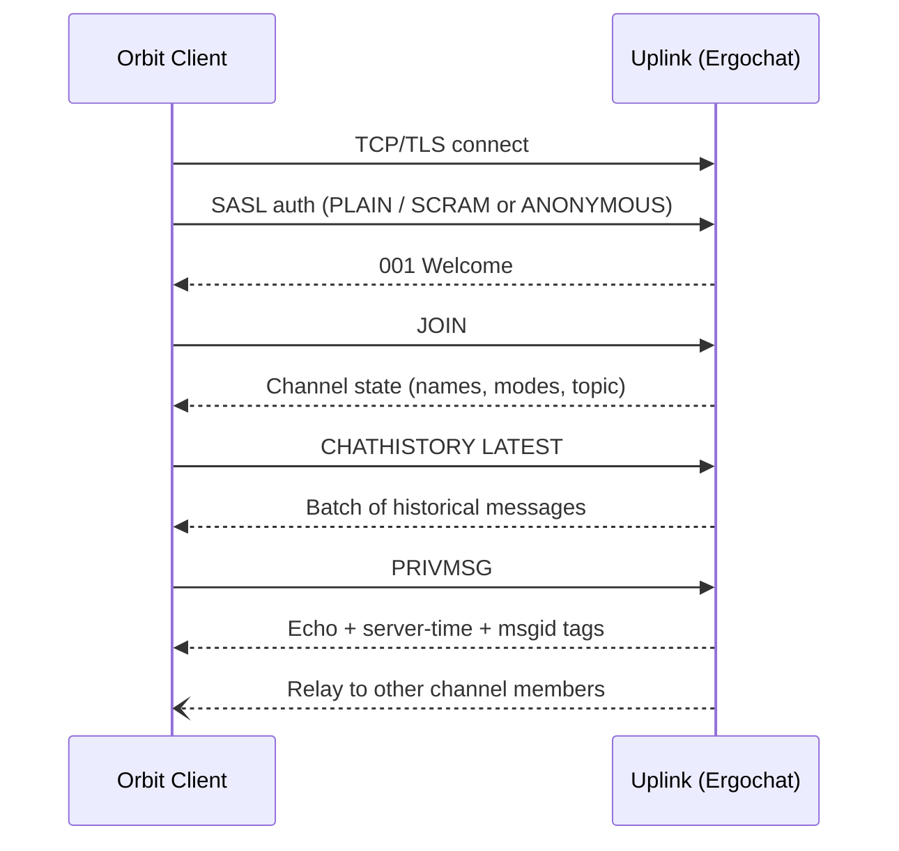

# Uplink

The runnable side of Uplink: Ergo configuration, command mechanics, and the sequences Orbit
clients drive against the server. The channel model, the required IRCv3 extension set, and the
no-fork posture live in [Uplink architecture](../02-architecture/03-uplink.md) and
[Protocol Posture](../02-architecture/02-protocol-posture.md).

## Connection Flow

Orbit clients connect the same way any IRCv3 client does:



For the SASL credential paths (JWT via the auth-script bridge, native `jwt-auth`, NickServ,
ANONYMOUS), see [Identity](05-identity.md).

## Ergo Configuration

Key configuration points for an Orbit-compatible Ergochat instance:

- **WebSocket listener**: Ergochat exposes a WebSocket endpoint on a dedicated port. In production,
  TLS for this endpoint is terminated by a reverse proxy (Caddy in the reference deployment) which
  proxies to Ergochat's internal WebSocket port. Ergochat CAN terminate TLS directly for raw IRC
  connections (port 6697), but the reverse proxy is required for any deployment that serves web
  clients or needs to host `/.well-known/orbit/services.json` for service discovery. See
  [Deployment](09-deployment.md) for the well-known file format.
- **History storage**: Enabled with operator-configured per-channel retention. There is no mandated
  default - operators choose an appropriate retention window for their community (e.g., 7 days or
  10,000 messages). DM query history uses the same operator-configured retention as channels. See
  [History and DM Retention](#history-and-dm-retention) below for the config snippet.
- **SASL**: Required for registered users. SASL PLAIN and SCRAM-SHA-256 over TLS. By default,
  Ergochat's built-in account database handles credential verification. When an identity provider
  is deployed, Ergochat delegates SASL verification to it via the `auth-script` configuration
  option and a thin auth-script bridge, or verifies JWTs natively via `accounts.jwt-auth` - see
  [Identity](05-identity.md) for both paths. The bridge MUST enable account autocreation so the
  first OIDC login establishes a persistent account and nickname reservation. Operators who want a
  strict single source of truth MAY instead disable NickServ registration
  (`accounts.registration.enabled = false`). Either way, Ergochat's nickname enforcement continues
  to work because it is tied to account login, not to NickServ specifically. See
  [Identity architecture](../02-architecture/09-identity.md) for the coexistence vs strict model.
- **Client-only tag allowlist**: Ergochat relays all `+`-prefixed tags by default per IRCv3 spec.
  No special configuration needed, but the server should enforce maximum tag size limits.
- **Connection limits**: Per-IP connection limits configured to prevent abuse. Browser-based web
  clients connect directly, so limits should accommodate multiple simultaneous guest connections
  from the same IP (e.g., shared NAT or multiple browser tabs).
- **Nickname reservation**: The `anon-` prefix MUST be reserved. When NickServ handles
  registration, configure it to reject registration of any nickname starting with `anon-`. When
  an OIDC identity provider is configured, the provider's account management (and/or disabled
  NickServ registration in strict mode) ensures no user can register an `anon-` prefixed username.
  Either way, this prevents collision between registered users and anonymous guests.

For the DNS records that make this instance discoverable by Orbit clients, see
[Deployment](09-deployment.md).

### History and DM Retention

DM query history uses Ergo's standard retention configuration:

```yaml
history:
  enabled: true
  channel-length: 2048        # channel history
  query-length: 2048          # DM query history: enabled, operator-configured
```

Always-on mode MUST be enabled so DMs sent to disconnected registered users are held for delivery:

```yaml
accounts:
  multiclient:
    always-on: opt-out        # registered users are always-on by default
```

This is standard Ergo configuration. No patches, no plugins. The DM storage model and the
always-on requirement are specified in [Messaging](../02-architecture/10-messaging.md).

### Data Protection Levers

The retention and erasure posture is described in
[Messaging](../02-architecture/10-messaging.md). The Ergo config keys that implement it:

- Per-channel and per-DM retention windows (`history.channel-length`, `history.query-length`,
  and the retention settings above) bound how long personal data is kept.
- `history.retention.allow-individual-delete: true` enables per-message erasure via `REDACT`
  (see [Message Retractions](#message-retractions-redact) below).
- `history.retention.enable-account-indexing` makes account-wide erasure complete and efficient
  when an account is unregistered and its stored messages purged. Operators expecting to honour
  erasure requests should enable it, weighing the storage/privacy trade-off of the index itself.

### Metadata Server Configuration

`draft/metadata-2` is **disabled by default**. Ergo only advertises it when the operator adds a
top-level `metadata` block to the config; if the block is absent, metadata is off and `SUB`/`SET`
commands fail. Operators enabling it should use the following config:

```yaml
metadata:
  enabled: true
  operator-only-modification: false   # leave off for self-service profiles
  max-subs: 100   # how many keys a client may subscribe to
  max-keys: 100   # how many keys can be stored per entity
  client-throttle:  # rate-limit METADATA SET to prevent abuse
    enabled: true
    duration: 2m
    max-attempts: 10
```

`operator-only-modification` (Ergo 2.18.0+) is a *global* switch - it gates all metadata writes
behind operator privileges. There is no per-key write ACL, so a deployment cannot, with stock
Ergo, allow users to set `orbit.status` while reserving `avatar` for a privileged service. Leave
it off for self-service profiles.

`draft/metadata-2` shipped stable in Ergo 2.17.0. When it is unavailable (older Ergo, or the
config block is absent), clients fall back to nick-only display and the basic AWAY/online model -
see [Clients architecture](../02-architecture/11-clients.md).

## Metadata Commands

Orbit clients negotiate `draft/metadata-2` at connect time and subscribe to the keys they
understand:

```
METADATA * SUB avatar display-name orbit.status
```

When any user in a shared channel (or a monitored user) updates one of these keys, the client
receives a live `METADATA` notification and updates the UI immediately. No polling required.

Users set their own metadata:

```
METADATA * SET avatar :https://depot.example.com/avatars/abc123/avatar.webp
METADATA * SET display-name :Alice
METADATA * SET orbit.status :dnd
```

On joining a channel, Ergo sends the current metadata for all users in the channel (within the
client's subscription list) as part of the join burst. Clients immediately have profile data for
all visible users without additional requests.

### User Metadata Keys

| Key             | Content                                     | Example                                                         |
|-----------------|---------------------------------------------|-----------------------------------------------------------------|
| `avatar`        | URL of the user's avatar image (Orbit uses a Depot URL) | `https://depot.example.com/avatars/abc123/avatar.webp` |
| `display-name`  | Human-readable display name (separate from nick) | `Alice`                                                    |
| `orbit.status`  | Short presence status string                | `dnd`, `in a meeting`, `streaming`                              |

`avatar` and `display-name` are the IRCv3 quasi-standard keys (unprefixed) so other
metadata-aware clients interoperate; `orbit.status` is vendor-prefixed because it has no
standard equivalent. The `avatar` value is a plain URL - Orbit stores a Depot URL there, but
any client simply fetches it.

Metadata is user-set and unverified: clients MUST sanitize values and never treat them as an
identity claim. The trust rules live in
[Tags and Trust](../02-architecture/04-tags-and-trust.md) and
[Services architecture](../02-architecture/08-services.md).

### Channel Metadata Keys

This table is the canonical definition of the channel metadata keys Orbit uses. These keys are
set by channel operators and fetched on channel join as part of the metadata burst.

| Key | Content | Set by | Example |
|---|---|---|---|
| `display-name` | Friendly human-readable name separate from the IRC channel name | Operator | `Frontend` |
| `avatar` | URL of the channel's avatar image (Depot URL or external) | Operator | `https://depot.example.com/avatars/ch-abc123/avatar.webp` |
| `color` | Accent color for the channel as a hex string (without `#`) | Operator | `3b82f6` |
| `homepage` | URL for the channel's associated project, docs, or community page | Operator | `https://example.com/docs` |
| `markdown` | Rich channel description, stored as Markdown | Operator | `Welcome to **#dev/frontend**...` |
| `subchannels` | Comma-separated authorized direct child segment names for slash-notation trees | Operator | `frontend, backend, infra` |

These keys are channel-scoped and distinct from the user metadata keys above. Channels and users
share the same `draft/metadata-2` extension but have separate key namespaces in practice - a
`METADATA GET` on `#channel` returns channel keys; a `METADATA GET` on a nick returns user keys.

The parent channel operator sets the `subchannels` allowlist:

```
METADATA #dev SET subchannels :frontend,backend,infrastructure
```

For unjoined parent channels (e.g. for slash-notation tree verification), clients request
metadata explicitly:

```
METADATA #dev GET subchannels
```

For joined parent channels, the metadata arrives in the join burst automatically. The
authorization model built on `subchannels` - what clients verify and how unverified subchannels
are flagged - is specified in [Clients architecture](../02-architecture/11-clients.md).

## Presence State Detection

Basic presence states derive from Ergo's `away-notify`, `extended-monitor`, and `draft/pre-away`
extensions (the presence model is described in
[Messaging](../02-architecture/10-messaging.md)):

| State   | IRC primitive              | How Orbit clients detect it        |
|---------|----------------------------|------------------------------------|
| Online  | No AWAY set, connected     | Connected + no AWAY flag           |
| Away    | AWAY set                   | AWAY flag via `away-notify`        |
| Offline | QUIT / disconnected        | QUIT event or monitor update       |

Richer status strings build on the `orbit.status` metadata key above.

## Avatar Upload Flow

1. User selects an avatar image in Orbit settings.
2. Client requests a pre-signed URL from Depot (`POST /upload/presign` - see [Depot](04-depot.md)).
3. Client uploads the image to S3 via the pre-signed URL.
4. Client sets the metadata key: `METADATA * SET avatar :<depot-url>`
5. All clients sharing a channel with this user receive the update immediately via
   `draft/metadata-2` subscription.

Avatars are stored in Depot under a conventional path: `avatars/{account_hash}/avatar.webp`. Old
avatars are overwritten - one avatar per account.

## Read Markers

`draft/read-marker` is stable in Ergo. It tracks the user's read position per channel on the
server, synchronized across all connected client sessions:

- When the user reads messages in a channel, the client sends a `MARKREAD` command with the latest
  `msgid` they have seen.
- When the user connects from another device, the server provides the stored read marker for each
  channel, allowing the client to show accurate unread counts from the correct position.
- This replaces client-side unread tracking, which is device-local and resets on each new
  connection.

Orbit clients MUST negotiate `draft/read-marker` and use it for all unread tracking.

## Message Retractions (REDACT)

Message retractions use the IRC-standard `REDACT` command, provided by the
`draft/message-redaction` extension:

```
REDACT #channel <msgid> [reason]
```

This is a server-side operation, not a client tag. The server validates that the sender has
permission to retract the message - either they authored it (matched via `account-tag`) or they
are a channel operator. The full permission model is in
[Uplink architecture](../02-architecture/03-uplink.md).

**What different clients see:**

- **Orbit clients** supporting `draft/message-redaction` see the message removed from the channel
  and render a tombstone inline: *"This message was retracted."*
- **IRC clients not supporting `draft/message-redaction`** receive a server NOTICE fallback:
  ```
  *** alice retracted a message ***
  ```
- **On reconnect**, the IRCv3 spec lets a server either drop redacted messages from `chathistory`
  entirely or replay them followed by a `REDACT` event. Orbit clients therefore handle `REDACT`
  inside `chathistory` batches the same way they handle a live one (rendering the tombstone) rather
  than assuming the message is simply absent. Either server behaviour converges on the same
  rendered result. Clients never reconstruct retracted *content*; the original message body is not
  recoverable from history.

> **Operator requirement**: Ergo gates `REDACT` behind `history.retention.allow-individual-delete`.
> When this is `false` (Ergo's recommended default), Ergo does **not** advertise the
> `draft/message-redaction` capability ([ergochat/ergo#2215](https://github.com/ergochat/ergo/issues/2215)),
> so Orbit clients see no deletion affordance and `REDACT` commands are rejected. Operators who want
> retractions must set `allow-individual-delete: true`. That single flag enables the full permission
> model described above - authors deleting their own messages **and** channel operators deleting
> others' - and lets redactions persist and replay through `chathistory`. It is independent of
> `enable-account-indexing`, which governs only bulk per-account history purges and is not required
> for per-message redaction. Toggling it on requires an Ergo restart (not just a rehash) before the
> capability is re-advertised.

Message editing is not standardized in IRC yet; Orbit handles it at the tag layer with the interim
`+orbit/msg-amend` tag - see [Tags](02-tags.md).

## Replies

To reply to a message, the client sends a `PRIVMSG` with the standard IRCv3 `+draft/reply=<msgid>`
client tag referencing the original `msgid`, with the reply content as the message body. A reply
appears in `chathistory` as a `PRIVMSG` carrying the same tag. See [Tags](02-tags.md) for the
standard IRCv3 client tags Orbit handles, and
[Uplink architecture](../02-architecture/03-uplink.md) for the reply model.

## Thread Creation Sequence

Threads are client-managed subchannels named `<parent-channel>/t-<msgid>` - a thread on message
`abc123` in `#dev` lives at `#dev/t-abc123`. The design, naming scheme, and known limitations are
in [Uplink architecture](../02-architecture/03-uplink.md).

When a user posts the first reply to a message in thread mode, the Orbit client:

1. JOINs `<parent>/t-<msgid>` - IRC creates the channel automatically on the first JOIN.
2. Sets `+s` (secret) mode, so the thread channel is excluded from `/list` output for classic
   IRC clients.
3. Sets the TOPIC of the thread channel to the original message content, attributed to its author:
   ```
   <original message text> - @alice, 2025-01-15 20:30 UTC
   ```
4. Sends the reply as a `PRIVMSG` in the thread channel.
5. Sends a `PRIVMSG` to the **parent channel** with a human-readable notice pointing IRC clients
   to the thread channel:
   ```
   ↳ Thread started by alice in #dev/t-abc123
   ```
   This message is visible to all IRC clients and allows them to follow the thread by joining the
   named channel directly. Orbit clients suppress this message from the chat view and render the
   thread indicator instead.
6. Sends a `+orbit/msg-thread` `TAGMSG` to the **parent channel**, signaling that a thread now
   exists on the target message.

For each subsequent reply, the client JOINs the thread channel (if not already joined) and sends
the `PRIVMSG` there. That's it - being in the channel is the subscription. No additional TAGMSG
is sent to the parent channel on subsequent replies.

The `+orbit/msg-thread` payload is defined in [Tags](02-tags.md). The client-side rendering
mechanics (thread panel, indicator, reply counts) are in [Clients](08-clients.md).

## Cross-References

- [Uplink architecture](../02-architecture/03-uplink.md) - channel model, required extensions, threads design
- [Tags](02-tags.md) - the `+orbit/*` namespace and standard IRCv3 client tags
- [Identity](05-identity.md) - SASL credential paths, auth-script bridge, native jwt-auth
- [Depot](04-depot.md) - avatar and file storage
- [Deployment](09-deployment.md) - DNS records, reverse proxy, well-known file
