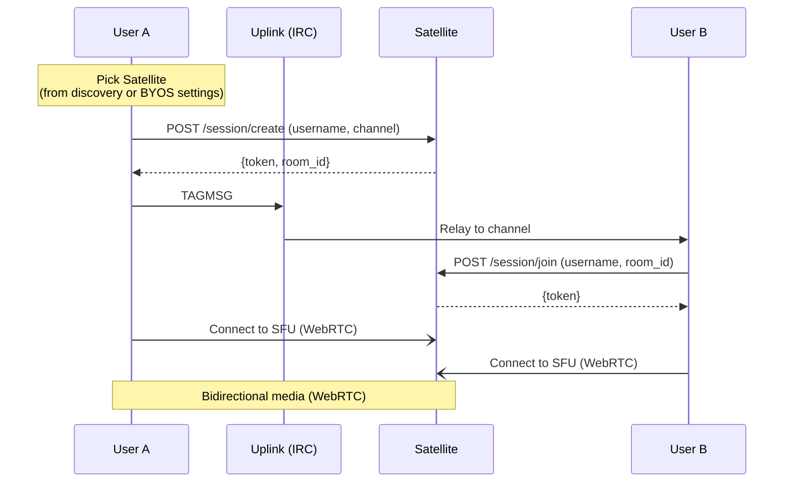
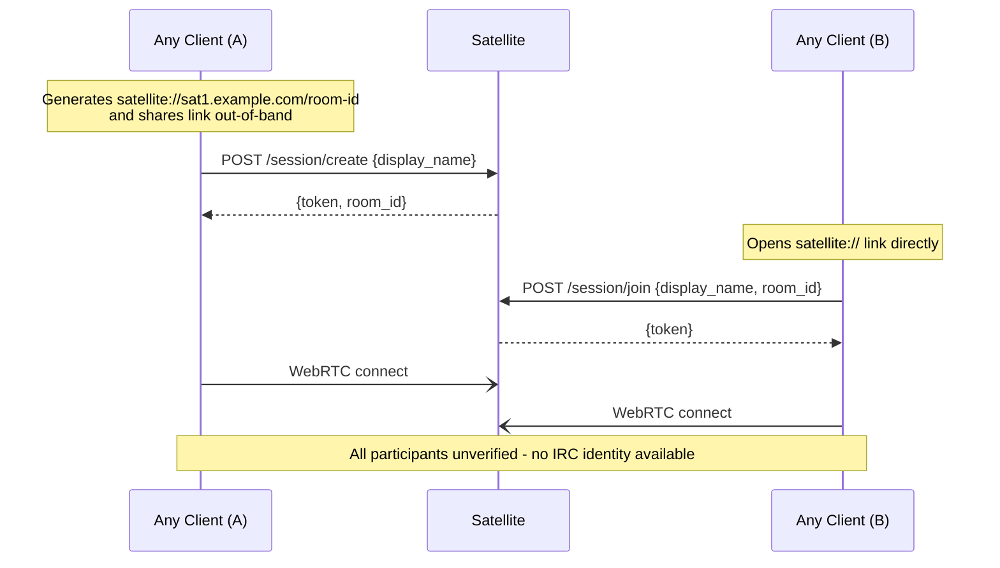
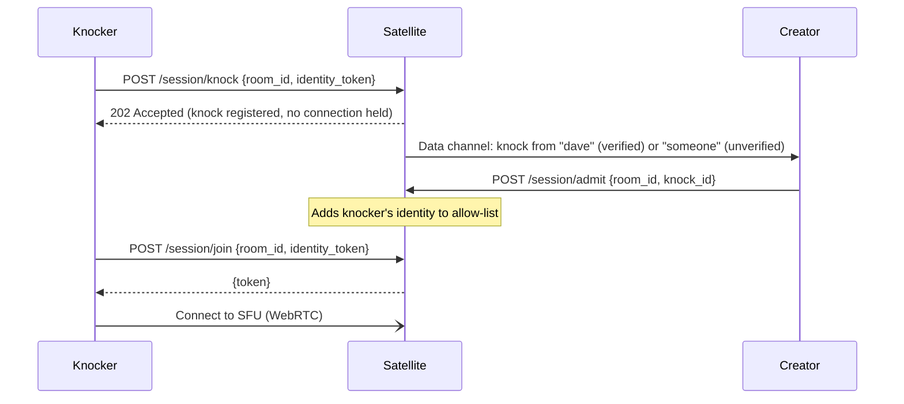

# Satellite

The runnable side of Satellite: session flows, token service endpoints, the P2P handshake,
knocking, STUN/TURN, codecs, and multi-node routing. The session model, discovery design, BYOS,
trust model, permissions model, limits, and scaling rationale live in
[Satellite architecture](../02-architecture/05-satellite.md).

## Discovery Metadata

Clients discover Satellites via DNS SRV records or the well-known services file (the resolution
algorithms are in [Deployment](09-deployment.md)), then query the Satellite's metadata endpoint
(`GET /info`) to retrieve:

```json
{
  "name": "US East",
  "region": "us-east",
  "version": "0.1.0",
  "participants": 8,
  "rooms": [
    {
      "room_id": "gaming-strategy-a7f3e2",
      "participants": 5,
      "locked": false,
      "protected": false,
      "created_at": "2025-01-15T20:30:00Z",
      "initiator": "alice"
    },
    {
      "room_id": "dev-standup-b8c1d4",
      "participants": 3,
      "locked": true,
      "protected": true,
      "created_at": "2025-01-15T21:00:00Z",
      "initiator": "bob"
    }
  ]
}
```

`/info` requires no authentication, so unauthenticated clients (embedded pages, anonymous guests)
can list available sessions before joining. The rationale and the operator options for
restricting visibility are in [Satellite architecture](../02-architecture/05-satellite.md).

## Group Session Flow



The `+orbit/sat-invite` payload is defined in [Tags](02-tags.md#orbitsat-invite). Pure IRC clients
do not see the tag - the invite is invisible to them.

When the invite carries `"protected": true`, the Orbit client displays a password prompt before
attempting to join. The password is sent to the Satellite's token service in the `/session/join`
request - if it matches, a token is issued; if not, the join is rejected. The password is never
sent over IRC. The session creator sets the password when creating the session; it can be shared
out-of-band (DM, external chat, etc.).

### Error Handling and Edge Cases

- **Unreachable Satellite**: If the Satellite in a `+orbit/sat-invite` is unreachable, the client
  displays an error ("Satellite unavailable") and does not join. The invite remains visible in the
  channel with an "offline" indicator.
- **Token rejection**: If the token service rejects a join request (invalid key, session full,
  password wrong), the client shows the specific error reason returned by the token service.
- **Satellite crash during session**: If a Satellite goes down during an active session, all
  participants are disconnected. The client shows "Voice session ended unexpectedly." There is no
  automatic migration - the session initiator (or any participant) must start a new session and
  post a new `+orbit/sat-invite`.
- **Competing invites**: If multiple users post `+orbit/sat-invite` for the same channel
  simultaneously (different Satellites or different rooms), the Orbit client displays all active sessions.
  Users choose which to join. There is no "one active session per channel" constraint - multiple
  concurrent voice sessions in the same channel are valid (e.g., different sub-groups).

## Standalone Session Flow

A Satellite can be used entirely without Uplink. The bootstrapping mechanism is a direct link:

```
satellite://sat1.example.com/room-id?name=Hangout
```

URI scheme registration and link formats are in [Clients](08-clients.md).



Ephemeral chat via LiveKit data channels is available in standalone mode; persistent chat is not
(that requires Uplink).

### Standalone Authentication

When a user opens a `satellite://` link, identity verification is still possible if the
Satellite's domain has a discoverable identity provider. The client-side flow:

1. User opens `satellite://sat.example.com/room-id`.
2. The client extracts the domain (`example.com`) and attempts service discovery - checking `/.well-known/orbit/services.json` or `_transponder._tcp.example.com` for an identity provider endpoint.
3. If an identity provider is discovered, the client offers the user the option to authenticate via the OIDC provider's Authorization Code flow.
4. If the user authenticates, the client presents the resulting JWT to the Satellite's token service alongside the `/session/join` request. The token service verifies the JWT against the provider's JWKS and issues a LiveKit token with `verified: true` and the authenticated account name.
5. If the user declines authentication or no identity provider is discovered, the client falls back to the unverified join flow (display name only, no identity badge).

The identity provider used for standalone authentication is always the one associated with the
**Satellite's domain**, not the user's home domain. Cross-domain identity verification is a
federation concern - see [Federation](../02-architecture/14-federation.md).

## Token Service

Each Satellite runs a token service (or gateway, in multi-node deployments) - a small HTTP API
that issues LiveKit-compatible JWTs scoped to a room and identity.

- **OIDC identity verification**: When the domain's OIDC identity provider is configured (the
  [Transponder](../02-architecture/07-transponder.md) role), the token service verifies the
  client's JWT using standard JWT/JWKS verification against the provider's JWKS endpoint - the
  same verification any OIDC consumer performs. If valid, the issued LiveKit JWT includes
  `verified: true` and the authenticated account name. If no identity token is presented, the
  participant joins as unverified. Token verification is a local cryptographic operation: the
  JWKS is fetched once and cached, so the identity provider stays out of the media hot path
  (caching rules in [Identity](05-identity.md#jwks-caching-and-key-rotation)).
- **BYOS Satellites**: The operator controls auth entirely. They issue tokens however they see fit.
- **Password-protected sessions**: When a session is created with a password, the token service
  stores the password hash for that room. Clients joining a protected session must include the
  password in their `/session/join` request. The token service verifies it before issuing a JWT.
  This is per-session, not per-Satellite - the same Satellite can host both open and protected
  sessions simultaneously.
- **No identity provider configured**: The token service issues tokens to anyone who can reach
  the Satellite. All participants are unverified. Sessions can still be password-protected.
- **Guest publish policy**: Whether unverified participants receive publish permissions is a
  per-Satellite operator setting (default: publish enabled). When disabled, the token service
  issues LiveKit JWTs for unverified participants with the `canPublish` grant set to `false`, so
  they join receive-only - they can hear and see the session but not speak or share. Verified
  participants always receive publish grants. Enforcement lives in the token grant and the SFU,
  not the client, so a modified or embedded client cannot bypass it. The product-level default
  (guests can speak) is in [Experience](../01-product/02-experience.md).

### Session Creation Payloads

All session configuration is client-driven: the creator's client sends the moderator list,
allow-list, access mode, and lock state to the token service at session creation time and can
update them during the session. The Satellite holds this state only for the session's lifetime
(the permissions model is in [Satellite architecture](../02-architecture/05-satellite.md)).

Delegating moderation to other verified users:

```json
POST /session/create
{
  "username": "zealsprince",
  "channel": "#gaming",
  "moderators": ["alice", "bob"]
}
```

When `alice` or `bob` join with a verified identity token matching those accounts, the token
service issues their LiveKit JWT with the `roomAdmin` grant. The creator's own LiveKit JWT is
issued with the `roomAdmin` grant as well - mute and kick are built-in LiveKit operations, not
custom Orbit logic. Unverified users cannot receive delegated moderation - identity must be
provable. If no `moderators` list is provided, only the creator has admin privileges.

Restricting a session to an allow-list:

```json
POST /session/create
{
  "username": "zealsprince",
  "channel": "#gaming",
  "access": "allow-list",
  "allowed": ["alice", "bob", "charlie"]
}
```

When `access` is `"allow-list"`, only verified users whose account identity matches an entry in
`allowed` can join. Unverified users are always rejected in allow-list mode.

Locking mid-session:

```json
POST /session/lock
{
  "room_id": "gaming-strategy-a7f3e2",
  "locked": true
}
```

Only the session creator (or a co-moderator) can lock/unlock. A locked session rejects all new
join requests regardless of access mode.

### Knocking

When a session is locked or restricted (password-protected or allow-listed), a rejected user can
knock. The knock is delivered to the session creator (and co-moderators) as a LiveKit data
channel message:



After knocking, the client opens a **Server-Sent Events** connection to
`GET /session/knock/status/:knock_id`. The Satellite holds this connection open and pushes a
single event when the knock is admitted, rejected, or times out, then closes the stream. The
knocker consumes no SFU resources while waiting - the SSE connection is a lightweight HTTP
long-poll on the token service, not a media connection.

```
GET /session/knock/status/:knock_id
Accept: text/event-stream

← event: admitted
← data: {}

(stream closes)
```

On receiving an `admitted` event, the client immediately retries `POST /session/join`. On a
`rejected` or `timeout` event, the client shows an appropriate message and closes the SSE
connection.

Knocking is best-effort. If no one responds within a reasonable timeout (e.g., 60 seconds), the
Satellite pushes a `timeout` event and closes the stream. There is no queue, no waiting room, no
persistent state beyond the knock's TTL - it's a doorbell with a brief ring.

## P2P Handshake

1:1 calls bypass Satellite entirely. The client establishes a direct WebRTC connection using IRC
only for the initial handshake - a single message in each direction.

The initiator sends a `TAGMSG` to the recipient's nickname with a `+orbit/p2p-offer` tag
containing a compact handshake payload (the payload shape is defined in
[Tags](02-tags.md#orbitp2p-offer-and-orbitp2p-answer)). The recipient's client displays the
incoming request based on the `intent` field - "Alice wants to start a voice call" or "Bob wants
to send you a file." If accepted, the recipient responds with a `+orbit/p2p-answer` tag
containing the same fields (their own ICE credentials, DTLS fingerprint, and a candidate).
Uplink's involvement ends here.

Full SDP offers are never sent over IRC: SDPs are large (~2-3 KB for audio+video) due to
exhaustive codec enumeration, which creates pressure on the IRCv3 tag budget (4,094 bytes for
client tags) and Ergochat's flood protection. The IRC payload contains only connection
credentials (~300 bytes); full SDP negotiation happens over the data channel where there are no
size constraints.

### Intent

The `intent` field declares the purpose of the connection and determines the client UX:

| Intent | Initial UI | Can escalate to | Session ends when |
|--------|-----------|-----------------|-------------------|
| `call` | Voice call | + video, + screen share, + chat, + file transfer | Either party hangs up |
| `video` | Video call | + screen share, + chat, + file transfer | Either party hangs up |
| `chat` | Ephemeral DM chat window | + call, + video, + file transfer | Either party closes the window |
| `file` | File transfer dialog | Nothing - single purpose | Transfer completes or is cancelled |

The intent sets the **starting state**, not a permanent constraint. A voice call can escalate to
video, add screen sharing, or open a side chat - all negotiated over the WebRTC data channel. A
file transfer is transactional: it completes and the connection tears down.

### Post-Handshake Negotiation

Once the WebRTC data channel is open, all further signaling happens over the direct connection:

- **Media negotiation**: Codec selection (Opus for audio, VP9 for video), adding/removing tracks, changing resolution - standard WebRTC renegotiation via SDP offer/answer exchanged over the data channel.
- **ICE trickling**: Additional ICE candidates are exchanged over the data channel, not IRC. If the initial candidate doesn't work (e.g., symmetric NAT), TURN relay candidates are sent through the data channel to establish a relayed path.
- **Escalation**: Adding video to a voice call, starting a screen share, or opening a file transfer - all negotiated over the data channel.

After the initial two-message handshake, the P2P connection is fully self-sufficient. Uplink can
go down, the entire Orbit infrastructure can be offline - the session continues. The only thing
that requires IRC is starting a *new* connection.

### TURN Fallback

If direct connectivity fails (both peers behind symmetric NATs), the connection falls back to a
TURN relay. Unlike the direct P2P case, a TURN-relayed session depends on the TURN server
remaining available - if the TURN server goes down, the call drops. However, ICE restart
candidates can be exchanged over the data channel to attempt a new path without re-involving IRC.

When TURN is in the path, encrypted media bytes transit the operator's TURN server (coturn or
STUNner). Because P2P calls use DTLS-SRTP, the relay only sees ciphertext - it cannot decrypt or
inspect media content. The privacy implications of the relayed path are covered in
[Satellite architecture](../02-architecture/05-satellite.md).

## STUN/TURN

- Self-hosted `coturn` is the default recommendation for NAT traversal.
- For Kubernetes deployments, **STUNner** is the recommended STUN/TURN layer - it integrates with
  the Kubernetes networking model and handles NAT traversal for WebRTC traffic exiting the cluster.
  STUNner is also the recommended layer when operating Satellite at scale (see
  [Multi-Node Deployments](#multi-node-deployments) below).
- LiveKit is configured to use the TURN server for candidates.
- For P2P calls, the client is configured with the same STUN/TURN servers.
- Public STUN servers (e.g., Google's) may be used as a fallback, but self-hosted is preferred to
  avoid leaking metadata.

## Codec Defaults

| Media | Codec | Bitrate (default)                       | Notes                                                              |
|-------|-------|-----------------------------------------|--------------------------------------------------------------------|
| Audio | Opus  | 64 kbps (voice), 128 kbps (music mode) | Mandatory.                                                         |
| Video | VP9   | Adaptive (300-2500 kbps)               | SVC profile for bandwidth adaptation. AV1 is an option.            |

## Multi-Node Deployments

Scaled deployments put multiple LiveKit nodes behind a gateway that exposes the same API surface
as a single node. The design rationale, scaling model, and risks are in
[Satellite architecture](../02-architecture/05-satellite.md). This section holds the routing
mechanics.

### Gateway Responsibilities

| Concern | How |
|---|---|
| **`/info`** | Aggregates room and participant data from all nodes. Returns a unified view - clients never see individual nodes. |
| **`/session/create`** | Picks the least-loaded node, creates the room there, records the room-to-node mapping, returns a token. The token contains the specific node's WebRTC endpoint so the client connects directly to the right node for media. |
| **`/session/join`** | Looks up which node hosts the target room, issues a token pointing at that node. |
| **`/session/knock`**, **`/session/lock`**, etc. | Proxied to the correct node based on the room-to-node mapping. |
| **Health checking** | Periodically polls each node. Unhealthy nodes stop receiving new rooms. If a node becomes unresponsive, its rooms are marked as lost - participants are disconnected and the client shows "Voice session ended unexpectedly." |
| **Drain coordination** | On scale-down, the gateway stops routing new sessions to a target node. Once all rooms on that node have naturally ended, the node is retired. |

The API contract is identical to a single-node Satellite: same endpoints (`/info`,
`/session/create`, `/session/join`, `/session/knock`, `/session/admit`, `/session/lock`), same
response shapes, same `satellite://` links - the link points at the gateway, not at individual
nodes. The only new element in the response is the WebRTC endpoint URL embedded in the LiveKit
JWT, which points at the specific node hosting the room - standard LiveKit behavior, not a
gateway-specific concern.

### Room-to-Node Mapping

The gateway tracks which rooms live on which nodes. This is a small, fast-changing dataset
(room ID → node URL). Options:

- **In-memory hash map** - simplest. Lost on gateway restart, but rooms are ephemeral - a gateway restart means all routing state is rebuilt by querying each node's LiveKit API for active rooms.
- **Redis / shared store** - needed only if the gateway itself is horizontally scaled (multiple gateway instances). Likely overkill for most deployments.
- **LiveKit's native room list API** - the gateway queries each node's LiveKit API on startup and periodically to rebuild its routing table. This makes the gateway stateless - it derives routing from the nodes themselves.

The stateless approach (derive from nodes) is preferred. The gateway becomes a pure routing
function with no state of its own - if it restarts, it re-queries nodes and is back in seconds.

Room affinity is inherent - a room lives on one node for its entire lifetime. Room migration
(moving an active room from one node to another) is explicitly out of scope: LiveKit sessions are
stateful, WebRTC connections are tied to a specific server, and moving a room is indistinguishable
from the room crashing. If a node needs to be retired while rooms are still active, the operator
waits for them to drain.

### Load Balancing

"Least-loaded" for `/session/create` needs a metric. Options:

| Metric | Pros | Cons |
|---|---|---|
| Participant count | Simple, easy to query from LiveKit API | Doesn't account for video vs. audio-only load |
| Room count | Even simpler | A room with 2 people and a room with 50 people are not equivalent |
| Bandwidth utilization | Most accurate reflection of actual load | Requires node-level metrics export, more complex |
| CPU utilization | Good proxy for encryption/forwarding load | Requires node-level metrics, OS-dependent |

The initial implementation uses **participant count** - it's available directly from LiveKit's
API with no extra instrumentation. This can be refined to bandwidth- or CPU-aware routing if
participant count proves too coarse.

### Kubernetes Integration

K8s is the natural deployment model for multi-node Satellites:

- **Nodes as pods** in a StatefulSet or Deployment. Each pod runs LiveKit + a lightweight health endpoint.
- **Gateway as a Deployment** (1-2 replicas) with a Service fronting it. The DNS SRV record points at the gateway Service.
- **Autoscaling** via HPA (Horizontal Pod Autoscaler) based on aggregate participant count or custom metrics.
- **Drain on scale-down** via `preStop` hooks - the gateway stops routing to the pod, waits for rooms to drain, then the pod terminates.
- **STUNner** for NAT traversal - integrates with K8s networking for TURN relay.

K8s is not required. The gateway works equally well with a static set of nodes defined in a
config file - Docker Compose with 3 LiveKit containers and 1 gateway container is a valid
multi-node deployment.

## Cross-References

- [Satellite architecture](../02-architecture/05-satellite.md) - session model, discovery, BYOS, trust, permissions, limits, scaling
- [Tags](02-tags.md) - the `sat-invite` and P2P handshake payloads
- [Identity](05-identity.md) - JWT verification and JWKS caching
- [Clients](08-clients.md) - `satellite://` URI scheme registration
- [Deployment](09-deployment.md) - SRV records and resolution algorithms
