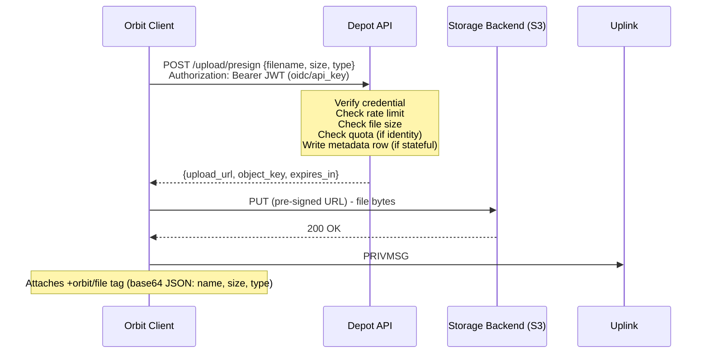

# Depot

The runnable side of Depot: the upload flow, the API surface, keys, quotas, deletion, the
metadata store, object keys, and configuration. The component boundary (what S3 does vs what
Depot does), the storage driver contract, the credential model, guest policy, recipient-scoped
downloads, and the moderation posture live in
[Depot architecture](../02-architecture/06-depot.md).

## Upload Flow

1. User selects a file in the Orbit client.
2. The client sends a presign request to Depot (`POST /upload/presign`). Depot authenticates the request against the accepted credentials, enforces rate limits and maximum file size, checks per-user quota (when an identity is present), and - if all checks pass - returns an upload URL.
3. The client PUTs the file to the returned upload URL. With the `s3` driver this goes directly to the storage backend and never passes through Depot; with the `fs` driver the URL points back at Depot, which proxies the bytes to disk.
4. On successful upload, the client posts a `PRIVMSG` to the channel containing the public file URL as the message body.
5. The client attaches file metadata as a single `+orbit/file` tag (base64-encoded JSON containing name, size, and type) on the same `PRIVMSG`. The payload is defined in [Tags](02-tags.md#orbitfile).
6. The Orbit client renders an inline preview (images, audio, video) or a download card. Pure IRC clients see a plain URL.

The presign request:

```
POST /upload/presign
Authorization: Bearer <JWT>        # when oidc or api_key credential is used

{
  "filename": "screenshot.png",
  "size": 2048576,
  "content_type": "image/png"
}
```



The diagram shows the `s3` driver (direct pre-signed PUT) as the primary illustration. With the
`fs` driver the only change is that `upload_url` points back at Depot, so the PUT in step
`U->>S3` is instead `U->>D` and Depot writes to local disk; everything else, including the client
contract, is identical.

## The Depot API

Depot is a thin HTTP service deployed co-located with (or in front of) the storage backend.

| Endpoint | Purpose |
|----------|---------|
| `POST /upload/presign` | Authenticate, validate, rate-limit, return a time-limited upload URL |
| `POST /upload` | One-shot multipart upload (ShareX/cURL); returns the final URL |
| `POST /keys` | Mint a long-lived API key (requires OIDC) |
| `GET /keys` | List the caller's API keys (requires OIDC) |
| `DELETE /keys/{id}` | Revoke an API key (requires OIDC) |
| `DELETE /file/{key}` | Delete a file (requires identity; uploader or operator only) |
| `GET /quota` | Return current usage for the authenticated user |
| `GET /health` | Health check for deployment tooling |

**Responsibilities:**

- **Authentication**: Verify the caller against the accepted credential flags (`anonymous`, `oidc`, `api_key` - the credential model is in [Depot architecture](../02-architecture/06-depot.md)).
- **Upload URL issuance**: Generate a time-limited upload URL via the active storage driver. With the `s3` driver the SDK handles signing natively; no custom signing logic is needed.
- **Rate limiting**: Enforce per-IP upload rate limits always, and per-user limits when an identity is present.
- **Size enforcement**: Reject requests that exceed the configurable maximum file size per upload.
- **Quota enforcement**: Reject requests that would exceed the user's storage quota.
- **Metadata tracking**: Record upload metadata for quota accounting, deletion, and audit (when a stateful capability is enabled).

Depot does **not** proxy file downloads under the `s3` driver; those are served by the storage
backend. It does serve and proxy under the `fs` driver, and it serves the private/proxied
download path in either driver when recipient-scoping requires it.

When `oidc` is enabled, Depot verifies the JWT signature against the provider's published JWKS -
the same verification pattern used by Satellite and the auth-script bridge (see
[Identity](05-identity.md)). No component contacts any other component to check identity.

## API Keys & External Uploads (ShareX / Puush / cURL)

API keys are a separate auth path from the short-lived OIDC browser token, designed for external
tools that cannot run an interactive OIDC flow.

A user, already authenticated via OIDC in the Orbit client, mints a long-lived key:

```
POST /keys
Authorization: Bearer <JWT>

{ "label": "ShareX desktop", "scopes": ["upload"], "expires_at": "2027-01-01" }
```

Depot stores **only a hash** of the key plus the owner identity (`sub`/`iss`), the label,
optional scopes, and an optional expiry. The raw key is shown **once**, at creation. Lifecycle
operations:

- **List** (`GET /keys`): the caller's keys with labels and `last_used` timestamps.
- **Revoke** (`DELETE /keys/{id}`): instant, unlike a JWT which remains valid until it expires.
- **Last-used** tracking for spotting stale or leaked keys.

A key is presented exactly like a JWT:

```
Authorization: Bearer <key>
```

Depot resolves the key to its owner and then reuses **all** the OIDC-mode machinery: identity,
quota, deletion rights, and audit. A key-attributed upload is indistinguishable from an
OIDC-attributed upload once the owner is resolved.

### One-shot upload endpoint

The two-step presign dance is awkward for ShareX and cURL, so Depot provides a one-shot endpoint:

```
POST /upload          (multipart/form-data)
Authorization: Bearer <key>
```

It accepts the file bytes directly and returns the final URL. Note that the one-shot endpoint
**proxies bytes even under the `s3` driver**, since the client cannot perform the pre-signed PUT
itself. Because of this it should be **rate-limited more tightly** than the presign flow. The
Orbit client keeps using the efficient presign flow and does not touch `/upload`.

## Per-User Quotas

When an identity is present (OIDC or API key), Depot enforces per-user storage quotas. At presign
time, before issuing the upload URL, it queries the metadata store:

```
SUM(file_size) WHERE uploader_account = ? AND uploader_issuer = ?
```

If the current total plus the requested file size exceeds the configured quota, the request is
rejected with a clear error before any upload URL is issued.

**Configuration:**

- `default_quota`: the default per-user storage limit (e.g., `500MB`), applied to all users unless overridden.
- `quota_overrides`: a map of account names to custom limits (e.g., a higher quota for trusted users or bots).

Quotas require an identity. Anonymous uploads cannot be quota'd per-user; for those the operator
relies on bucket-level storage limits and manual monitoring.

## File Deletion

### By uploaders (identity present)

When the caller has an identity, they can delete their own files:

```
DELETE /file/{object_key}
Authorization: Bearer <JWT or API key>
```

Depot verifies the credential, checks the metadata store to confirm the authenticated account
matches the `uploader_account` for the given object key, deletes the object, and removes the
metadata row. If the account does not match, the request is rejected.

### By server operators

Operators can always delete files at the backend level (MinIO console, AWS S3 management,
`mc rm`, or simply removing files from disk under the `fs` driver) regardless of credential
configuration. Depot does not gate operator-level access. When an operator deletes a file out of
band, the metadata row (if any) becomes orphaned and the periodic cleanup job reconciles it
automatically.

### Anonymous uploads

There is no client-facing delete API for anonymous uploads. Without an identity, ownership cannot
be proven.

## Metadata Store

When any stateful capability is enabled (quotas, deletion, audit, API keys, recipient-scoping),
Depot maintains a small metadata database tracking uploads.

| Field | Description |
|-------|-------------|
| `object_key` | Object key (primary key) |
| `uploader_account` | Account from the JWT `sub` claim (or the API key owner) |
| `uploader_issuer` | Issuer from the JWT `iss` claim (supports multi-server identity) |
| `file_size` | File size in bytes |
| `content_type` | MIME type |
| `original_filename` | Original filename as provided by the client |
| `uploaded_at` | Timestamp of presign URL issuance |
| `allowed_recipients` | Account subs permitted to download a private file (recipient-scoped downloads - see [Depot architecture](../02-architecture/06-depot.md)) |

SQLite is sufficient for most single-server deployments. Postgres is supported for operators who
already have one.

The metadata row is written at **presign time**, not at upload completion. The presigned URL
constrains the upload (size, content type, expiry), so the row is a reliable record of intent. If
the client never completes the upload, the row is orphaned; a periodic cleanup job reconciles
metadata against actual stored objects and prunes stale rows.

When only `anonymous` is enabled, no metadata is stored and Depot is stateless.

## Object Key Structure

The object key encodes the uploader identity for easy grouping, admin tooling, and backend-level
lifecycle policies:

```
uploads/{account_hash}/{timestamp}-{random}/{filename}
```

| Segment | Purpose |
|---------|---------|
| `uploads/` | Top-level prefix; separates user uploads from other contents (avatars, etc.) |
| `{account_hash}` | A short hash of the uploader's account name; groups files by user at the backend level without exposing the raw account name in the URL |
| `{timestamp}-{random}` | Collision-free directory per upload; timestamp enables chronological listing |
| `{filename}` | Original filename, sanitized; preserves human-readable context in the URL |

For anonymous uploads (no identity), `{account_hash}` is replaced with `_anonymous`.

## Service Discovery

Orbit clients discover a domain's Depot instance via a `_depot._tcp` DNS SRV record or the
well-known services file. For record format and the full client resolution algorithm, see
[Deployment](09-deployment.md).

## Configuration Example

```toml
[depot]
# Axis 1: storage driver - where bytes live
driver = "s3"                       # "s3" | "fs"

[depot.s3]                           # used when driver = "s3"
endpoint = "https://s3.example.com"
bucket   = "orbit-uploads"
region   = "auto"

[depot.fs]                           # used when driver = "fs"
root = "/var/lib/depot/uploads"

# Axis 2: accepted credentials - any combination
[depot.credentials]
anonymous = false
oidc      = true                     # verify Transponder JWTs
api_key   = true                     # ShareX / Puush / cURL

[depot.limits]
max_file_size = "100MB"
default_quota = "500MB"
rate_limit_per_ip   = "30/min"
rate_limit_per_user = "120/min"
oneshot_rate_limit  = "10/min"       # /upload proxies bytes; throttle harder

[depot.quota_overrides]
"botaccount" = "5GB"

[depot.store]
backend = "sqlite"                   # "sqlite" | "postgres"; only needed for stateful capabilities
path    = "/var/lib/depot/depot.db"
```

## Cross-References

- [Depot architecture](../02-architecture/06-depot.md) - S3-vs-Depot boundary, storage driver contract, credentials, guest policy, moderation posture
- [Tags](02-tags.md) - the `+orbit/file` payload
- [Identity](05-identity.md) - how the JWT flows through all components
- [Deployment](09-deployment.md) - storage backend setup, CORS, backups
