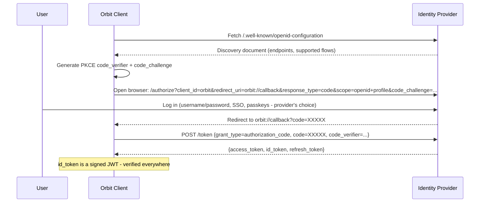
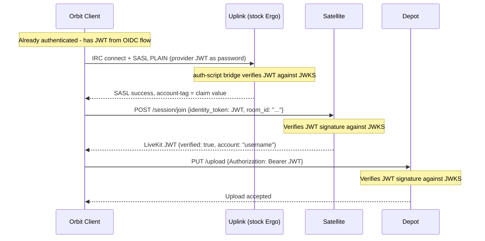
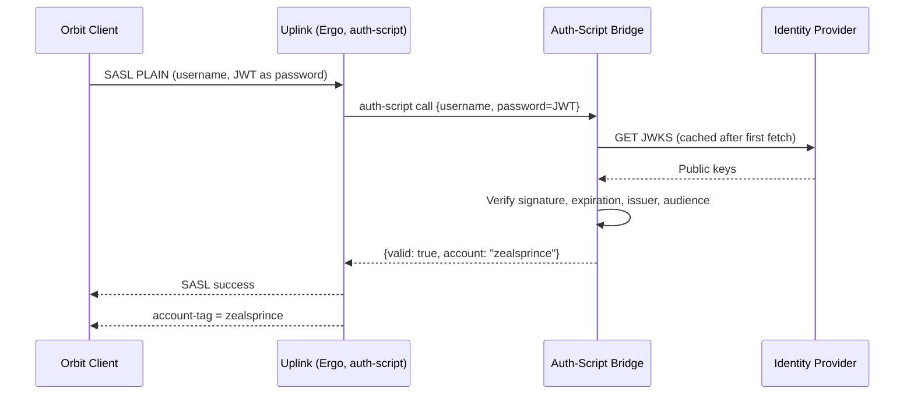
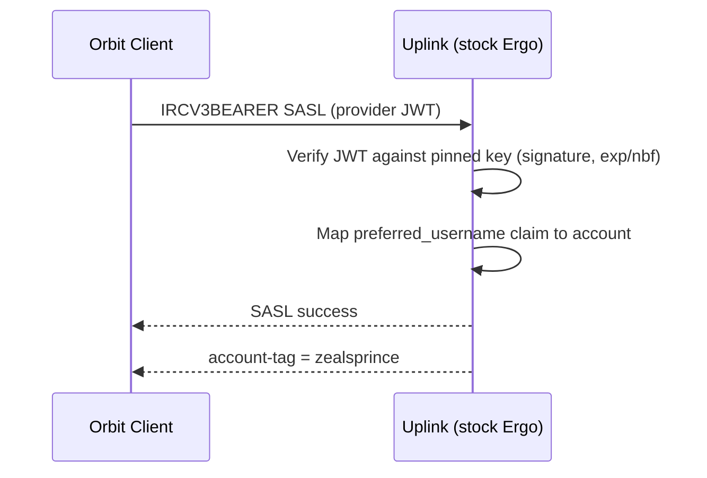
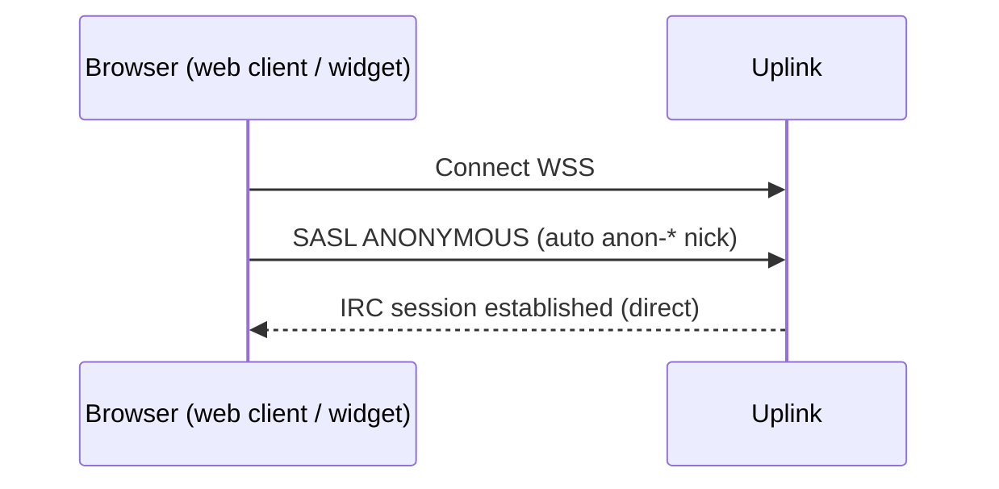
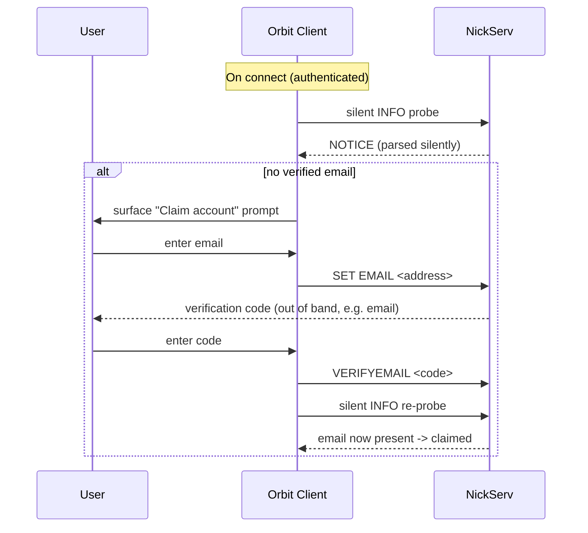

# Identity

The runnable side of Orbit identity: OIDC flows, token refresh, the two Ergo verification paths,
anonymous access, a worked Keycloak example, and the NickServ mechanics Orbit clients drive. The
auth model (OIDC authoritative, NickServ coexistence, graceful degradation) lives in
[Identity architecture](../02-architecture/09-identity.md); the identity provider role is
[Transponder](../02-architecture/07-transponder.md).

## OIDC Discovery

Every OIDC-compliant provider serves a discovery document at `/.well-known/openid-configuration`.
This document tells any consumer where to find the provider's endpoints:

```json
{
  "issuer": "https://id.example.com/realms/orbit",
  "authorization_endpoint": "https://id.example.com/realms/orbit/protocol/openid-connect/auth",
  "token_endpoint": "https://id.example.com/realms/orbit/protocol/openid-connect/token",
  "jwks_uri": "https://id.example.com/realms/orbit/protocol/openid-connect/certs",
  "userinfo_endpoint": "https://id.example.com/realms/orbit/protocol/openid-connect/userinfo",
  "scopes_supported": ["openid", "profile", "email"],
  "response_types_supported": ["code"],
  "code_challenge_methods_supported": ["S256"]
}
```

No component needs to know what provider is behind this URL. They fetch the discovery document,
find the endpoints they need, and proceed with standard OIDC flows. How the client finds the
issuer URL in the first place (well-known file, DNS SRV) is in
[Deployment](09-deployment.md#identity-provider-resolution).

## Authorization Code Flow with PKCE

The Orbit client authenticates against the server's OIDC identity provider using the standard
Authorization Code flow with PKCE (Proof Key for Code Exchange). This is the recommended flow for
native/desktop applications and works with any OIDC provider - Keycloak, Authentik, Authelia,
Zitadel, Supabase, or any other.



The identity provider controls the login experience entirely. If the operator wants
username/password, that's their choice. If they want Google SSO, passkeys, or MFA - that's
configured in the provider, not in Orbit. The client just opens a browser to the authorization
endpoint and collects the token at the end.

## How the JWT Flows Through Components

Once the client has a JWT, it is reused across all Orbit components for the current domain:



One authentication, one JWT, verified everywhere. Each component independently verifies the token
against the provider's published keys - no component contacts any other component to check
identity. The Satellite token service behavior is in [Satellite](03-satellite.md#token-service);
Depot's credential handling is in [Depot](04-depot.md).

## Token Refresh

The OIDC authorization flow returns three tokens: `access_token`, `id_token`, and
`refresh_token`. The `access_token` and `id_token` are short-lived (typically 5-15 minutes,
controlled by the identity provider). The `refresh_token` is long-lived and used to silently
obtain new tokens without requiring the user to log in again.

The Orbit client manages token refresh transparently:

1. On startup, the client checks the stored `id_token` expiry. If it is within 60 seconds of expiry (or already expired), the client immediately performs a silent refresh before attempting to connect to any component.
2. During a session, the client tracks the token expiry and schedules a background refresh before expiry. The refresh uses the `refresh_token` against the provider's token endpoint (`grant_type=refresh_token`). No user interaction is required.
3. On refresh success, the client stores the new tokens and uses the new `id_token` for any subsequent component requests (new Depot uploads, new Satellite session joins). Already-established connections are unaffected:
   - **Uplink (IRC)**: SASL authentication only happens at connect time. An already-connected IRC session persists independently of token expiry. The refreshed token is used on the next reconnect.
   - **Satellite**: The LiveKit session JWT issued at join time has its own lifetime, independent of the OIDC token. An active voice session is unaffected by OIDC token refresh.
   - **Depot**: Each upload request presents the current token. If the token was refreshed since the last upload, the new token is used automatically.
4. If the refresh token is expired or revoked (e.g., the user's account was suspended), the refresh fails. The client displays a re-authentication prompt. The user must log in again to continue using authenticated features.

The refresh token lifetime is set by the identity provider. Operators should configure a refresh
token lifetime appropriate to their community (e.g., 7-30 days for persistent logins, shorter for
higher-security deployments).

## Uplink Verification Paths

Stock Ergo verifies provider JWTs with no IRC server fork. Two integration paths exist; which one
applies depends mainly on how the provider signs its tokens.

### Path A: auth-script bridge (general-purpose, recommended)

Ergo's standard `auth-script` hook calls a small, stateless HTTP service that verifies the JWT
against the provider's JWKS and returns the account name. This is the path that works with
**any** OIDC provider, because it performs full JWKS-based verification: it fetches and caches
the provider's published keys, follows key rotation by `kid`, supports every common signing
algorithm (RS256, ES256, EdDSA, HS256), and validates issuer, audience, and expiration. The
client authenticates with `SASL PLAIN`, sending the provider JWT as the password.

The flow:

1. The Orbit client obtains a JWT from the OIDC provider (browser-based Authorization Code + PKCE flow).
2. The client connects to IRC and sends `SASL PLAIN` with the JWT as the password.
3. Ergo's `auth-script` calls the bridge.
4. The bridge verifies the JWT signature against the provider's JWKS and checks expiration, issuer, and audience.
5. If valid, the bridge returns the account name from the configured claim (by convention `preferred_username`). Ergo sets the `account-tag`.



The bridge is a small, stateless service (~50-100 lines): it does not manage users, issue tokens,
or store state - it verifies tokens and returns an account name. Because it sits in the
authentication critical path for every JWT-authenticated connection, it is a production
dependency (see [Auth-Script Bridge Requirements](#auth-script-bridge-requirements)). A
real-world deployment runs this path today: the website client authenticates via `SASL PLAIN`
sending a Supabase (ES256) JWT as the password, verified by an auth-script bridge that returns
the `preferred_username` claim as the IRC account.

### Path B: native `accounts.jwt-auth` (constrained)

Ergo can verify JWTs internally via `accounts.jwt-auth`, advertised over the `IRCV3BEARER` SASL
mechanism, with no helper process. This path needs no extra component, but Ergo's built-in
verifier is deliberately minimal, so it is only viable under specific conditions:

- **Signing algorithm must be `hmac` (HS256/384/512), `rsa` (RS256/384/512), or `eddsa` (Ed25519).** Ergo does **not** support ECDSA / ES256. Providers that sign with ES256 - a common default, including Supabase - cannot use this path and must use Path A.
- **Keys are static.** Ergo does not fetch JWKS; the verifying key is pinned in the config as a literal or a key file. Rotation requires editing the config (list multiple `tokens` entries to overlap during a rotation). JWKS auto-discovery is an open Ergo feature request, not a current capability.
- **Only signature and `exp`/`nbf` are validated.** `jwt-auth` does not enforce issuer or audience. If those matter, scope the signing key to this use or use Path A.

Configuration maps a claim to the IRC account name:

```yaml
# ircd.yaml (relevant accounts settings only)
accounts:
    jwt-auth:
        enabled: true
        autocreate: true
        tokens:
            - algorithm: "rsa"            # hmac | rsa | eddsa  (no ECDSA/ES256)
              key-file: "jwt_pubkey.pem"  # static key; or `key:` inline. No JWKS.
              account-claims: ["preferred_username"]
```



**`OAUTHBEARER` is a different mechanism.** Ergo advertises two bearer-style SASL mechanisms
wired to two different backends. `IRCV3BEARER` is served by `accounts.jwt-auth` (local JWT
verification, above). `OAUTHBEARER` is served by `accounts.oauth2`, which verifies tokens by
calling the provider's OAuth2 **token introspection** endpoint (RFC 7662) at connect time - a
per-authentication network round-trip, not local JWKS verification, and a separate integration
with its own configuration. Orbit's JWT-based identity uses Path A or `IRCV3BEARER`/`jwt-auth`,
not `OAUTHBEARER`.

### Common to both paths

**Account name mapping:** the IRC account name comes from a configured claim - by convention
`preferred_username` (standard OIDC `profile` scope). This claim MUST be present and MUST be a
valid IRC nickname. The OIDC provider is responsible for ensuring `preferred_username` values are
unique and conform to IRC nickname rules (no spaces, no leading digits, within length limits). If
the claim is absent, authentication MUST be rejected. The `sub` claim (often an opaque UUID in
providers like Keycloak) is NOT used for the IRC account name.

**Autocreation:** Ergo MUST be configured with autocreation enabled (on the auth-script bridge,
or in native `jwt-auth`), so a persistent Ergo account and nickname reservation are established
on a user's first OIDC login. Without it, OIDC users may not get a persistent account or a
reserved nick. The coexistence-vs-strict deployment models and the namespace-conflict behavior
are in [Identity architecture](../02-architecture/09-identity.md).

**Without an identity provider:** Ergo uses its built-in NickServ and internal account database
for SASL authentication. No external service is required.

## Anonymous Guests (SASL ANONYMOUS)

The Orbit web client (embedded or deployed as a full web app) connects directly to Ergochat's
WebSocket endpoint - the same path as the desktop client. There is no middleware proxy.



- Anonymous/guest users connect via SASL ANONYMOUS. Ergochat assigns a `anon-*` nickname automatically.
- No account creation, no backend, no JWT, no session tokens required.
- Guest nicknames are prefixed with `anon-` and cannot be registered.
- Any IRC client - including third-party web UIs - can connect the same way. This is intentional: Orbit does not gatekeep access to a standard IRC server.

## Example: Keycloak Deployment

A concrete example using Keycloak as the identity provider.

**1. Deploy Keycloak alongside Orbit:**

```yaml
# docker-compose.yml (relevant services only)
services:
  keycloak:
    image: quay.io/keycloak/keycloak:latest
    environment:
      KC_DB: postgres
      KC_DB_URL: jdbc:postgresql://db:5432/keycloak
      KEYCLOAK_ADMIN: admin
      KEYCLOAK_ADMIN_PASSWORD: "..."
    command: start
    ports:
      - "8080:8080"

  # Auth-script bridge: verifies provider JWTs against the provider's JWKS
  # (any provider, any signing algorithm). General-purpose verification path.
  auth-bridge:
    image: orbit/auth-bridge:latest
    environment:
      OIDC_ISSUER: "https://id.example.com/realms/orbit"
    ports:
      - "9090:9090"
```

**2. Configure Keycloak:**

- Create a realm (e.g., `orbit`).
- Create a client (e.g., `orbit-client`) with Authorization Code + PKCE flow, redirect URI `orbit://callback`.
- Add users or connect external identity sources (LDAP, Google, GitHub - Keycloak handles all of this).

**3. Point Orbit components at the issuer URL:**

- **Ergo via auth-script bridge (general-purpose):** point `auth-script` at the auth-bridge service, which verifies provider JWTs against `https://id.example.com/realms/orbit`. Works with any provider and any signing algorithm. Clients authenticate with `SASL PLAIN`, JWT as the password.

- **Ergo native `accounts.jwt-auth` (RS256/EdDSA/HMAC providers only):** Keycloak signs with RS256 by default, so it can use the native path with no bridge. Pin Keycloak's realm signing public key and map `preferred_username` to the account. Ergo does not fetch JWKS, so the key must be updated on rotation:

  ```yaml
  # ircd.yaml (relevant accounts settings only)
  accounts:
      jwt-auth:
          enabled: true
          autocreate: true
          tokens:
              - algorithm: "rsa"
                key-file: "keycloak_pubkey.pem"   # export from the realm; no JWKS auto-fetch
                account-claims: ["preferred_username"]
  ```
- **Satellite** - set `OIDC_ISSUER=https://id.example.com/realms/orbit`. The token service fetches the JWKS and verifies identity tokens.
- **Depot** - set `OIDC_ISSUER=https://id.example.com/realms/orbit`. Same JWKS verification.

**4. Publish discovery:**

Serve `/.well-known/orbit/oidc` on the community domain:

```json
{
  "issuer": "https://id.example.com/realms/orbit"
}
```

The Orbit client fetches this, discovers the Keycloak instance, and handles the rest
automatically.

## Auth-Script Bridge Requirements

The bridge should be published as a standalone container image and binary that operators deploy
alongside Ergo. Configuration is a single environment variable: the OIDC issuer URL
(`OIDC_ISSUER`). Where the bridge is deployed it sits in the authentication critical path for
every JWT-authenticated IRC connection, so despite its small scope (~50-100 lines of JWT
verification logic) it MUST be treated as a **production dependency**.

**Requirements (when deployed):**

- **Health checks**: The bridge MUST expose a health endpoint (e.g., `/healthz`) that verifies it can reach the OIDC provider's JWKS endpoint. Container orchestrators and monitoring should use this to detect failures.
- **Structured logging**: All authentication attempts (successes and failures) MUST be logged with structured fields (timestamp, account name, failure reason). This is the operator's primary audit trail for identity-related issues.
- **Startup validation**: On startup, the bridge MUST fetch the OIDC discovery document and JWKS at least once. If the provider is unreachable at startup, the bridge should fail loudly rather than start in a degraded state.

## JWKS Caching and Key Rotation

All components that verify JWTs against the provider's JWKS (the auth-script bridge, the
Satellite token service, and Depot) MUST cache the JWKS with a reasonable TTL (default: 1 hour).
When an incoming JWT contains a `kid` (key ID) that doesn't match any cached key, the component
MUST re-fetch the JWKS immediately. This handles key rotation gracefully - keys can be rotated at
the provider without restarting these components. Native Ergo `accounts.jwt-auth` is the
exception: it uses a statically configured key and does not fetch JWKS, so rotating keys there is
a manual config change (multiple `tokens` entries can overlap during a rotation).

If the JWKS re-fetch fails (provider temporarily unreachable), the component should continue
using the cached keyset and log a warning. JWTs signed with an unknown `kid` are rejected, but
JWTs matching a cached key continue to verify successfully. This provides resilience against
transient provider outages.

## OIDC Provider Downtime

If the OIDC provider is unreachable and the cached JWKS has expired:

- **Uplink (Ergo)**: The auth-script bridge rejects the SASL attempt with a standard error (native `accounts.jwt-auth` is unaffected by provider downtime, since it verifies against a pinned key with no network call). The client displays "Authentication failed" - not a silent hang. Already-connected IRC sessions are unaffected (SASL is only checked at connection time).
- **Satellite token service**: Falls back to the unverified join flow. Users can still join sessions but appear as unverified participants.
- **Depot**: Rejects authenticated upload requests. Users see a clear error. Downloads (which are public/unauthenticated) are unaffected.

## Token Lifetime and Clock Skew

The OIDC provider controls token lifetime. For IRC connections, the JWT only needs to be valid at
SASL authentication time - once the IRC session is established, it persists independently of the
token's expiry. Short-lived tokens (5-15 minutes) are ideal for security; refresh tokens handle
longer client sessions transparently (see [Token Refresh](#token-refresh)).

All JWT verification MUST apply a clock skew tolerance of plus or minus 30 seconds to account for
time drift between the provider and verifying components. This is standard practice in JWT
libraries.

## Scopes

Orbit requires the `openid` and `profile` scopes at minimum. The `email` scope SHOULD be
requested when the NickServ account-claim flow is in use: the client prefills the claim email
from the `email` claim and uses it to detect OIDC/NickServ email divergence (see
[Account Claim Flow](#account-claim-flow) below). Without `email`, the claim flow still functions
but cannot prefill or detect divergence.

## Account Claim Flow

An OIDC-autocreated account starts with no email on its NickServ record. The presence of a
verified email is the signal that the account is recoverable via NickServ's
`SENDPASS`/`RESETPASS` flow from a legacy client, independent of the identity provider. The model
(why claiming matters, the three claim states, email divergence as the co-ownership signal) is in
[Services architecture](../02-architecture/08-services.md) and
[Identity architecture](../02-architecture/09-identity.md). The mechanics:

- The client probes account state **silently** on connect to determine claim status (does the
  NickServ record carry a verified email?).
- If unclaimed, the client surfaces a non-blocking prompt to claim the account.
- The claim flow maps to NickServ commands: `SET EMAIL <address>` then `VERIFYEMAIL <code>`.
- The verified email is the claim signal; once present, the account can recover via
  `SENDPASS`/`RESETPASS`.



> **Implementation note - why the claim sequence is `SET EMAIL` then `RESETPASS`, never
> `SET PASSWORD`.** An OIDC-autocreated account has empty credentials (`PassphraseHash` unset).
> Ergo blocks `NS SET PASSWORD` on such accounts with `errCredsExternallyManaged` - it treats the
> account as externally managed (by the OIDC provider, whether verified natively or via the
> auth-script bridge). The email-reset path is the way in: `RESETPASS` calls the
> internal `setPassword` with elevated privileges, which bypasses that lock and can set the first
> password. So `SET EMAIL` -> `VERIFYEMAIL` establishes recovery, and `SENDPASS`/`RESETPASS` is the
> only self-service route to an actual password on an OIDC-origin account. Re-running `RESETPASS`
> also overwrites a squatter's stored password, which is how a re-claim can fully evict prior
> co-ownership.

## Service Notice Routing

The services abstraction depends on never leaking service chatter, so clients MUST handle service
`NOTICE`/`PRIVMSG` traffic deterministically:

| Source | Trigger | Routing |
|---|---|---|
| NickServ/ChanServ | Reply to a client-initiated background op (probe, `SET`) | Parsed silently; never opens a buffer |
| NickServ/ChanServ | Unsolicited (server-initiated reminder, e.g. unverified-email notice) | Reflected as structured UI state|
| HistServ | Any | Suppressed from unread/mention/badge state |
| Any service | Power-user/raw mode explicitly enabled | Shown verbatim in a service query buffer |

Suppression is implemented with short-lived "suppressing" flags around each client-initiated
operation plus a dedicated silent-probe path: while a probe or `SET` is in flight, matching
service notices are parsed for state and withheld from buffers.

## Conformance Summary

| Service interaction | Orbit requirement |
|---|---|
| NickServ email claim / recovery readiness | Abstracted - silent probe + claim flow; never raw commands |
| NickServ always-on management | Abstracted - surface status, warn when off |
| NickServ raw commands for OIDC users | Never required |
| Live channel moderation (modes) | Intent-mapped to channel modes (see [Identity architecture](../02-architecture/09-identity.md)) |
| Persistent channel admin (ChanServ) | Abstracted into a channel-settings panel |
| HistServ | Not user-facing; use `chathistory` |
| Metadata as profile signal | Cosmetic only, never an identity signal |

## Bot-Managed Roles

For communities that need role hierarchies beyond IRC channel modes, an IRC bot connected to
Uplink is the standard solution. The pattern is straightforward:

1. The bot maintains a role database mapping accounts to roles (e.g., `moderator`, `trusted`, `newcomer`).
2. On user JOIN, the bot checks the user's `account-tag` against the role table and applies the appropriate channel modes (`+o` for moderators, `+v` for trusted users in moderated channels).
3. Bot operators manage roles via DM commands to the bot (`!role add alice moderator`) or via an external admin interface.

This is how IRC communities have managed roles for decades. Any IRC library in any language can
implement it. No Orbit-specific API is needed, and the bot runs on any IRCv3 server - not just
Orbit's Uplink.

The Orbit extension API (see [Extensions](../02-architecture/15-extensions.md)) enables
client-side UI for role management that pairs with a companion bot, giving operators a visual
interface on top of the same underlying mechanism.

## Cross-References

- [Identity architecture](../02-architecture/09-identity.md) - auth model, permission model, coexistence vs strict, degradation
- [Transponder](../02-architecture/07-transponder.md) - the identity provider role and verification model
- [Services architecture](../02-architecture/08-services.md) - the NickServ/ChanServ/HistServ abstraction principles
- [Satellite](03-satellite.md) - token service verification
- [Depot](04-depot.md) - Bearer credential handling
- [Deployment](09-deployment.md) - identity provider discovery
