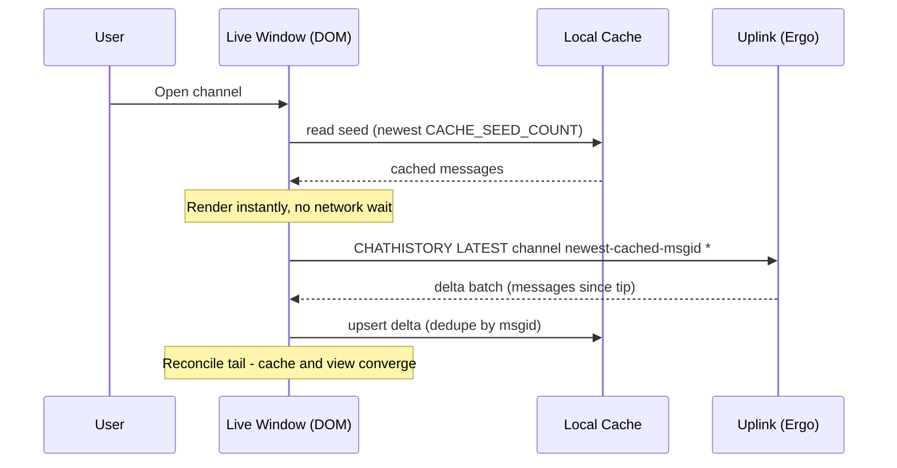

# Local History Cache & Storage

Every Orbit client keeps a persistent, on-device copy of the message history it has seen. This is
distinct from the in-memory **live window** in [Memory Discipline](01-desktop.md#memory-discipline):
the live window is what is mounted in the DOM right now (capped, evicted aggressively); the **local
cache** is the durable archive underneath it that outlives the session.

Cross-references:
- [Desktop - Memory Discipline](01-desktop.md#memory-discipline) - the in-DOM live window this cache feeds
- [Desktop - Reconnection Flow](01-desktop.md#reconnection-flow) - `CHATHISTORY` reconciliation the cache piggybacks on
- [Uplink - Interaction with Chat History](../02-components/01-uplink/01-overview.md#interaction-with-chat-history) - how retractions and replies replay through `chathistory`
- [Platform](../05-infrastructure/04-platform.md) - the capability-port pattern the cache is implemented as

## Why a Local Cache Fits IRC

The IRC history model is unusually cache-friendly:

- **Records are immutable and append-only.** A delivered `PRIVMSG` never changes. The only
  post-delivery mutations are retractions (rendered as a *tombstone* overlay, never a content edit -
  see [Retractions](../02-components/01-uplink/01-overview.md#retractions)) and, post-MVP, editing.
  It is a write-once store with rare overlay events, not a cache-coherence problem.
- **There is a stable server-assigned dedup key for content.** Every `PRIVMSG`/`NOTICE` carries a
  `msgid` (`message-ids`, the primary/dedup key) and an authoritative `server-time` (the sort key).
  Dedup is per message, not per batch. A given line keeps the same `msgid` whether it arrives live,
  as an `echo-message` self-copy, or in a later `chathistory` replay, so those copies of it merge
  into one cached record. A replay of 200 messages still writes 200 records; it just skips the ones
  already cached. Lines with no `msgid` are the exception: presence events (`JOIN`/`PART`) from
  `event-playback`, and replays from servers that omit the tag. Those get a deterministic synthetic
  key and dedupe by a `type + author + text + server-time` signature, so the same event still
  collapses to one record whichever path delivered it.
- **Delivery is already batched.** `chathistory` responses arrive inside a `batch`, pre-chunked by
  the server. The cache writes a batch as a unit; the renderer consumes it incrementally.

### Offloading Uplink

Ergo's history retention is **operator-configured and intentionally bounded** (reference guidance:
~7 days or 10,000 messages per channel - see
[Ergochat Configuration](../02-components/01-uplink/01-overview.md#ergochat-configuration)). It is
the source of truth but not a long-term archive, and every `chathistory` request costs CPU, disk,
and a round-trip. A local cache shifts the load profile:

- **Scrollback is served from disk.** Re-opening a channel and scrolling up hits zero round-trips
  when the data is cached - a material reduction in work on a `$5 VPS` serving a whole community.
- **The cache outlives server retention.** Messages aged out of Ergo's window stay readable on every
  device that saw them live, with no unbounded server-side storage.
- **Reconnection fetches a delta, not a window.** The client knows its newest cached `msgid` per
  target and asks only for what it missed (`CHATHISTORY LATEST ... after the cached tip`). See
  [Reconnection Flow](01-desktop.md#reconnection-flow).
- **It is the foundation for client-side search.** A populated cache answers many searches locally -
  instant, offline-capable, without hammering the server FTS index. Server search stays
  authoritative for history the client never saw.

> The cache never weakens the trust model. It stores what the server delivered, keyed by the
> server-asserted `account-tag` and `msgid` - a performance/availability layer, not a new source of
> authority. See [Tag Integrity and Trust Model](../02-components/01-uplink/02-tags/02-trust-model.md).

## Storage Model

The cache is scoped **per account, per target** ("target" = any channel or DM query, as in
`CHATHISTORY TARGETS`). Keying by account keeps multiple identities (or servers) on a shared device
from colliding. Two logical stores:

| Store      | Key                          | Holds |
|------------|------------------------------|-------|
| `messages` | `msgid` - server `msgid`, or a synthetic `evt:*` key for keyless lines (with a `[target, server_time]` index) | One record per delivered line |
| `buffers`  | `target` (channel/DM name)   | Per-target metadata: oldest/newest cached `msgid` and timestamp, cached count, last reconcile time, cap override |

A `messages` record stores exactly what the renderer and search need:

```ts
interface CachedMessage {
  msgid: string            // primary key: server msgid, or a synthetic evt:* key for keyless lines
  target: string           // channel or DM this belongs to
  serverTime: number       // sort key, from server-time (epoch ms)
  account: string | null   // server-asserted author identity (account-tag), null for unauthenticated
  nick: string             // nick at send time (display only; account is authoritative)
  type: "privmsg" | "notice" | "action" | "join" | "part"
  text: string
  tags: Record<string, string> // surviving +orbit/* and +draft/* tags (reply ref, reactions, etc.)
  redacted?: boolean       // tombstone overlay; original text is NOT retained when set
  edited?: boolean         // set when text was edited in place (post-MVP)
}
```

Dedup is by `msgid` wherever the server provides one: the live socket path and the `chathistory`
path upsert into the same store, so overlaps resolve to a single record rather than a visible
duplicate. Keyless lines (presence events, msgid-less replays) carry a deterministic synthetic key
and additionally collapse by a content + `server-time` signature, giving the same single-record
guarantee. The synthetic key is never surfaced as a real `msgid`, so it cannot anchor a
`CHATHISTORY` request.

Servers without `message-ids` support fall back to that same synthetic key for every line, so
caching still works, just on a best-effort content signature instead of an authoritative id. A
server that old is unlikely to implement the other IRCv3 features anyway, so the experience stays
close to plain IRC. Bouncer playback (ZNC and similar) isn't an MVP target; supporting it later
means reconciling the timestamps the bouncer stamps on replay and matching best-effort.

## Seeding, Paging, and the Sliding Window

Three tunables govern the data path - defaults, not protocol constants. The desktop client can run
them higher than the web app (see [Environment Limits](#environment-limits-and-constraints)).

| Knob                | Role | Reference default |
|---------------------|------|-------------------|
| `CACHE_SEED_COUNT`  | Recent messages rendered immediately from cache on open | ~150 |
| `CACHE_PAGE_SIZE`   | Older messages pulled per scroll-up page | ~50 |
| `MAX_LIVE_MESSAGES` | Hard cap on messages in the reactive in-memory buffer (DOM path) | 200 (matches [Memory Discipline](01-desktop.md#memory-discipline)) |

The cache is a strict superset of the live window: a `MAX_LIVE_MESSAGES`-sized view sliding over a
much larger cached (and ultimately server-side) history.

### Opening a Target (Prefill)



The buffer paints from disk on the frame the user clicks; reconciliation only fills the gap between
the cached tip and now. A cold target falls back to a normal `CHATHISTORY LATEST ... *` seed and
populates the cache from the response.

### Backward and Forward Paging

`fetchOlderHistory()` is **cache-first**: scrolling toward the top prepends the next
`CACHE_PAGE_SIZE` older messages from cache. Only when the cache is exhausted at its oldest `msgid`
does it issue `CHATHISTORY BEFORE <oldest-cached-msgid>`, writing the page back so the next scroll is
local again.

When the live window has been trimmed at the tail (user scrolled far up, newer messages evicted to
honour `MAX_LIVE_MESSAGES`), scrolling back down calls `fetchNewerFromCache()`: append newer
messages, trim from the head, keeping a constant-size window. A `tailTrimmed` flag tracks whether the
live window's newest message is still the buffer's true tip; when it is, live messages append
directly and no forward fetch is needed.

This symmetry keeps a multi-thousand-message buffer navigable with a bounded DOM - the user scrolls
arbitrarily far either way and the renderer never holds more than `MAX_LIVE_MESSAGES` nodes.

## Progressive Rendering

Rendering a whole seed at once janks because layout/paint for hundreds of components blocks the main
thread. Clients render the seed **incrementally**:

- Committed to the reactive buffer in `RENDER_CHUNK`-sized increments (e.g. 25-50 messages), one
  chunk per `requestAnimationFrame`, until fully mounted or `MAX_LIVE_MESSAGES` is reached.
- The first chunk is the visible viewport's worth, so content appears on the first frame; later
  chunks fill above/below as frames allow.
- Scroll position is anchored to a stable message (by `msgid`) across commits so the viewport does
  not jump.

> For extremely large buffers, list virtualization (mounting only the visible range) is the
> end-state optimization, tracked as a [performance follow-up](#evaluation-performance-and-limits).
> Incremental commit is the MVP mechanism.

## The Cache as a Platform Capability

Persistent storage is exactly the environment-specific capability the
[Platform](../05-infrastructure/04-platform.md) model targets. The cache is a
**capability port** on the `Platform` contract, not an `if (isTauri)` branch. `core` calls the port
and never knows whether records land in IndexedDB or SQLite.

```ts
// packages/core/src/platform/index.ts (addition to the Platform contract)
export interface HistoryCachePort {
  seed(target: string, limit: number): Promise<CachedMessage[]>
  pageBefore(target: string, beforeMsgid: string, limit: number): Promise<CachedMessage[]>
  pageAfter(target: string, afterMsgid: string, limit: number): Promise<CachedMessage[]>
  upsert(messages: CachedMessage[]): Promise<void>     // batched, dedupes by msgid
  markRedacted(msgid: string): Promise<void>           // tombstone overlay
  // Storage management surface
  bufferStats(): Promise<BufferStats[]>
  prune(target: string, keepCount: number): Promise<void>
  export(target: string): Promise<CachedMessage[]>
  clear(): Promise<void>                               // wipe this account's cache
}

export interface BufferStats {
  target: string
  count: number
  estimatedBytes: number
  oldest: number   // server-time epoch ms
  newest: number
}
```

| Target            | Adapter            | Backing store |
|-------------------|--------------------|---------------|
| Web app / PWA     | `web.ts`           | IndexedDB (one object store per logical store, indexed on `[target, serverTime]`) |
| Desktop (Tauri)   | `tauri.ts`         | SQLite via the Rust backend, served over the custom protocol for bulk reads, not JSON IPC |
| Widget            | `web.ts`, degraded | IndexedDB if available, else `null` port -> ephemeral in-memory only |
| Mobile (Tauri)    | `tauri-mobile.ts`  | reuses the desktop SQLite adapter |

When the port is `null` (storage blocked, private-browsing denial, widget mode), core degrades
explicitly to an in-memory buffer and the seed/prefill path has nothing to read - the same
`null`-port pattern used for `tray` and `deepLinks`. Bulk desktop reads go over Tauri's custom
protocol handler rather than JSON IPC, per the
[Large IPC payloads](01-desktop.md#memory-discipline) rule.

## Cache Lifecycle

**A detached, app-scoped writer.** The write path must not be owned by a view component. An early
prototype scoped syncing to the chat surface and only persisted mounted buffers (a "3 of 8 buffers
cached" bug). The writer is owned at **app scope** - a store/composable subscribed to the message
stream for *all* joined targets for the whole session. Mount/unmount changes what is *rendered*,
never what is *persisted*.

**Write path.**

- Live messages and `chathistory` batches are written through `upsert()` in **debounced batches** to
  amortize transaction overhead (IndexedDB setup, SQLite write locks).
- Retractions call `markRedacted(msgid)`, setting the tombstone flag and dropping stored `text`;
  original content is never retained, matching the server contract.
- Edits (post-MVP) update the record's `text` in place, keyed by `msgid`. The `edited` flag is
  reserved on `CachedMessage` so the overlay is representable ahead of the feature.
- Presence events (`JOIN`/`PART`) from `event-playback` are persisted too, keyed on their synthetic
  `evt:*` id, so scrollback renders them consistently rather than only when a live replay happens to
  include them.
- `server-time` is the sort key, not arrival order. `event-playback` can deliver an old-stamped line
  live, so the live window inserts it at its `server-time` position rather than appending (see
  [Memory Discipline](01-desktop.md#memory-discipline)); cache reads are already
  `[target, server_time]`-ordered, so prefill and paging return correct order for free.

**Invalidation and clearing.** Records are immutable, so there is almost nothing to invalidate. Two
clearing paths: **user-initiated** (the [Storage management surface](#storage-management-surface))
and **force refresh** (Ctrl+Shift+R, already clearing `localStorage` for settings, extended to call
`HistoryCachePort.clear()` scoped to the active account).

## Storage Management Surface

The cache is durable and can grow large, so it is a first-class surface in **Settings -> Storage**:

- **Per-buffer stats** - target, cached count, estimated bytes, cached date range (`bufferStats()`).
- **A live total** - aggregate count and size across buffers, plus environment quota and headroom
  (web) from `navigator.storage.estimate()`.
- **Eviction** - per-buffer "Evict old messages" (`prune(target, keepCount)`, oldest-first) and a
  global "Evict all". Eviction never removes what is currently mounted.
- **Export** - per-buffer "Export as JSON" (`export(target)`) for a user-owned archive.
- **A configurable per-buffer cap** - e.g. `chat.cacheMaxMessagesPerBuffer` (default low tens of
  thousands) triggering an oldest-first prune after writes exceed it; changing it can trigger a
  one-time prune of over-cap buffers.

Eviction is **oldest-first within a target**, never cross-target, so heavily-used channels do not
evict each other. The cap is per-buffer to keep accounting predictable.

## Environment Limits and Constraints

### Web App / PWA (IndexedDB)

- **Quota is browser-managed and shared.** Chromium grants ~60% of free disk (shared across the
  origin); Firefox uses group/eTLD+1 limits; Safari is tightest. Treat quota as finite: read
  `navigator.storage.estimate()`, surface it, and prune before writes near the limit rather than
  letting a write throw `QuotaExceededError`.
- **Best-effort storage can be evicted.** Under pressure the browser may clear a non-persistent
  origin's IndexedDB. The client SHOULD request `navigator.storage.persist()` (granted more readily
  for installed PWAs) to reduce surprise eviction.
- **WebKit time-based eviction.** Safari may evict script-writable storage for low-engagement sites
  after inactivity. Installing the PWA and `persist()` mitigate this; the cache re-seeds from
  `chathistory` if wiped.
- **Structured-clone cost.** Large IndexedDB reads deserialize on the main thread; mitigated by
  chunked reads and, as a follow-up, Web Worker cache I/O.
- **Posture.** Keep web defaults moderate (`CACHE_SEED_COUNT ~150`, cap in the low tens of
  thousands). The web cache is an accelerator and recent-history archive, not an unbounded one.

### Desktop / Mobile (SQLite)

- **No browser quota and no surprise eviction.** SQLite is bounded only by disk, so the standalone
  clients can run a larger seed, a higher cap, and effectively a complete personal archive.
- **Bulk reads are cheap and off the WebView.** Paging/search run in Rust against an indexed table
  and stream over the custom protocol, avoiding main-thread deserialization.
- **The asymmetry is intentional.** The same `HistoryCachePort` contract backs both; only limits and
  tuning differ. A user wanting a permanent searchable archive runs the desktop client.

## Evaluation: Performance and Limits

What the design gets right:

- **Instant target switches** via prefill; network only fills the tail delta.
- **Bounded DOM** regardless of buffer size via the sliding window plus incremental rendering.
- **Reduced server load** - scrollback and reconnection are deltas, not full re-pulls.
- **Trivial coherence** - immutable, stably-keyed records (`msgid`, or a synthetic key for keyless lines) with tombstone overlays; no invalidation graph.

Tracked follow-ups (not MVP blockers):

- **List virtualization** for very large mounted ranges, making the live-window cap a soft target.
- **Worker-thread cache I/O** on the web, keeping structured-clone off the main thread.
- **Batch-write tuning** - larger debounce windows and prune-before-write under quota pressure.
- **A local search index** - an inverted index over the cache (or SQLite FTS5 on desktop) so the
  client answers most searches locally, escalating to the server only for uncached history. The
  biggest future server-offload win.

Known limits:

- The web cache can be evicted by the browser; treat it as a fast, best-effort layer with the server
  as durable fallback. The desktop cache is the durable one.
- Estimated byte sizes are approximate (clone/row overhead) - for user guidance, not billing.
- The cache cannot recover content the server never delivered or that was retracted.
