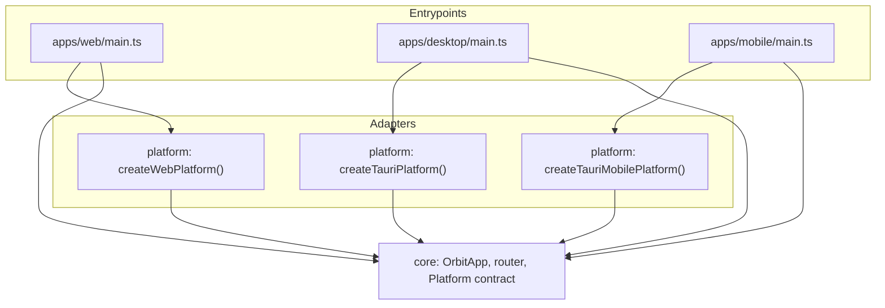
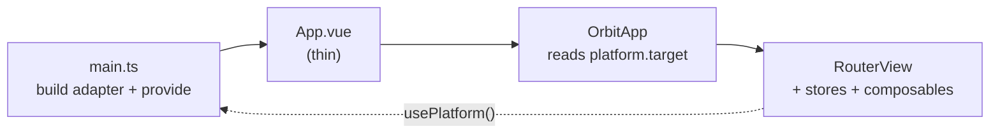

# Application Seams

[Monorepo](03-monorepo.md) describes *where the code lives* (`packages/core`, `packages/platform`, `apps/*`) and how it is built and shipped. This page describes *how the pieces hang together at runtime* - the seams between packages, the direction dependencies are allowed to point, and the single boot sequence that wires a target-specific adapter into the shared application.

The goal is one rule, stated many ways: **`packages/core` is the entire application and is target-agnostic; everything that differs between desktop, web, and mobile is a capability adapter injected at boot.** If you find yourself adding an `if (isTauri)` to a component, a store, or a composable, you are cutting the seam in the wrong place.

Cross-references:
- [03-monorepo.md](03-monorepo.md) - Directory structure, build commands, CI
- [../04-clients/02-web-app.md](../04-clients/02-web-app.md) - The capability matrix and the platform adapter from the client's perspective
- [../04-clients/01-desktop.md](../04-clients/01-desktop.md) - The Tauri shell that backs the desktop adapter

## Dependency Direction

Three workspace packages and the thin app entrypoints, with dependencies pointing in exactly one direction:



Rules that fall out of this graph:

- **`core` depends on nothing target-specific.** No `@tauri-apps/api`, no `import.meta.env`-driven branching, no raw `navigator.*` reads buried in components. It owns the `Platform` *contract* (the types) but never a concrete adapter.
- **`platform` depends on `core` for types only.** Each adapter (`web.ts`, `tauri.ts`, `tauri-mobile.ts`) imports the port interfaces from `core` and returns a concrete `Platform`. Adapters are the *only* place `@tauri-apps/api` or browser globals appear.
- **`apps/*` depend on both `core` and `platform`.** An entrypoint's whole job is to construct the right adapter and hand it to `core`. It contains no application logic.

Imports are by **workspace package name** (`core`, `platform`) - bare specifiers resolved through pnpm workspaces - not deep relative paths or path aliases:

```ts
import { providePlatform, router } from "core"
import { createWebPlatform } from "platform"
```

## The Platform Contract

`packages/core/src/platform/index.ts` is the seam. It is the one file `core` and every adapter both agree on. It defines:

1. **Capability ports** - small interfaces, one per capability that differs across environments (`NotificationPort`, `TrayPort`, `AudioDevicePort`, `DeepLinkPort`, `FileTransferPort`, `DnsPort`).
2. **The `Platform` interface** - an object holding one instance of each port, plus a `target` discriminator. A port an environment cannot provide is `null`.
3. **The injection plumbing** - a Vue `InjectionKey`, `providePlatform(app, platform)`, and `usePlatform()`.

```ts
export interface Platform {
  readonly target: "web" | "desktop" | "mobile"
  readonly notifications: NotificationPort
  readonly tray: TrayPort | null          // null on web/widget
  readonly audioDevices: AudioDevicePort
  readonly deepLinks: DeepLinkPort | null  // null in the browser
  readonly fileTransfer: FileTransferPort
  readonly dns: DnsPort | null             // null in the browser
}

export const PLATFORM_KEY: InjectionKey<Platform> = Symbol("orbit-platform")

export function providePlatform(app: App, platform: Platform): void {
  app.provide(PLATFORM_KEY, platform)
}

export function usePlatform(): Platform {
  const platform = inject(PLATFORM_KEY)
  if (!platform) {
    throw new Error("No platform adapter provided. Call providePlatform(app, ...) at app boot.")
  }
  return platform
}
```

The shape is **capability, not platform**. Core never asks "am I in Tauri?"; it asks a port to do a thing. When a capability is absent (`tray === null` on web), core degrades *explicitly* at that one call site - it hides the tray affordance - rather than scattering environment checks across the tree. This is what keeps the component tree environment-agnostic and `core` headlessly testable.

A concrete adapter is just a factory that fills in the ports. The web adapter nulls out what the browser cannot do:

```ts
export function createWebPlatform(): Platform {
  return {
    target: "web",
    notifications: createNotificationPort(),
    tray: null,           // no native tray in the browser
    audioDevices: createAudioDevicePort(),
    deepLinks: null,      // no orbit:// handler in the browser
    fileTransfer: createFileTransferPort(),
    dns: null,            // resolver endpoint used instead
  }
}
```

## The Boot Seam

There is exactly one place per target where the seam is stitched: the entrypoint's `main.ts`. It is deliberately tiny.

```ts
// apps/web/src/main.ts
import { createApp } from "vue"
import { providePlatform, router } from "core"
import { createWebPlatform } from "platform"
import App from "./App.vue"

const app = createApp(App)
app.use(router)
providePlatform(app, createWebPlatform())
app.mount("#app")
```

The desktop and mobile entrypoints are the same four lines with a different adapter (`createTauriPlatform()`, `createTauriMobilePlatform()`). Swapping the target is swapping one import. The adapter is provided **once, before mount**, so every component and composable downstream can `usePlatform()` synchronously without guards.

The app component itself is a pass-through into `core`:

```vue
<!-- apps/web/src/App.vue -->
<script setup lang="ts">
import { OrbitApp } from "core"
</script>

<template>
  <OrbitApp />
</template>
```

`OrbitApp` (in `core`) owns the real tree and reads the environment from the injected adapter - never from a prop or an env var:

```vue
<!-- packages/core/src/components/OrbitApp.vue -->
<script setup lang="ts">
import { usePlatform } from "../platform/index.ts"
const platform = usePlatform()
</script>

<template>
  <div class="ob-root" :data-target="platform.target">
    <RouterView />
  </div>
</template>
```

So the runtime wiring is:



## Environment Is Derived, Never Passed

`platform.target` is the **single source of truth** for "which environment am I in". Consequences:

- Components and stores that need to branch on environment read `usePlatform().target`, not a prop threaded down the tree and not `import.meta.env`.
- The `<div class="ob-root" :data-target="...">` exposes the target to CSS for environment-specific styling without any JS branching.
- Because the adapter carries the target, there is no second source to keep in sync. The adapter you inject *is* the environment.

## Import Discipline

The seam only holds if the boundaries are enforced, not just documented:

- **No platform imports inside `core`.** A lint boundary forbidding `@tauri-apps/api`, and discouraging raw `navigator.*`/`window.*` capability access, inside `packages/core` is the cheap mechanical guard. If core needs a capability, add a port to the contract.
- **No deep imports across packages.** Consume `core` and `platform` through their package entrypoints (`packages/*/src/index.ts`), not via deep relative paths. `core/src/index.ts` re-exports the public surface: `OrbitApp`, `router`, and the entire platform contract.
- **Adapters own all the messy parts.** Permission prompts, `enumerateDevices()`, anchor-click downloads, Tauri IPC - all of it lives in `packages/platform`. Core sees only clean port methods.

## Testability

Because the only environment dependency is the injected `Platform`, `core` is tested headlessly against a mock adapter - no Tauri, no real browser APIs:

```ts
const platform: Platform = {
  target: "web",
  notifications: { requestPermission: async () => true, notify: async () => {} },
  tray: null,
  audioDevices: { enumerate: async () => [], onChange: () => () => {} },
  deepLinks: null,
  fileTransfer: { download: async () => {} },
  dns: null,
}
// provide(PLATFORM_KEY, platform) in the test harness, then mount the component.
```

This is the practical payoff of the seam: the shared test suite in [CI](03-monorepo.md#ci-pipeline) exercises the real application logic against a controlled adapter, so a `core` regression is caught before any target build runs.

## Adding a New Target

The seam reduces "support a new platform" to a mechanical checklist:

1. Add `packages/platform/src/<target>.ts` exporting a factory that returns a `Platform` with the right `target` and ports (reuse an existing adapter and override only what differs - `tauri-mobile.ts` extends `tauri.ts`).
2. Add `apps/<target>/` with a four-line `main.ts` that injects the new adapter.
3. If the target unlocks a brand-new capability, add a port to the contract in `core` and implement it across the existing adapters (`null` where unavailable).

No change to the component tree, stores, or routing is required. That is the seam working as intended.
