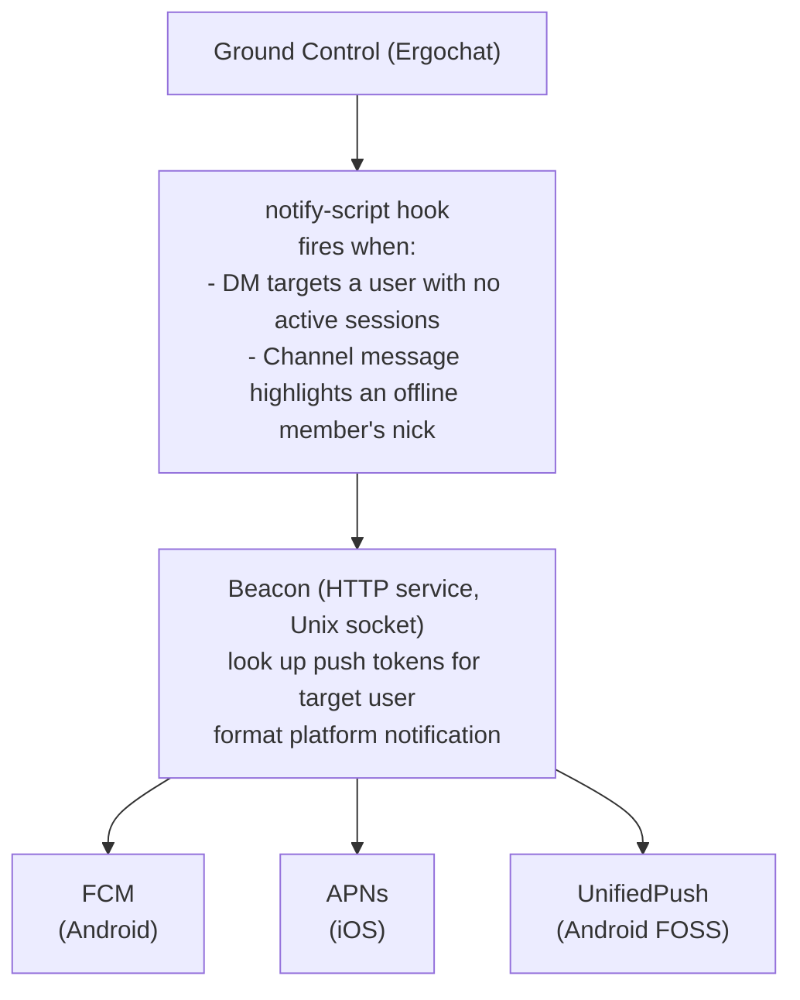

# Research: Beacon (Push Notification Relay)

Beacon is a self-hostable push notification relay for Orbit. Like [Transponder](../02-components/04-transponder.md), it is an optional, standalone HTTP service that extends Orbit's capabilities without connecting to the IRC server as a client. Ergochat notifies Beacon directly via a server-side hook when events target offline users - the same delegation pattern used by `auth-script` for SASL authentication.

> **This is the only place in the entire Orbit stack where existing server software needs to be modified.** Every other component - Ground Control, Satellite, Depot, Transponder - works with Ergochat and standard infrastructure as-is. Beacon requires a new hook (`notify-script`) to be added to Ergochat. This hook does not exist today. Everything else described in this spec is implementable without touching Ergochat.

## What is Beacon?

Beacon is a small, self-hostable service that receives event notifications from Ground Control and fires push notifications via the appropriate platform delivery channel. It is deployed by the server operator and runs entirely under their control.

Ergochat calls Beacon's notify endpoint when a notification-worthy event targets a user with no active sessions. Beacon dispatches the notification through the configured delivery backend:

- **FCM (Firebase Cloud Messaging)** - Android (Google ecosystem)
- **APNs (Apple Push Notification service)** - iOS (required by the platform; unavoidable)
- **UnifiedPush** - Android FOSS alternative to FCM; enables fully Google-free push delivery on Android

Beacon is **optional**. If a server operator does not deploy it, no push notifications are delivered. Everything else in Orbit continues to work. The [PWA](../04-clients/02-web-app.md) provides limited background notification capability via the Web Notifications API on supported browsers, which covers the non-native case for MVP.

## Why It's Needed

Mobile operating systems - iOS and Android - aggressively kill background processes. An app that is not in the foreground cannot maintain a persistent connection to Ground Control or poll for new messages without triggering OS-level termination. This is a hard platform constraint, not an Orbit limitation.

The only reliable mechanism for reaching an offline mobile user is a **push notification delivered via the OS push relay infrastructure** (FCM for Android, APNs for iOS). This requires a server-side component that:

1. Knows which users have registered which push tokens with which delivery endpoints
2. Can dispatch a push payload in response to IRC events (mentions, DMs) when those users are offline

Beacon is that component. Ground Control is responsible for detecting the events and determining that the target user is offline - both of which it already knows as core IRC session state. Beacon is responsible only for maintaining the push token store and dispatching notifications.

## Why Not a Bot

The naive approach is to implement Beacon as an IRC bot: connect to Ground Control, join all channels, parse messages for mentions, track online/offline status via `MONITOR`, and dispatch push notifications. This approach has two fundamental problems.

**It duplicates knowledge Ergochat already has.** Online/offline state is core IRC session state - Ergochat knows immediately when a user has no active sessions. Nickname highlight matching is something the server can do natively. DM recipients are known at the moment of delivery. Having a bot re-derive all of this from the outside is redundant and fragile.

**It cannot observe DMs.** In standard IRC, a `PRIVMSG` to a nickname is delivered only to that nickname - no other connected client sees it. A bot-based Beacon could monitor channel mentions but could never see DMs directed at other users without IRC operator-level privileges, which carries serious privacy implications (the bot would see all private traffic, not just messages to offline users).

The `notify-script` hook solves both problems: Ergochat handles all event detection internally using state it already holds, and calls Beacon only when a notification is warranted, for both channel mentions and DMs alike.

## Architecture



1. **Ergochat detects the event** - when a `PRIVMSG` targets an offline user (DM) or a channel message contains the nick of an offline channel member (mention), Ergochat calls the configured `notify-script` endpoint over a Unix socket.
2. **Ergochat calls Beacon** - a lightweight JSON payload with event metadata. No message content is included.
3. **Beacon responds immediately** - `202 Accepted`. The call is non-blocking on the IRC message path.
4. **Beacon looks up push tokens** - the target user's registered device tokens are retrieved from the token store.
5. **Beacon dispatches** - a push notification is sent via the appropriate backend for each registered device.
6. **The mobile OS delivers** the notification, which wakes the app if needed to display the alert.
7. **The app fetches actual messages** - on reconnect, the Orbit client fetches missed messages via `CHATHISTORY`. Beacon never touches message content.

## The `notify-script` Hook

### Current Status

**`notify-script` does not exist in Ergochat today.** It must be implemented and contributed upstream as a PR before Beacon can function without a bot fallback. This is the single required change to existing server software in the entire Orbit project.

Ergochat already has two script hook types that use identical infrastructure:

- `auth-script` - delegates SASL credential verification to an external process or socket (`irc/authscript.go`)
- `ip-check-script` - delegates IP ban decisions to an external process or socket (`irc/authscript.go`)

Both use the shared `RunScript` / `RunScriptOverSocket` infrastructure in `irc/script.go`, which handles subprocess spawning, Unix socket communication, JSON I/O, timeouts, and semaphore throttling. `notify-script` is a third instance of this exact pattern. No new infrastructure is needed - only a new call site and a new pair of input/output structs.

### Required Ergochat Contribution

The implementation lives in a new file: **`irc/notifyscript.go`**

Following the structure of `irc/authscript.go`, this file defines:

```go
// NotifyScriptInput is the JSON payload sent to the notify-script on each event.
type NotifyScriptInput struct {
    Event     string `json:"event"`    // "dm" or "mention"
    Sender    string `json:"sender"`   // nick of the message sender
    Target    string `json:"target"`   // account name of the offline recipient
    Channel   string `json:"channel"`  // channel name for mentions; empty string for DMs
    Timestamp string `json:"timestamp"` // server-time of the triggering message (ISO 8601)
}

// NotifyScriptOutput is the JSON response from the notify-script.
// Beacon responds with success=true; errors are logged but do not affect message delivery.
type NotifyScriptOutput struct {
    Success bool   `json:"success"`
    Error   string `json:"error"`
}

func HandleNotifyScript(sem utils.Semaphore, config ScriptConfig, input NotifyScriptInput) (output NotifyScriptOutput, err error) {
    if sem != nil {
        sem.Acquire()
        defer sem.Release()
    }
    inputBytes, err := json.Marshal(input)
    if err != nil {
        return
    }
    inputBytes = append(inputBytes, '\n')
    outBytes, err := RunScript(config.Command, config.Socket, config.Args, inputBytes, config.Timeout, config.KillTimeout)
    if err != nil {
        return
    }
    err = json.Unmarshal(outBytes, &output)
    return
}
```

The call site hooks into the PRIVMSG handler. After a message is delivered, if the server has a `notify-script` configured, it checks whether the target (nick for DMs, each mentioned member for channel messages) has zero active sessions. If so, it calls `HandleNotifyScript` asynchronously - notification dispatch must never block message delivery.

The config block in `ircd.yaml` follows the existing `auth-script` shape exactly:

```yaml
notify-script:
  command: "/path/to/beacon-notify"   # subprocess mode
  # socket: "/run/beacon/notify.sock" # Unix socket mode (preferred for Beacon)
  timeout: 5s
  kill-timeout: 10s
```

In practice, Beacon runs as a persistent service and Ergochat communicates with it over a Unix socket (`socket` mode), using `RunScriptOverSocket` from `irc/script.go`. This avoids subprocess overhead on every notification event and keeps Beacon as a long-running daemon rather than a script invoked per message.

### Upstreaming Strategy

This PR should be proposed to the Ergochat project with the following framing:

- It follows the existing `auth-script` / `ip-check-script` pattern exactly
- The implementation is contained in a single new file (`irc/notifyscript.go`) plus a call site in the PRIVMSG handler and a config entry
- It is entirely optional - servers without `notify-script` configured are unaffected
- The use case (push notifications for offline users) is a common need across IRC deployments, not Orbit-specific

**If the PR is not accepted upstream, the implementation can be maintained as a minimal patch on a tracked fork**. The change is small and localized enough that rebasing it on new Ergochat releases would be low-effort. Ergochat would become "Ground Control" as a true forked codebase.

## Hook Payload Reference

**DM event** - fired when a `PRIVMSG` to a nickname targets a user with zero active sessions:

```json
{
  "event": "dm",
  "sender": "alice",
  "target": "zealsprince",
  "channel": "",
  "timestamp": "2025-01-15T14:32:00Z"
}
```

**Mention event** - fired when a channel `PRIVMSG` contains the nick of an offline channel member:

```json
{
  "event": "mention",
  "sender": "alice",
  "target": "zealsprince",
  "channel": "#gaming",
  "timestamp": "2025-01-15T14:32:00Z"
}
```

**No message content is included in either payload.** The push notification delivered to the device says only *"New message from alice"* or *"alice mentioned you in #gaming"*. Message content stays on the IRC server and is retrieved by the client via `CHATHISTORY` when it reconnects. Sensitive content never passes through FCM, APNs, or any third-party relay infrastructure.

Ergochat fires the hook asynchronously and does not block the IRC message path on the result.

## Beacon API

Beacon is a persistent HTTP service with two concerns: push token registration (called by mobile clients) and the notify endpoint (called by Ergochat over a Unix socket).

### Push Token Registration

Called by the Orbit mobile client at login time. Associates a device's push token with the user's IRC account name.

```
POST /register
Authorization: Bearer <JWT>

{
  "platform": "fcm" | "apns" | "unifiedpush",
  "token": "<device push token>",
  "endpoint": "<UnifiedPush distributor URL, if platform=unifiedpush>"
}
```

The JWT is verified against the domain's OIDC provider (the [Transponder](../02-components/04-transponder.md) role) if one is configured. This binds the push token to a verified account identity. Without an OIDC provider, account identity falls back to the NickServ account name from the IRC connection.

```
DELETE /register
Authorization: Bearer <JWT>
```

Called at logout. Removes the token for the authenticated account on this device.

### Notify Endpoint (Unix Socket)

Listens on a Unix socket. Called by Ergochat's `notify-script` via `RunScriptOverSocket`. This listener is internal only - it MUST NOT be exposed on a public network interface. Ergochat and Beacon are co-deployed on the same host or within the same container network.

Input and output are newline-terminated JSON, matching the `RunScript` contract from `irc/script.go`.

Beacon responds `{"success": true}` immediately and dispatches the push notification asynchronously.

## Token Store

Beacon maintains a small database mapping account names to registered device tokens:

| Field | Description |
|-------|-------------|
| `account` | IRC account name (from OIDC `sub` or NickServ account) |
| `platform` | `fcm`, `apns`, or `unifiedpush` |
| `token` | Platform-issued device push token |
| `endpoint` | UnifiedPush distributor URL (UnifiedPush only) |
| `registered_at` | Timestamp of registration |

SQLite is sufficient for most single-server deployments. Postgres is supported for operators who already have one running.

A single user may have multiple registered tokens (phone, tablet, etc.). Beacon dispatches to all registered tokens for the target account and prunes any token that the delivery backend reports as expired or invalid.

## Self-Hosting and iOS Constraint

Beacon runs under the **server operator's control**, not Hivecom's. This preserves the decentralized model - operators decide whether to enable push notifications for their community and configure their own FCM project credentials and APNs certificates.

For Android, UnifiedPush support means operators can route notifications through any compatible distributor (e.g., ntfy, Gotify), removing the FCM dependency entirely. This makes a fully FOSS, Google-free push stack possible.

For iOS, APNs is unavoidable - Apple's platform does not permit alternative push delivery mechanisms. However, Beacon itself remains self-hosted. The APNs connection is made by the operator's Beacon instance using the operator's registered APNs credentials. Hivecom is not in the notification delivery path.

## MVP Status

Beacon is **not part of the MVP**. The PWA (see [Web App & PWA](../04-clients/02-web-app.md)) provides limited background notification via the Web Notifications API on supported desktop browsers. On mobile, PWA push notifications work on Android (Chrome) and iOS 16.4+ (Safari). This covers the majority of the mobile use case without a native app or Beacon.

Beacon becomes necessary when native mobile apps (see [Mobile Clients](07-mobile-clients.md)) ship and users expect reliable background notification delivery regardless of browser state.

The `notify-script` Ergochat PR should be proposed and tracked in parallel with the mobile client track, so it is available and - ideally - merged upstream by the time Beacon is needed in production.

## Cross-References

- [Mobile Clients](07-mobile-clients.md) - the track that Beacon unblocks
- [Transponder](../02-components/04-transponder.md) - architectural parallel: both are optional, standalone HTTP services that extend Orbit without connecting to Ground Control as a client
- [Ground Control](../02-components/01-ground-control/01-overview.md) - the Ergochat instance that calls the `notify-script` hook
- [Authentication](../03-identity/01-authentication.md) - JWT verification used for push token registration
- Ergochat source references: [`irc/authscript.go`](https://github.com/ergochat/ergo/blob/master/irc/authscript.go), [`irc/script.go`](https://github.com/ergochat/ergo/blob/master/irc/script.go)
